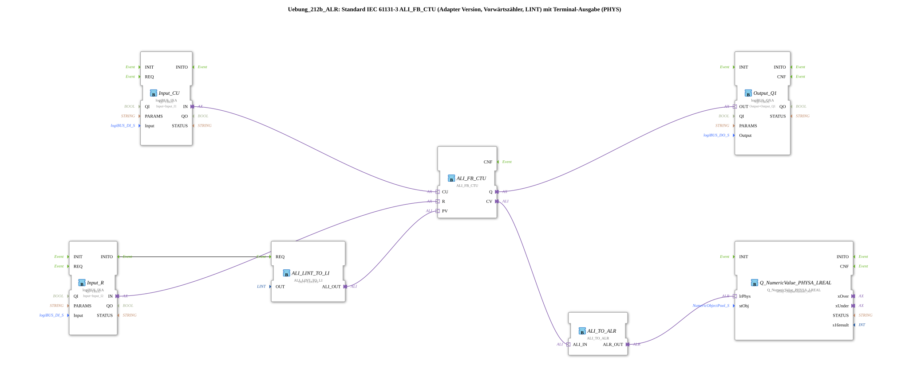

# Exercise_212b_ALR: Standard IEC 61131-3 ALI_FB_CTU (Adapter Version, Up Counter, LINT) with Terminal Output (PHYS)

* * * * * * * * * *
## Introduction

This exercise implements an up counter (CTU) according to IEC 61131-3 as an adapter version. The counter uses type `ALI_FB_CTU` and can be preset to a predefined value (here 5). The current counter value is output via a physical terminal output (`Q_NumericValue_PHYSA_LREAL`) on an output channel. Additionally, a digital output (`Output_Q1`) is set as soon as the counter value reaches or exceeds the preset value. The inputs for the counter signal (CU) and the reset (R) are fed by digital inputs of the logiBUS platform. A comment indicates that negative counter readings are possible and recommends installing an AX_D_FF to reduce the number of events.
## Function Blocks (FBs) Used

### Sub-Blocks:

#### **ALI_FB_CTU**

- **Type**: `adapter::iec61131::counters::ALI_FB_CTU`
- **Parameters**: None
- **Event Inputs/Outputs**: No direct event connections; events are transported via the adapter ports `CU`, `R`, `Q`, and `CV`.
- **Data Inputs/Outputs**:
- **Inputs**: `CU` (count pulse), `R` (reset), `PV` (preset value, via adapter from `ALI_LINT_TO_LI`)
- **Outputs**: `Q` (target reached), `CV` (current counter value, type LINT)
- **Functionality**: This module is a forward counter for LINT values. Each rising edge at the `CU` input increments the internal counter by 1. A signal at the `R` input resets the counter to 0. The output `Q` becomes TRUE as soon as the current counter reading reaches at least the value of `PV`. The current counter reading is available at output `CV`.

#### **ALI_LINT_TO_LI**

- **Type**: `adapter::conversion::unidirectional::ALI_LINT_TO_LI`
- **Parameters**:
- `OUT` = `LINT#5` (constant preset value)
- **Event Inputs/Outputs**:
- **Event Input**: `REQ` (triggered by `INITO` from `Input_R`)
- **Data Inputs/Outputs**:
- **Output**: `ALI_OUT` (supplies the constant value 5 as an ALI signal to the `PV` input of the counter)
- **Functionality**: This function block Converts a constant LINT value to the ALI format, which the counter expects as a preset input. The output is updated when an event occurs at the `REQ` input (here, only once during initialization).

Converts a constant LINT value to the ALI format, which the counter expects as a preset input.
#### **Input_CU**

- **Type**: `logiBUS::io::DI::logiBUS_IXA`
- **Parameters**:
- `QI` = `TRUE` (Qualifier, always active)
- `Input` = `Input_I1` (Physical DI channel)
- **Event Inputs/Outputs**: No direct event connections
- **Data Inputs/Outputs**:
- **Output**: `IN` (Adapter, supplies the digital input signal to the `CU` input of the counter)
- **Functionality**: Reads the state of the digital input `Input_I1` and provides it as an adapter signal.

#### **Input_R**

- **Type**: `logiBUS::io::DI::logiBUS_IXA`
- **Parameters**:
- `QI` = `TRUE`
- `Input` = `Input_I2`
- **Event Inputs/Outputs**:
- **Event Output**: `INITO` (activated on first power-up and triggers `ALI_LINT_TO_LI.REQ`)
- **Data Inputs/Outputs**:
- **Output**: `IN` (adapter, supplies the reset signal to the `R` input of the counter)
- **Functionality**: Reads The state of the digital input `Input_I2` is monitored and provided as an adapter signal for the counter reset. The `INITO` event output is used for the one-time initialization of the preset value.

The system monitors the state of the digital input `Input_I2` and provides it as an adapter signal for the counter reset.
#### **Output_Q1**

- **Type**: `logiBUS::io::DQ::logiBUS_QXA`
- **Parameters**:
- `QI` = `TRUE`
- `Output` = `Output_Q1` (physical DO channel)
- **Data Inputs/Outputs**:
- **Input**: `OUT` (adapter, receives the `Q` signal from the counter)
- **Function**: Sets the digital output `Output_Q1` to the value of the counter output `Q`.

#### **ALI_TO_ALR**

- **Type**: `adapter::conversion::unidirectional::ALI_TO_ALR`
- **Parameters**: None
- **Data Inputs/Outputs**:
- **Input**: `ALI_IN` (receives the current counter reading `CV` from the counter)
- **Output**: `ALR_OUT` (sends the value as an ALR signal to the terminal output)
- **Functionality**: Converts the ALI signal (LINT) into an ALR signal (LREAL), which is required for physical output.

#### **Q_NumericValue_PHYSA_LREAL**

- **Type**: `isobus::UT::Q::Q_NumericValue_PHYSA_LREAL`
- **Parameters**:
- `stObj` = `OutputNumber_N3` (reference to the terminal output object)
- **Data Inputs/Outputs**:
- **Input**: `lrPhys` (receives the ALR signal from `ALI_TO_ALR`)
- **Functionality**: Outputs the passed LREAL value as a numeric value to the physical terminal output `OutputNumber_N3`.

## Program Flow and Connections

This exercise implements a counting counter with terminal output. The connections are structured as follows:

1. **Initialization**: When the PLC starts, the INITO event is triggered by `Input_R`. This triggers `ALI_LINT_TO_LI` and sets the counter's preset value to `LINT#5`. The counter is now configured for the target value of 5.
2. **Counting Operation**: The digital input `Input_I1` (pushbutton or sensor) is routed via `Input_CU` to the counter's `CU` input. Each rising edge increments the internal counter value. The digital input `Input_I2` is routed via `Input_R` to the input `R`. A signal resets the counter to 0.
3. **Outputs**:
- The counter's output `Q` is routed via `Output_Q1` to the digital output `Output_Q1`. This output becomes TRUE as soon as the counter reading is >= 5.
- The current counter reading (`CV`) is converted to an LREAL value via `ALI_TO_ALR` and displayed on the terminal `OutputNumber_N3` via `Q_NumericValue_PHYSA_LREAL`.The counter reading is output. This allows the counter reading to be displayed in a visualization or on a screen.
4. **Special Features**: A comment in the network indicates that negative counter readings are possible (e.g., due to overflow or incorrect usage). It is also recommended to insert an AX_D_FF block if necessary to reduce the number of events (especially with rapid counting pulses) and decrease the system load.

**Learning Objectives**: Understanding the IEC 61131-3 counter (CTU) in the adapter version, working with constants and conversion blocks, connecting digital inputs and outputs as well as physical terminal outputs.

**Difficulty Level**: Medium – Basic knowledge of the 4diac IDE and the logiBUS system is required.

**Required Prior Knowledge**: Working with function blocks, adapter connections, and event control in 4diac.

## Summary

Exercise `Uebung_212b_ALR` demonstrates a fully configured up-counter with a fixed preset value and physical output. It combines digital inputs/outputs, a counter block, conversion blocks, and a terminal output into a functional automation example. The comments provide practical tips for optimization (event reduction) and point out possible constraints (negative values).

Exercise `Uebung_212b_ALR` demonstrates a fully configured up-counter with a fixed preset value and physical output.

---

### 🌐 Related topic subpages on ms-muc-docs.de

- [🌐 Eclipse 4diac IDE & Color Reference on ms-muc-docs.de](https://www.ms-muc-docs.de/iec-61499/eclipse-4diac/)

]
