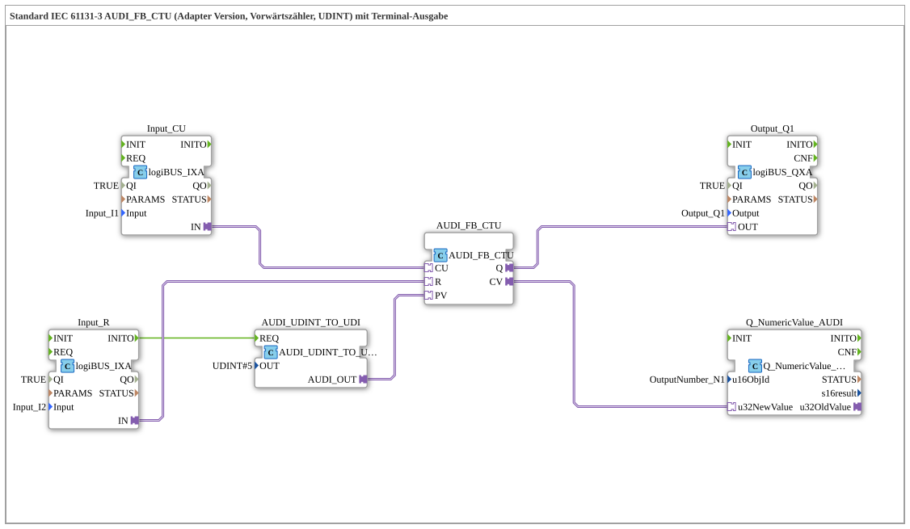

# Exercise_213_AUDI: Standard IEC 61131-3 AUDI_FB_CTU (Adapter Version, Up Counter, UDINT) with Terminal Output

* * * * * * * * * *
## Introduction

This exercise implements a **Up Counter (CTU)** according to IEC 61131-3 in an adapter version for the **UDINT** data type. The counter is controlled via two digital inputs (count pulse and reset) and outputs the current counter value as well as the end-of-count value to a terminal and a digital output. A fixed preset value of 5 is specified via a conversion block.
This exercise is designed to introduce you to:

- Adapter-based function blocks (AUDI_FB_CTU)
- Data conversion (UDINT → UDI)
- Connecting logiBUS inputs/outputs
- Numeric terminal output via the function block `Q_NumericValue_AUDI`

## Function blocks (FBs) used

### Sub-blocks:

#### **AUDI_FB_CTU**

- **Type**: `adapter::iec61131::counters::AUDI_FB_CTU`
- **Internal FBs used**: None
- **Parameters**: No explicit parameters (all control via adapter interfaces)
- **Event inputs/outputs**:
- No events (pure data and adapter connections)
- **Data inputs/outputs** (adapter interfaces):
- **CU** (Count Up) – Counting pulse (via adapter connection from `Input_CU.IN`)
- **R** (Reset) – Resets the counter to 0 (from `Input_R.IN`)
- **PV** (Preset Value) – Comparison value for setting `Q` (from `AUDI_UDINT_TO_UDI.AUDI_OUT`)
- **Q** (Output) – Becomes TRUE when `CV ≥ PV` (at `Output_Q1.OUT`)
- **CV** (Current Value) – Current counter reading (at `Q_NumericValue_AUDI.u32NewValue`)
- **Functionality**:

On each rising edge at the CU input, the counter is incremented by 1, provided `R=FALSE` is present. A signal at `R` resets the counter to 0. The output `Q` is TRUE as soon as the current counter value `CV` reaches or exceeds the preset value `PV`. The counting range is `UDINT` (0 … 4,294,967,295).

#### **AUDI_UDINT_TO_UDI**

- **Type**: `adapter::conversion::unidirectional::AUDI_UDINT_TO_UDI`
- **Internal Function Blocks Used**: None
- **Parameters**:
- `OUT` = `UDINT#5` (fixed preset value)
- **Event Input/Output**:
- **REQ** (Event Input) – triggers the conversion (connected to `Input_R.INITO`)
- **Data Output**:
- **AUDI_OUT** (Adapter Output) – sends the converted UDI value (corresponds to `UDINT#5`) to `AUDI_FB_CTU.PV`
- **Functionality**:

Converts the constant UDINT value 5 The signal is converted into a UDI adapter signal, which is then used as a preset value by the subsequent CTU module. This conversion is triggered once during the initialization event (`INITO`) of the reset input.

#### **Input_CU**

- **Type**: `logiBUS::io::DI::logiBUS_IXA`
- **Parameters**:
- `QI` = `TRUE` (Active Block)
- `Input` = `Input_I1` (Physical Input 1)
- **Event/Data Connections**:
- No events
- **IN** (Adapter Output) – supplies the digital input value to `AUDI_FB_CTU.CU`
- **Functionality**:

Provides the first digital logiBUS input (terminal I1) as an adapter signal for the counting pulse.

---

#### **Input_R**

- **Type**: `logiBUS::io::DI::logiBUS_IXA`
- **Parameters**:
- `QI` = `TRUE`
- `Input` = `Input_I2`
- **Event/Data Connections**:
- **INITO** (Event Output) – triggered at the start of initialization (connected to `AUDI_UDINT_TO_UDI.REQ`)
- **IN** (Adapter Output) – supplies the digital input value to `AUDI_FB_CTU.R`
- **Functionality**:

Provides the second digital logiBUS input (terminal I2) as an adapter signal for resetting the counter. Additionally, the event `INITO` is generated at startup, triggering a one-time initialization of the preset value.

#### **Output_Q1**

- **Type**: `logiBUS::io::DQ::logiBUS_QXA`
- **Parameters**:
- `QI` = `TRUE`
- `Output` = `Output_Q1` (Physical Output 1)
- **Event/Data Connections**:
- No events
- **OUT** (Adapter Input) – receives the signal from `AUDI_FB_CTU.Q`
- **Functionality**:

Receives the counter end value (`Q`) and outputs it on the first digital logiBUS output (terminal Q1).

---

#### **Q_NumericValue_AUDI**

- **Type**: `isobus::UT::Q::Q_NumericValue_AUDI`
- **Parameters**:
- `u16ObjId` = `OutputNumber_N1` (defines the terminal output object)
- **Event/Data Ports**:
- No events
- **u32NewValue** (data input) – receives the current counter value from `AUDI_FB_CTU.CV`
- **Functionality**:

Displays the passed 32-bit value (CV) on a numeric terminal (e.g., HMI). The object ID `OutputNumber_N1` determines on which display element the number appears.

---

## Program Flow and Connections

### Flow

1. **Initialization**:

After system startup, the reset input `Input_R` is initialized. The resulting event `INITO` triggers the conversion block `AUDI_UDINT_TO_UDI`, which passes the preset value `5` to the counter `AUDI_FB_CTU.PV`.

2. **Counting Operation**:

Every rising edge at the logiBUS input I1 (`Input_CU`) increments the counter as long as the reset (`Input_R`) is inactive.

- A signal at input I2 (`Input_R`) resets the counter to 0.

3. **Output**:
- The counter's output `Q` is connected directly to the logiBUS output Q1 (`Output_Q1`).
- The current counter reading `CV` is continuously sent to the terminal block `Q_NumericValue_AUDI` and displayed there.

### Connection Overview (from the Network)

| Source | Destination | Type |
|--------|------|-----|
| `Input_CU.IN` | `AUDI_FB_CTU.CU` | Adapter (Data) |
| `Input_R.IN` | `AUDI_FB_CTU.R` | Adapter (Data) |
| `Input_R.INITO` | `AUDI_UDINT_TO_UDI.REQ` | Event |
| `AUDI_UDINT_TO_UDI.AUDI_OUT` | `AUDI_FB_CTU.PV` | Adapter (Data) |
| `AUDI_FB_CTU.Q` | `Output_Q1.OUT` | Adapter (Data) |
| `AUDI_FB_CTU.CV` | `Q_NumericValue_AUDI.u32NewValue`| Data |

> **Note**: A comment is stored in the network: *“Insert an AX_D_FF here if necessary to reduce the number of events.”* – This indicates a possible optimization where an edge-triggered flip-flop can be added to reduce the event rate.

---

## Summary

The exercise **Exercise_213_AUDI** implements a complete up-counter (CTU) according to IEC 61131-3 in an adapter variant. The counter is operated via two logiBUS digital inputs, and its current value as well as when the preset value is reached are output to both a terminal and a digital output. The one-time initialization of the preset value is performed via a converter block. This exercise teaches the use of adapter-based function blocks, data conversion, and the integration of inputs/outputs in the 4diac IDE.

**Difficulty Level**: Intermediate
**Prerequisites**: Basic knowledge of the 4diac IDE, IEC 61131-3, logiBUS inputs/outputs

---

### 🌐 Related topic subpages on ms-muc-docs.de

- [🌐 Eclipse 4diac IDE & Color Reference on ms-muc-docs.de](https://www.ms-muc-docs.de/iec-61499/eclipse-4diac/)

]
