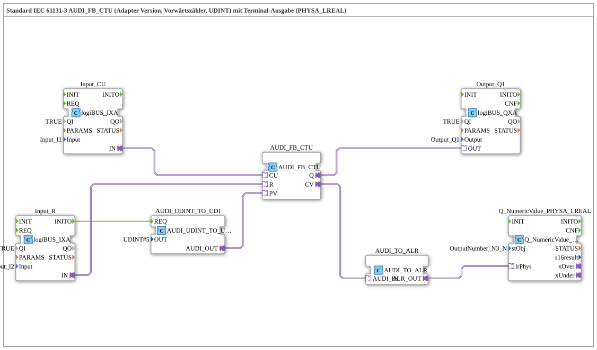

# Exercise_213b_ALR: Standard IEC 61131-3 AUDI_FB_CTU (Adapter Version, Up Counter, UDINT) with Terminal Output (PHYSA_LREAL)

* * * * * * * * * *
## Introduction
This exercise implements an **up counter (CTU)** according to IEC 61131-3 with a **counting range of UDINT** (unsigned 32-bit integer) as an **adapter version**.
The counter result is output to a **terminal** via an **analog output (LREAL)**.

Additionally, the **setpoint (PV) of the counter** is initially set to **5** via a **UDINT-to-unidirectional converter**, so that the counter provides an output signal (Q) when it reaches 5.

**Learning Objectives**

- Understanding the interaction of IEC meters with adapter interfaces
- Working with conversion blocks (UDINT → Unidirectional → LREAL)
- Parameterizing and integrating logiBUS inputs/outputs

**Difficulty Level**

Medium – Basic knowledge of 4diac IDE and IEC blocks is required.

**Starting the Exercise**

The subapp `Uebung_213b_ALR` must be integrated into a 4diac project and linked to the corresponding logiBUS hardware resources (Input_I1, Input_I2, Output_Q1, OutputNumber_N3).

---

## Function Blocks (FBs) Used

The following function blocks are used in the SubApp network:

### **AUDI_FB_CTU** (Central Counter Logic)
- **Type**: `adapter::iec61131::counters::AUDI_FB_CTU`
- **Description**: Up counter with counter input (CU), reset input (R), output (Q), and current counter value (CV).
- **Special Feature**: The internal logic uses the UDINT data type.

### **AUDI_UDINT_TO_UDI** (Setpoint Input)
- **Type**: `adapter::conversion::unidirectional::AUDI_UDINT_TO_UDI`
- **Parameter**: `OUT = UDINT#5`
- **Function**: Converts the constant value `5` into a unidirectional signal and passes it to the setpoint input **PV** of the counter. This programs the counter to a threshold of 5.

### **Input_CU** (Counting Pulses)
- **Type**: `logiBUS::io::DI::logiBUS_IXA`
- **Parameter**: `QI = TRUE`, `Input = Input_I1`
- **Function**: Reads the digital input **I1** and makes the signal available at the adapter output **IN**. Connected to the counter input **CU**.

### **Input_R** (Reset)
- **Type**: `logiBUS::io::DI::logiBUS_IXA`
- **Parameters**: `QI = TRUE`, `Input = Input_I2`
- **Function**: Reads the digital input **I2** and connects its output to the counter's reset input **R**.
- **Additionally,** the **INITO** event triggers the converter `AUDI_UDINT_TO_UDI`, so the setpoint is initially set at startup.

### **Output_Q1** (Counter Q Output)
- **Type**: `logiBUS::io::DQ::logiBUS_QXA`
- **Parameters**: `QI = TRUE`, `Output = Output_Q1`
- **Function**: Outputs the counter output **Q** (active if CV ≥ PV) on the digital output **Q1**.

### **AUDI_TO_ALR** (UDINT → Analog LREAL Conversion)
- **Type**: `adapter::conversion::unidirectional::AUDI_TO_ALR`
- **Function**: Converts the unidirectional counter reading (CV) into a physical analog signal (LREAL). This signal is then passed to the subsequent terminal block.

### ### **Q_NumericValue_PHYSA_LREAL** (Terminal Output)
- **Type**: `isobus::UT::Q::Q_NumericValue_PHYSA_LREAL`
- **Parameter**: `stObj = OutputNumber_N3`
- **Function**: Outputs the counter value, which is available as LREAL, to the terminal object `OutputNumber_N3`. The numerical value can be observed there in real time.

### **Notes from Comments**
- The **AUDI_TO_ALR** conversion works with **signed values** – therefore, negative numbers are theoretically possible, even though the counter only outputs positive UDINT values.
- To reduce the event rate (especially with fast counting pulses), an **AX_D_FF** (dominant flip-flop) can be used (see comment in the network).

---

## Program Flow and Connections

1. **Initialization**

At startup, the **Input_R** block executes its INIT cycle. The **INITO** event triggers **AUDI_UDINT_TO_UDI** (REQ), which transfers the setpoint `UDINT#5` to the **PV** input of the counter.

2. **Counter Operation**

- Each rising edge at the digital input **I1** is forwarded via **Input_CU** to the **CU** input of the counter.
- The counter increments its internal value (CV).
- As soon as `CV ≥ PV` (=5), the output **Q** switches to TRUE and activates **Output_Q1** (hardware output Q1).

3. **Reset**

- A signal at the digital input **I2** is routed via **Input_R** to the **R** input of the counter. This resets the counter to 0, and **Q** becomes FALSE.

4. **Terminal Output**

- The current counter value (CV) leaves the counter as an adapter signal and is first converted into a physical LREAL value via **AUDI_TO_ALR**.
- This LREAL value is then passed to **Q_NumericValue_PHYSA_LREAL** and displayed on the configured terminal object `OutputNumber_N3`.

**Adapter connections in detail:**

- `Input_CU.IN` → `AUDI_FB_CTU.CU` (count pulses)
- `Input_R.IN` → `AUDI_FB_CTU.R` (reset)
- `AUDI_FB_CTU.Q` → `Output_Q1.OUT` (output Q1)
- `AUDI_FB_CTU.CV` → `AUDI_TO_ALR.AUDI_IN` (counter reading for conversion)
- `AUDI_TO_ALR.ALR_OUT` → `Q_NumericValue_PHYSA_LREAL.lrPhys` (analog signal to terminal)
- `AUDI_UDINT_TO_UDI.AUDI_OUT` → `AUDI_FB_CTU.PV` (Setpoint Specification)

---

## Summary

Exercise **Exercise_213b_ALR** demonstrates the construction of an adapted IEC forward counter with a configurable setpoint and output of the counter reading to a terminal.

The counter is controlled via two digital inputs (I1 = count, I2 = reset). The output Q switches as soon as the counter reading reaches 5. An analog converter transforms the counter reading into an LREAL value, which is visualized on a terminal object.

This exercise is well-suited for understanding adapter connections, conversion blocks, and the integration of logiBUS hardware into 4diac.

---

### 🌐 Related topic subpages on ms-muc-docs.de
* [🌐 Eclipse 4diac IDE & Color Reference on ms-muc-docs.de](https://www.ms-muc-docs.de/iec-61499/eclipse-4diac/)

]