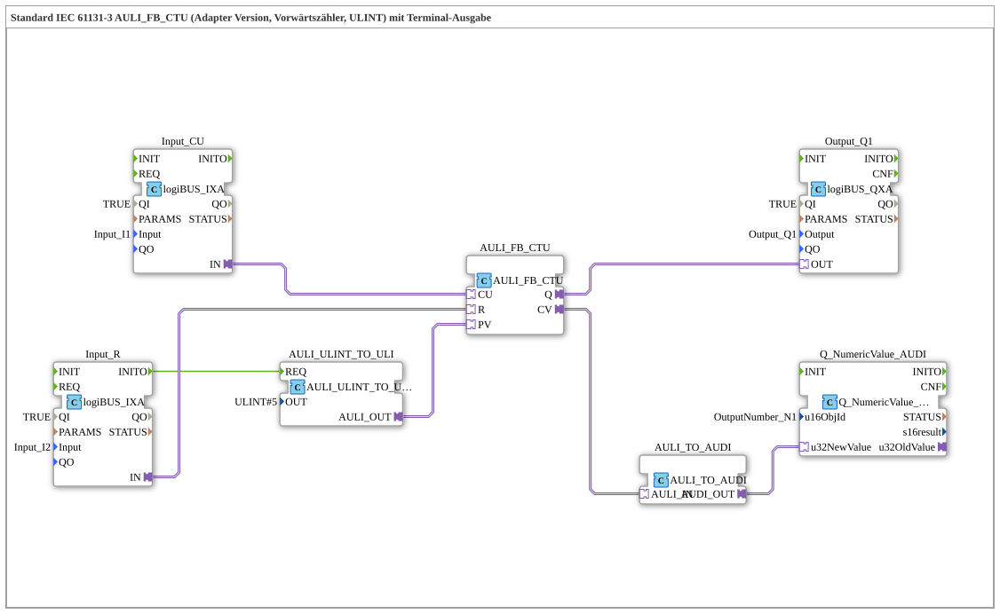

# Exercise_214_AULI: Standard IEC 61131-3 AULI_FB_CTU (Adapter Version, Up Counter, ULINT) with Terminal Output

* * * * * * * * * *

## Introduction

This exercise implements an up counter according to IEC 61131-3 (type **AULI_FB_CTU**) as an adapter version. The counter uses the **ULINT** data type and outputs its current counter value and overflow (Q) to a terminal output (numeric display) and a digital output. Additionally, the initial value (PV) is set via a conversion block. This exercise demonstrates the use of adapter function blocks (FBs), I/O connectivity, and data conversion.

## Function Blocks Used (FBs)

The sub-app consists of several function blocks, which are described below.

### Sub-module: AULI_FB_CTU

- **Type**: `adapter::iec61131::counters::AULI_FB_CTU`
- **Parameters**: None (set via adapter connections)
- **Function**: Up counter for ULINT values. It increments on every rising edge at the **CU** (Count Up) input. The **R** input resets the counter. The current counter value is output at the **CV** adapter output, and the overflow (counter value ≥ PV) is output at the **Q** output.

### Sub-Block: AULI_ULINT_TO_ULI

- **Type**: `adapter::conversion::unidirectional::AULI_ULINT_TO_ULI`
- **Parameters**:
- `OUT` = `ULINT#5` (default start value)
- **Function**: Converts a ULINT value (here a constant 5) into a ULI output value, which is fed to the counter as a **PV** (Preset Value). The block is activated at startup (INITO of the reset input).

### Sub-module: Input_CU

- **Type**: `logiBUS::io::DI::logiBUS_IXA`
- **Parameters**:
- `QI` = `TRUE`
- `Input` = `Input_I1` (Physical Input 1)
- **Function**: Digital input that provides the counting pulses (CU). The module provides the adapter output **IN**.

### Sub-module: Input_R

- **Type**: `logiBUS::io::DI::logiBUS_IXA`
- **Parameters**:
- `QI` = `TRUE`
- `Input` = `Input_I2` (physical input 2)
- **Function**: Digital input for resetting the counter (R). Its event output **INITO** is used to trigger the initialization of the PV value at startup.

### Sub-Block: Output_Q1

- **Type**: `logiBUS::io::DQ::logiBUS_QXA`
- **Parameters**:
- `QI` = `TRUE`
- `Output` = `Output_Q1` (Physical Output 1)
- **Function**: Digital output indicating the counter overflow (Q).

### Sub-Block: AULI_TO_AUDI

- **Type**: `adapter::conversion::unidirectional::AULI_TO_AUDI`
- **Parameters**: None
- **Function**: Converts the counter value of type ULINT (AULI) to a numeric value (AUDI) for terminal output.

### Sub-module: Q_NumericValue_AUDI

- **Type**: `isobus::UT::Q::Q_NumericValue_AUDI`
- **Parameters**:
- `u16ObjId` = `OutputNumber_N1` (Object ID of the numeric display)
- **Functionality**: Outputs the converted counter value to a terminal (numeric display).

## Program Flow and Connections

The exercise proceeds as follows:

1. **Initialization**: Upon startup (the **INITO** event of the input module `Input_R`), the module `AULI_ULINT_TO_ULI` is triggered. This module converts the constant value `ULINT#5` into a ULI value and assigns it to the counter as a **PV** (Preset Value).
2. **Counting Operation**: Each rising edge at the physical input `Input_I1` (connected to `Input_CU`) triggers a counting step on the counter **CU**. The counter increments its internal value.
3. **Reset**: A rising edge at the input `Input_I2` (connected to `Input_R`) resets the counter to 0.
4. **Output**:

The counter's overflow output **Q** is passed to the digital output `Output_Q1`.

- The current counter value **CV** is displayed on a terminal (numeric display with object ID `OutputNumber_N1`) via the conversion chain (`AULI_TO_AUDI` → `Q_NumericValue_AUDI`).

**Note**: A comment on the network suggests inserting an **AX_D_FF** (flip-flop) if needed to reduce the event rate.

**Note**: A comment on the network suggests inserting an **AX_D_FF** (flip-flop) if necessary. Overview of connections:

- **Event connection**: `Input_R.INITO` → `AULI_ULINT_TO_ULI.REQ`
- **Adapter connections**:
- `Input_CU.IN` → `AULI_FB_CTU.CU`
- `Input_R.IN` → `AULI_FB_CTU.R`
- `AULI_FB_CTU.Q` → `Output_Q1.OUT`
- `AULI_FB_CTU.CV` → `AULI_TO_AUDI.AULI_IN`
- `AULI_TO_AUDI.AUDI_OUT` → `Q_NumericValue_AUDI.u32NewValue`
- `AULI_ULINT_TO_ULI.AULI_OUT` → `AULI_FB_CTU.PV`

## Summary

The exercise **Exercise_214_AULI** teaches how to use the IEC 61131-3 compliant forward counter **AULI_FB_CTU** in an adapter-based environment. It demonstrates how to control a counter via digital inputs, process its value using conversion blocks, and output it to both a digital output and a terminal. The integration of initialization logic and the flexible connection via adapters make this exercise a solid foundation for more complex automation tasks with 4diac.

---

### 🌐 Related topic subpages on ms-muc-docs.de

- [🌐 Eclipse 4diac IDE & color reference on ms-muc-docs.de](https://www.ms-muc-docs.de/iec-61499/eclipse-4diac/)
