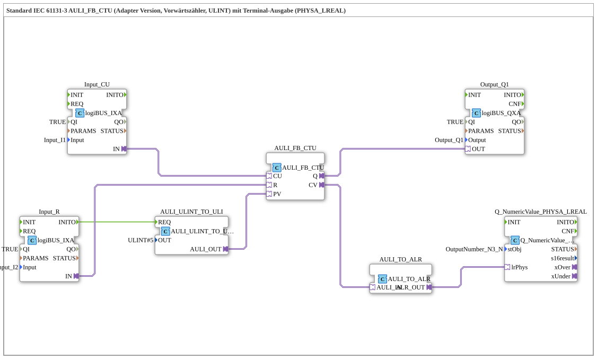

# Exercise_214b_ALR: Standard IEC 61131-3 AULI_FB_CTU (Adapter Version, Up Counter, ULINT) with Terminal Output (PHYSA_LREAL)

* * * * * * * * * *
## Introduction
This exercise implements an up counter (CTU) according to IEC 61131-3 as an adapter version. The counter uses the data type `ULINT`. The current counter value is output to a terminal via a physical output (`PHYSA_LREAL`). The preset value is initially set to 5.
## Function Blocks (FBs) Used

### AULI_FB_CTU
- **Type**: `adapter::iec61131::counters::AULI_FB_CTU`
- **Parameters**: none
- **Event Inputs**: (implicit via adapter connections)
- **Event Outputs**: (implicit)
- **Data Inputs**:
- `CU` (Count Up) – Clock input for counting up
- `R` (Reset) – Resets counter
- `PV` (Preset Value) – Default value, initially `ULINT#5`
- **Data Outputs**:
- `Q` (Output) – becomes `TRUE` when `CV >= PV`
- `CV` (current counter value) – `ULINT`

### AULI_ULINT_TO_ULI
- **Type**: `adapter::conversion::unidirectional::AULI_ULINT_TO_ULI`
- **Parameter**: `OUT = ULINT#5` (static value used as a preset)
- **Event Inputs**:
- `REQ` (Request) – triggers conversion (connected to `Input_R.INITO`)
- **Data Outputs**:
- `AULI_OUT` – sends the converted value to `AULI_FB_CTU.PV`

### Input_CU
- **Type**: `logiBUS::io::DI::logiBUS_IXA`
- **Parameters**:
- `QI = TRUE` (Activation)
- `Input = Input_I1` (Physical Digital Input 1)
- **Data Outputs**:
- `IN` – Adapter output, connected to `AULI_FB_CTU.CU`

### Input_R
- **Type**: `logiBUS::io::DI::logiBUS_IXA`
- **Parameters**:
- `QI = TRUE`
- `Input = Input_I2` (Physical Digital Input 2)
- **Data Outputs**:
- `IN` – Adapter output, connected to `AULI_FB_CTU.R`
- **Event Outputs**:
- `INITO` – Initialization event, connected to `AULI_ULINT_TO_ULI.REQ`

### Output_Q1
- **Type**: `logiBUS::io::DQ::logiBUS_QXA`
- **Parameters**:
- `QI = TRUE`
- `Output = Output_Q1` (Physical Digital Output 1)
- **Data Inputs**:
- `OUT` – Adapter input, connected to `AULI_FB_CTU.Q`

### AULI_TO_AUDI (Instance name `AULI_TO_AUDI`)
- **Type**: `adapter::conversion::unidirectional::AULI_TO_ALR`
- **Parameters**: none
- **Data Inputs**:
- `AULI_IN` – receives the counter value (`AULI_FB_CTU.CV`)
- **Data Outputs**:
- `ALR_OUT` – sends the counter value as `LREAL` to `Q_NumericValue_PHYSA_LREAL`

### Q_NumericValue_PHYSA_LREAL
- **Type**: `isobus::UT::Q::Q_NumericValue_PHYSA_LREAL`
- **Parameters**:
- `stObj = OutputNumber_N3` (reference to the terminal output object)
- **Data Inputs**:
- `lrPhys` – physical `LREAL` value, connected to `AULI_TO_AUDI.ALR_OUT`

## Program Flow and Connections

1. **Initialization**

When the controller starts up, `Input_R.INITO` triggers an event that activates the converter `AULI_ULINT_TO_ULI.REQ`. This converter transforms the static value `ULINT#5` and passes it as a preset (`PV`) to the counter `AULI_FB_CTU`.

2. **Counting Process**

- Each rising edge at the digital input `Input_I1` (connected to `Input_CU`) increments the counter `AULI_FB_CTU` by 1.
- The counter outputs the current count value (`CV`) as `ULINT`.
- When `CV >= PV` (here ≥ 5) is reached, the output `Q` is set to `TRUE`. This activates the digital output `Output_Q1`.

... 3. **Reset**

A signal at digital input `Input_I2` (connected to `Input_R`) resets the counter to 0.

4. **Output to Terminal**

- The counter value (`CV`) is converted into a floating-point number (`LREAL`) by the converter `AULI_TO_AUDI` of type `AULI_TO_ALR`.
- This is passed to the function block `Q_NumericValue_PHYSA_LREAL`, which displays the value on the terminal (object `OutputNumber_N3`).

**Notes:**

- Negative values are possible due to the data type used, `LREAL` (see comment in the network).
- To reduce the event rate, an AX_D_FF (query delay) can be added at high count frequencies (see comment).

## Summary
This exercise demonstrates the application of an IEC 61131-3 up-counter as an adapter function block (FB) with the `ULINT` data type. The counter is controlled via digital inputs, the output switches a digital output, and the current count value is output to a terminal as `LREAL` after type conversion. The preset value is initially set to 5.
