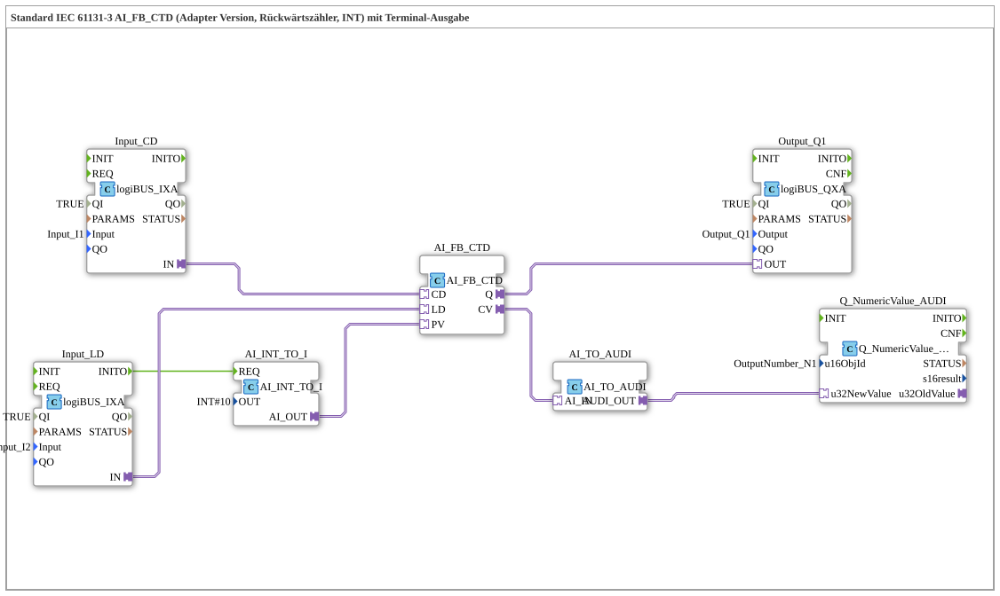

# Exercise_215_AI: Standard IEC 61131-3 AI_FB_CTD (Adapter Version, Down Counter, INT) with Terminal Output



* * * * * * * * * *
## Introduction

This exercise implements a down counter according to IEC 61131-3 with an adapter interface (AI_FB_CTD) and outputs the current counter value to a terminal. The counter is decremented and loaded via digital inputs.

## Function Blocks (FBs) Used

### Sub-Blocks: AI_FB_CTD
- **Type**: adapter::iec61131::counters::AI_FB_CTD
- **Internal FBs Used**: None

- **Parameters**: None

- **Event Output/Input**: CD (Count Down), LD (Load), R (Reset); Q (Overflow Output)

- **Data Output/Input**: CV (current counter value, INT), PV (preset value, INT as input via adapter)

- **Functionality**: The down counter decrements the value of PV with each event at CD. With each event at LD, the counter is reset to the value of PV. Output Q becomes TRUE when the counter value reaches or falls below 0.


``` ### Sub-Blocks: AI_INT_TO_I
- **Type**: adapter::conversion::unidirectional::AI_INT_TO_I
- **Internal Function Blocks Used**: None

- **Parameters**: OUT = INT#10

- **Event Output/Input**: REQ (Input), CNF (Output)

- **Data Output/Input**: AI_OUT (INT)

- **Functionality**: This block provides a constant integer value (here 10) that is used as the preset value (PV) for the counter. It is triggered by the INITO event of the load input.


``` ### Sub-Blocks: Input_CD (Count Down Input)

- **Type**: logiBUS::io::DI::logiBUS_IXA

- **Internal Function Blocks Used**: None

- **Parameters**: QI = TRUE, Input = Input_I1

- **Event Output/Input**: INITO (Initialization), IN (Event Output on Edge)

- **Data Output/Input**: None

- **Functionality**: Reads the digital input I1 of the logiBUS system and outputs an event on the adapter output on a rising edge. This event triggers the CD input of the counter.


``` ### Sub-Blocks: Input_LD (Load Input)
- **Type**: logiBUS::io::DI::logiBUS_IXA
- **Internal Function Blocks Used**: None

- **Parameters**: QI = TRUE, Input = Input_I2

- **Event Output/Input**: INITO (Initialization), IN (Event Output on Edge)

- **Data Output/Input**: None

- **Functionality**: Reads the digital input I2 and outputs an event on a rising edge. This event triggers the LD event at the meter. Simultaneously, the initialization of the PV value is triggered via INITO.


``` ### Sub-Blocks: Output_Q1

- **Type**: logiBUS::io::DQ::logiBUS_QXA

- **Internal Function Blocks Used**: None

- **Parameters**: QI = TRUE, Output = Output_Q1

- **Event Output/Input**: OUT (Event Input), CNF (Acknowledge)

- **Data Output/Input**: None

- **Functionality**: Receives the counter output Q (via adapter) and outputs it as the digital output Q1 of the logiBUS. Q1 becomes active as soon as the counter reaches zero.


### Sub-Blocks: AI_TO_AUDI

- **Type**: adapter::conversion::unidirectional::AI_TO_AUDI

- **Internal Function Blocks Used**: None

- **Parameters**: None

- **Event Output/Input**: REQ (Input), CNF (Output)

- **Data Output/Input**: AI_IN (INT), AUDI_OUT (AUDI)

- **Function**: Converts the integer counter value (CV) to the AUDI format required by the terminal. Note: This block does not support negative numbers, which can be problematic for a down counter.


**Event Output/Input**: REQ (Input), CNF (Output)

**Data Output/Input**: AI_IN (INT), AUDI_OUT (AUDI)

**Functionality**: Converts the integer counter value (CV) to the AUDI format required by the terminal. ### Sub-Blocks: Q_NumericValue_AUDI

- **Type**: isobus::UT::Q::Q_NumericValue_AUDI

- **Internal Function Blocks Used**: None

- **Parameters**: u16ObjId = OutputNumber_N1

- **Event Output/Input**: IN (Input for new value)

- **Data Output/Input**: u32NewValue (AUDI)

- **Functionality**: Receives the converted value via the adapter connection and displays it on the terminal (e.g., visualization) under the object ID OutputNumber_N1.

## Program Flow and Connections

The blocks are wired via adapter connections. Initially, the preset value 10 is provided via AI_INT_TO_I as soon as the load input (Input_LD) triggers an INITO event. The counter starts with PV=10.


**Process**:

1. **Counting**: A rising edge at input I1 (Input_CD) sends an event via the adapter connection to the CD input of AI_FB_CTD. The counter decrements by 1.

2. **Loading**: A rising edge at input I2 (Input_LD) triggers the LD event and resets the counter to the value of PV (10). Simultaneously, the converter AI_INT_TO_I is triggered via INITO to reset the PV value.

3. **Output**: The current counter value (CV) is converted into a terminal format via AI_TO_AUDI and displayed on the visualization (Q_NumericValue_AUDI). The counter's output Q is connected to the digital output Q1.

**Notes from the source code**:

- The AI_TO_AUDI block cannot process negative values. Since a down counter can count below zero, this is a limitation.

- It is recommended to include an AX_D_FF (event flip-flop) to reduce the number of events at the terminal.

## Summary

This exercise teaches how to use an IEC 61131-3 down counter (CTD) in an adapter-based implementation using 4diac. It demonstrates the integration of digital inputs and outputs via logiBUS and the visualization of counter values on a terminal. The learner understands the interaction of events, data conversion, and the limitations of the components used (no negative numbers). This exercise is suitable for advanced users with basic knowledge of 4diac and logiBUS.


---

### 🌐 Related topic subpages on ms-muc-docs.de

* [🌐 Eclipse 4diac IDE & Color Reference on ms-muc-docs.de](https://www.ms-muc-docs.de/iec-61499/eclipse-4diac/)

]