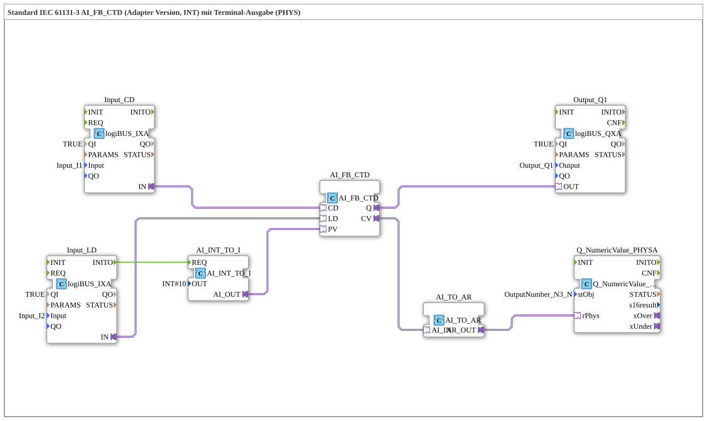

# Exercise_215b_AR: Standard IEC 61131-3 AI_FB_CTD (Adapter Version, INT) with Terminal Output (PHYS)

* * * * * * * * * *
## Introduction

This exercise implements a down counter (CTD) according to IEC 61131-3 as an adapter variant. The counter is controlled via two digital inputs (Count-Down and Load) and outputs a digital output (Q) as well as the current counter value (CV). The counter value is converted into a text representation via a converter and displayed on a terminal (PHYS). The preset value (PV) is permanently set to 10 and supplied to the counter via another adapter.
Learning Objectives:

- Understanding the AI_FB_CTD function block (down counter as an adapter)
- Working with adapter interfaces for data and event transmission
- Data type conversion (INT to adapter, CV to array)
- Controlling logiBUS inputs and outputs
- Outputting numerical values to a terminal

Difficulty Level: Advanced
Prerequisites: Basic knowledge of IEC 61131-3, 4diac IDE, adapter concept

## Function Blocks (FBs) Used

### AI_FB_CTD

- **Type**: `adapter::iec61131::counters::AI_FB_CTD`
- **Internal FBs Used**: None (Basic Function Block)
- **Functionality**: Down counter (countdown) with the adapter interfaces `CD` (count input), `LD` (load preset) `PV` (preset value), `Q` (output, becomes TRUE when CV=0), and `CV` (current counter value).

### AI_INT_TO_I

- **Type**: `adapter::conversion::unidirectional::AI_INT_TO_I`
- **Parameters**:
- `OUT` = `INT#10` (preset value, fixed at 10)
- **Function**: Converts an integer value (here 10) into an adapter output, which is connected to the PV input of the meter.

## AI_INT_TO_I ### Input_CD

- **Type**: `logiBUS::io::DI::logiBUS_IXA`
- **Parameters**:
- `QI` = `TRUE` (Enable)
- `Input` = `Input_I1` (Physical Input 1)
- **Functionality**: Digital input for the CD signal (countdown). The counter is decremented on a rising edge.

### Input_LD

- **Type**: `logiBUS::io::DI::logiBUS_IXA`
- **Parameters**:
- `QI` = `TRUE`
- `Input` = `Input_I2` (physical input 2)
- **Functionality**: Digital input for the LD signal (Load). On a rising edge, the preset value (PV) is loaded into the counter.

### Output_Q1

- **Type**: `logiBUS::io::DQ::logiBUS_QXA`
- **Parameters**:
- `QI` = `TRUE`
- `Output` = `Output_Q1` (Physical Output 1)
- **Function**: Digital output that forwards the counter's Q state (TRUE=CV=0) to a logiBUS output module.

### AI_TO_AR

- **Type**: `adapter::conversion::unidirectional::AI_TO_AR`
- **Function**: Converts the counter's analog adapter value (CV) into an array (AR) expected by the terminal module.

### Q_NumericValue_PHYSA

- **Type**: `isobus::UT::Q::Q_NumericValue_PHYSA`
- **Parameters**:
- `stObj` = `OutputNumber_N3` (references a terminal output object)
- **Functionality**: Displays the passed numeric value (from AI_TO_AR) on the terminal (PHYS).

## Program Flow and Connections

The program flow consists of an event-driven and a data-flow-driven part.

1. **Initialization**: At startup, the converter `AI_INT_TO_I` (`REQ`) is triggered by the event output `INITO` from `Input_LD`. This converts the fixed integer value `10` into an adapter value and passes it to the `PV` input of `AI_FB_CTD`.
2. **Counter Operation**:
- A rising signal at `Input_I1` (CD) is forwarded via `Input_CD` to the `CD` adapter input of the counter. The counter decrements the current value.
- A rising signal at `Input_I2` (LD) triggers `AI_INT_TO_I` again and loads the preset value into the counter.
- The counter's output `Q` is directly connected to `Output_Q1`: As soon as the counter reaches 0, the output is set.
- The current counter value `CV` is converted into an array via `AI_TO_AR` and passed to the terminal block, which displays the numerical value on the screen.
3. **Notes from the comments**:
- Negative values can also occur with this configuration (CD signals when CV=0).
- If necessary, a `AX_D_FF` (edge marker) should be inserted to reduce the number of events if the counter counts too quickly.

## Summary

This exercise demonstrates the implementation of a down counter according to IEC 61131-3 using adapters for connecting logiBUS inputs/outputs, data type conversion, and terminal output. The counter is controlled via two digital inputs and outputs both a binary value and a numerical value. The solution illustrates the modular design with reusable adapter modules and the easy integration of hardware interfaces into the 4diac IDE.

---

### 🌐 Related topic subpages on ms-muc-docs.de

- [🌐 Eclipse 4diac IDE & color reference on ms-muc-docs.de](https://www.ms-muc-docs.de/iec-61499/eclipse-4diac/)

]
