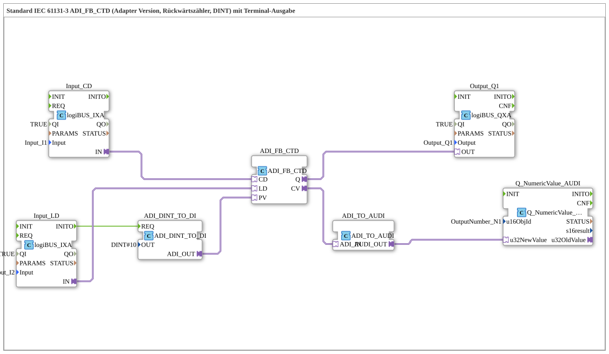

# Exercise_216_ADI: Standard IEC 61131-3 ADI_FB_CTD (Adapter Version, Countdown Counter, DINT) with Terminal Output

* * * * * * * * * *
## Introduction
This exercise implements a countdown counter according to IEC 61131-3 based on the adapter function block `ADI_FB_CTD`. The counter uses the data type `DINT` and outputs the current counter value as well as the counter end signal. To visualize the counter value, it is output via a terminal block, which requires an adapter conversion.
This exercise demonstrates the use of adapter interfaces to connect various function blocks and the limitations of the conversion used.

## Function Blocks Used (FBs)

### ADI_FB_CTD
- **Type**: `adapter::iec61131::counters::ADI_FB_CTD`
- **Parameters**: none
- **Function**: IEC 61131-3 Down Counter (CTD). On each rising edge at input `CD`, the current value (PV) is decremented. When zero is reached, output `Q` is set. The counter is loaded with the value from `PV` via input `LD`.

``` - **Adapter Inputs**: `CD` (count pulse), `LD` (load), `PV` (default value)
- **Adapter Outputs**: `Q` (counter end), `CV` (current counter reading)

### ADI_DINT_TO_DI
- **Type**: `adapter::conversion::unidirectional::ADI_DINT_TO_DI`
- **Parameters**: `OUT = DINT#10`
- **Function**: Converts a constant DINT number (here 10) into a DI adapter interface, which serves as the default value (`PV`) for the counter.

### Input_CD
- **Type**: `logiBUS::io::DI::logiBUS_IXA`
- **Parameters**: `QI = TRUE`, `Input = Input_I1`
- **Function**: Digital input for the count signal (CD). Enabled via physical input I1.

### Input_LD
- **Type**: `logiBUS::io::DI::logiBUS_IXA`
- **Parameters**: `QI = TRUE`, `Input = Input_I2`
- **Function**: Digital input for the load signal (LD). Enabled via physical input I2. The event output `INITO` of this function block starts the initialization of the default value.

### Output_Q1
- **Type**: `logiBUS::io::DQ::logiBUS_QXA`
- **Parameters**: `QI = TRUE`, `Output = Output_Q1`
- **Function**: Digital output for the counter end signal (`Q`). Switches the physical output Q1.

### ADI_TO_AUDI
- **Type**: `adapter::conversion::unidirectional::ADI_TO_AUDI`
- **Parameters**: None
- **Function**: Converts the ADI interface (DINT) to an AUDI interface (Analog Universal Data Interface). **Important:** This conversion does not support negative numbers – the counter value can only be displayed as a positive number or zero.
... ### Q_NumericValue_AUDI

- **Type**: `isobus::UT::Q::Q_NumericValue_AUDI`
- **Parameter**: `u16ObjId = OutputNumber_N1`
- **Function**: Outputs the passed numeric value (from the AUDI interface) to a terminal. The object ID refers to a predefined output address.

## Program Flow and Connections

Control is achieved via event and adapter connections:

1. **Initialization of the Default Value**:

The event output `INITO` of the function block `Input_LD` triggers the function block `ADI_DINT_TO_DI`. This loads the constant `DINT#10` once into `ADI_FB_CTD` (via the adapter connection `ADI_DINT_TO_DI.ADI_OUT` → `ADI_FB_CTD.PV`).

2. **Count Pulses (CD)**:

The adapter output `Input_CD.IN` is connected to the adapter input `ADI_FB_CTD.CD`. Each rising edge at input I1 increments the counter by one.

3. **Load Signal (LD)**:

The adapter output `Input_LD.IN` is connected to the adapter input `ADI_FB_CTD.LD`. A signal at I2 loads the counter with the current default value (10).

4. **Counter End (Q)**:

The adapter output `ADI_FB_CTD.Q` leads to the adapter input `Output_Q1.OUT`. When zero is reached, output Q1 is activated.

5. **Counter Reading Output**:

The adapter output `ADI_FB_CTD.CV` (current counter reading) is converted via `ADI_TO_AUDI` and forwarded to the terminal block `Q_NumericValue_AUDI`. The counter reading appears on the terminal.

**Note**: The comment in the network indicates that the block `ADI_TO_AUDI` cannot process negative numbers. Since the down counter only counts to zero, this case does not occur in this exercise. For more advanced applications, a more suitable conversion would need to be chosen.

**Note**:** ## Summary

This exercise teaches how to use the IEC 61131-3 reverse counter as an adapter module. It demonstrates:

- the use of adapter interfaces to connect digital inputs, counters, and outputs,
- the initialization of a default value via conversion,
- the terminal output of a counter reading using an audio interface,
- the limitations of the conversion used (`ADI_TO_AUDI`) for negative values.

The setup is implemented as a sub-application and can be directly loaded and tested in a 4diac IDE environment.

--

### 🌐 Related topic subpages on ms-muc-docs.de
* [🌐 Eclipse 4diac IDE & color reference on ms-muc-docs.de](https://www.ms-muc-docs.de/iec-61499/eclipse-4diac/)

]