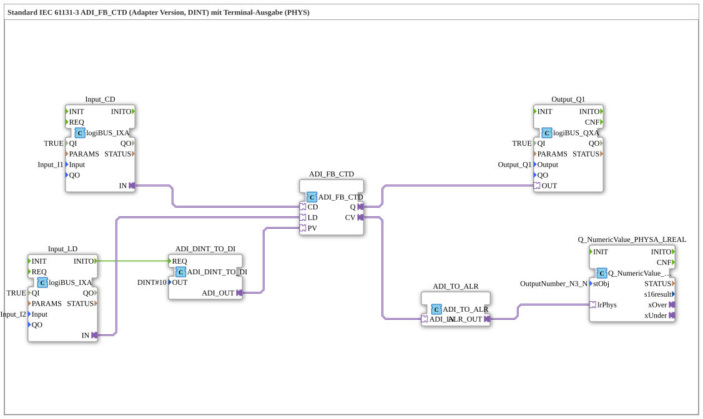

# Exercise_216b_ALR: Standard IEC 61131-3 ADI_FB_CTD (Adapter Version, DINT) with Terminal Output (PHYS)

* * * * * * * * * *
## Introduction
Exercise **Exercise_216b_ALR** implements a down counter according to IEC 61131-3 using an adapter-based function block `ADI_FB_CTD`. The counter value is output to an alphanumeric terminal (PHYS) via an adapter conversion chain. Additionally, a digital output is set when the counter value reaches zero. This exercise illustrates the integration of logiBUS inputs, adapter conversions, and terminal output in a compact sub-application.
## Function Blocks (FBs) Used

### Internal Function Blocks
- **ADI_FB_CTD** (Type: `adapter::iec61131::counters::ADI_FB_CTD`)
- **Description**: Adapter version of an IEC 61131-3 down counter (CTD). The block decrements the current value (`CV`) by 1 on each falling edge at the event input `CD`. The preset value is loaded via the adapter input `PV` as soon as the input `LD` is activated. The output `Q` is set as soon as `CV` reaches the value 0.
- **Parameters**: (no explicit parameters set – uses default values)
- **Event/Data Interfaces**:
- Event Input: `CD` (Count Down), `LD` (Load)
- Adapter Data Input: `PV` (Preset Value, DINT)
- Adapter Data Output: `CV` (Current Value, DINT), `Q` (BOOL)
- **ADI_DINT_TO_DI** (Type: `adapter::conversion::unidirectional::ADI_DINT_TO_DI`)
- **Description**: Converts a DINT value to an adapter data input (DI). A fixed preset value of DINT#10 is provided here.
- **Parameters**: `OUT` = DINT#10
- **Event/Data Interfaces**:
- Event Input: `REQ` (Trigger for output)
- Adapter Data Output: `ADI_OUT` (DINT)
- **Input_CD** (Type: `logiBUS::io::DI::logiBUS_IXA`)
- **Description**: Digital input module for logiBUS that provides the signal of the physical input `Input_I1`.
- **Parameters**: `QI` = TRUE (Qualifier), `Input` = Input_I1
- **Adapter Output**: `IN` (digital information)
- **Input_LD** (Type: `logiBUS::io::DI::logiBUS_IXA`)
- **Description**: Digital input module for logiBUS that provides the signal of the physical input `Input_I2`.
- **Parameters**: `QI` = TRUE, `Input` = Input_I2
- **Adapter Output**: `IN`
- **Event Output**: `INITO` (triggered on initialization)
- **Output_Q1** (Type: `logiBUS::io::DQ::logiBUS_QXA`)
- **Description**: Digital output module for logiBUS that controls the physical output `Output_Q1`.
- **Parameters**: `QI` = TRUE, `Output` = Output_Q1
- **Adapter Input**: `OUT` (digital information)
- **ADI_TO_ALR** (Type: `adapter::conversion::unidirectional::ADI_TO_ALR`)
- **Description**: Converts an adapter data value (DINT) into an alphanumeric format (ALR) suitable for terminal output.
- **No parameters** set.
- **Interfaces**:
- Adapter input: `ADI_IN` (DINT)
- Adapter output: `ALR_OUT` (ALR)
- **Q_NumericValue_PHYSA_LREAL** (Type: `isobus::UT::Q::Q_NumericValue_PHYSA_LREAL`)
- **Description**: Outputs a numeric value (interpreted as LREAL) to a physical terminal. The value is represented by the connected `stObj` (here `OutputNumber_N3`).
- **Parameter**: `stObj` = OutputNumber_N3 (reference to a terminal object)
- **Adapter Input**: `lrPhys` (physical value as LREAL)

## Program Flow and Connections

1. **Initialization**: When the subapplication starts, the function block `Input_LD` becomes active and triggers the event `INITO`. This event triggers `ADI_DINT_TO_DI.REQ`, so the preset value (DINT#10) is applied to the adapter output `ADI_OUT`.

2. **Load Preset**: The preset value is transferred via the adapter connection to input `PV` of the counter `ADI_FB_CTD`. Simultaneously, the event `INITO` activates the load input `LD` of the counter. (The event connection `Input_LD.INITO` only goes to `ADI_DINT_TO_DI.REQ`, not directly to the counter. However, `Input_LD.IN` is connected to `ADI_FB_CTD.LD` – this connection is implemented as an adapter connection and transmits the digital signal. The initialization of `Input_LD` presumably sets the input `LD` to TRUE, so that the counter loads the preset.)

3. **Counting Operation**: The digital input `Input_CD` (pin I1) supplies the counter with the counting pulses via the adapter input `CD`. On each falling edge (or as defined by the adapter), the counter decrements the current value `CV` by 1.

4. **Output Status**: As soon as `CV` reaches 0, the counter sets the output `Q` to TRUE. This is then passed to the physical output Q1 via `Output_Q1`.

5. **Terminal Output**: The current counter value (`CV`) is converted into an alphanumeric format via the adapter `ADI_TO_ALR` and passed to the terminal module `Q_NumericValue_PHYSA_LREAL`. This outputs the value to the configured terminal `OutputNumber_N3`. Note the comment: Negative values are also possible here (due to the counter overflowing below 0).

6. **Notes**: The comment suggests possibly including a `AX_D_FF` (flip-flop) to reduce the event rate. This would be useful for very fast counting pulses to reduce the load on the terminal output.

### Connection Overview (Adapter Connections)

| From (Source) | To (Destination) | Comment |

|--------------|-------------|------------|

| `Input_CD.IN` | `ADI_FB_CTD.CD` | Counting Pulses |

| `Input_LD.IN` | `ADI_FB_CTD.LD` | Load Signal |

| `ADI_FB_CTD.Q` | `Output_Q1.OUT` | Initial status (CV=0) |

| `ADI_FB_CTD.CV` | `ADI_TO_ALR.ADI_IN` | Current counter reading |

| `ADI_TO_ALR.ALR_OUT` | `Q_NumericValue_PHYSA_LREAL.lrPhys` | Terminal output |

| `ADI_DINT_TO_DI.ADI_OUT` | `ADI_FB_CTD.PV` | Preset value |

**Event connection**:

- `Input_LD.INITO` → `ADI_DINT_TO_DI.REQ`

## Summary
This exercise demonstrates the use of an IEC 61131-3 down counter in an adapter-based environment. By combining logiBUS inputs/outputs, DINT conversion, and alphanumeric terminal output, a complete, practical metering circuit is simulated. The user learns how to connect adapters and utilize event-driven controls. Particular emphasis is placed on the correct initialization of the preset value and the output of the meter reading (including negative values) to a terminal.
