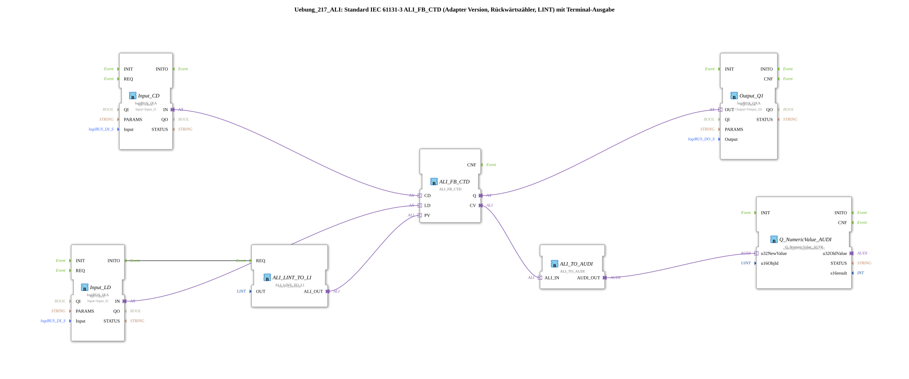

# Exercise_217_ALI: Standard IEC 61131-3 ALI_FB_CTD (Adapter Version, Down Counter, LINT) with Terminal Output

* * * * * * * * * *
## Introduction
This exercise implements an **IEC 61131-3 compliant down counter (CTD) in adapter version** for the LINT (Long Integer) data type. The current counter value is displayed on a terminal. The counter is decremented via a digital input signal **CD** (Count Down). Another digital signal **LD** (Load) loads the counter with a predefined preset value. Once the counter value reaches 0, the output **Q** is set.
The preset value is obtained from a constant block (LINT#10) during initialization and passed to the counter via an ALI-LINT-to-LI converter. The counter reading is passed through an ALI-to-AUDI converter to a numeric display module (Q_NumericValue_AUDI) and displayed on the terminal.

> **Note:** The ALI_TO_AUDI converter does not support negative numbers – this must be taken into account when selecting preset values.

## Function Blocks Used (FBs)

### ALI_FB_CTD
- **Type:** `adapter::iec61131::counters::ALI_FB_CTD`
- **Internal FBs Used:** None (standalone counter block)
- **Parameters:**
- Event Inputs: CD, LD, R (not used)
- Event Outputs: Q
- Data Inputs:
- CD (Adapter) – Count Down Pulse
- LD (Adapter) – Load Signal
- PV (Adapter: LINT) – Preset Value
- Data Outputs:
- CV (Adapter: LINT) – Current Counter Value
- Q (Adapter: BOOL) – Output becomes TRUE when CV = 0
- **Functionality:** A pulse at event input CD decrements the current counter value CV by 1. A pulse at LD loads the value from PV into CV. When CV = 0, output Q is set.

### ALI_LINT_TO_LI
- **Type:** `adapter::conversion::unidirectional::ALI_LINT_TO_LI`
- **Internal Function Blocks Used:** None
- **Parameters:**
- Parameter: `OUT` = `LINT#10` (Output value is provided as a constant)
- Event Input: REQ
- Event Output: CNF
- Data Input: IN (LINT) – not connected, as it is constant via parameters
- Data Output: ALI_OUT (Adapter) – provides the LINT value
- **Functionality:** Upon a request (REQ), provides the parameterized LINT value (here 10) at output ALI_OUT. Serves as the source for the preset value PV.

```
### Input_CD
- **Type:** `logiBUS::io::DI::logiBUS_IXA`
- **Internal Function Blocks Used:** None
- **Parameters:**
- `QI` = `TRUE` (Input enabled)
- `Input` = `Input_I1` (Physical input name)
- **Functionality:** Converts a digital signal from the fieldbus (Input_I1) into an adapter event output IN. Used to supply the CD (Count Down) signal to the counter.

### Input_LD
- **Type:** `logiBUS::io::DI::logiBUS_IXA`
- **Parameters:**
- `QI` = `TRUE`
- `Input` = `Input_I2`
- **Functionality:** Similar to Input_CD, it provides the load signal (LD) for the counter.

### Output_Q1
- **Type:** `logiBUS::io::DQ::logiBUS_QXA`
- **Parameters:**
- `QI` = `TRUE`
- `Output` = `Output_Q1`
- **Functionality:** Receives the digital output Q of the counter and makes it available as a fieldbus output (Output_Q1).

### ALI_TO_AUDI
- **Type:** `adapter::conversion::unidirectional::ALI_TO_AUDI`
- **Internal Function Blocks Used:** None
- **Parameters:** None
- **Functionality:** Converts the ALI adapter (LINT) to an AUDI adapter (UINT?). The converted value is passed to the numeric display block. Since the converter only processes positive values, negative counter readings cannot be displayed.

### Q_NumericValue_AUDI
- **Type:** `isobus::UT::Q::Q_NumericValue_AUDI`
- **Parameters:**
- `u16ObjId` = `OutputNumber_N1` (identifier of the terminal output element)
- **Functionality:** Receives an AUDI adapter with a numeric value and displays it on the connected terminal under the object ID OutputNumber_N1.

## Program Flow and Connections

The following diagram shows the logical data and event flow:

- **Initialization:** At startup (INITO event of Input_LD), the function block ALI_LINT_TO_LI is triggered via the event input REQ. This outputs the constant value LINT#10 at ALI_OUT. This is connected to the PV input of the counter.
- **Loading the Preset Value:** A pulse at Input_LD (input Input_I2) triggers the event output INITO and simultaneously, via the IN adapter, the counter's charging signal LD. The counter adopts the value from PV and sets CV = 10.
- **Count Down:** A pulse at Input_CD (input Input_I1) affects the counter's CD adapter. Each pulse decrements CV by 1.
- **Counter Reading Output:** The current counter reading CV is forwarded to ALI_TO_AUDI via the CV adapter. This converts the value to the AUDI adapter and passes it to Q_NumericValue_AUDI, which displays it on the terminal.
- **Output Q:** When CV = 0, the counter sets output Q. This is output as a fieldbus signal (Output_Q1) via Output_Q1.

### Connection List (Adapter and Event Connections)
- **Event Connection:** `Input_LD.INITO` → `ALI_LINT_TO_LI.REQ`
- **Adapter Connections:**
- `Input_CD.IN` → `ALI_FB_CTD.CD`
- `Input_LD.IN` → `ALI_FB_CTD.LD`
- `ALI_FB_CTD.Q` → `Output_Q1.OUT`
- `ALI_FB_CTD.CV` → `ALI_TO_AUDI.ALI_IN`
- `ALI_TO_AUDI.AUDI_OUT` → `Q_NumericValue_AUDI.u32NewValue`
- `ALI_LINT_TO_LI.ALI_OUT` → `ALI_FB_CTD.PV`

## Summary

This exercise implements a classic down counter (CTD) according to IEC 61131-3 using an adapter architecture. Participants will learn:

- Using a counter function block with the events CD and LD.
- Initializing a preset value via a separate conversion block (ALI_LINT_TO_LI).
- Forwarding counter readings to a terminal output (Q_NumericValue_AUDI), taking into account the limitations of the ALI_TO_AUDI converter (no negative numbers).
- Connecting adapters and events in a sub-application network.

The difficulty level is **medium**. Prior knowledge of the 4diac IDE and a basic understanding of event/data flows and adapters are recommended. The exercise can be started directly after importing the library and creating a suitable system.

---

### 🌐 Related topic subpages on ms-muc-docs.de
* [🌐 Eclipse 4diac IDE & Color Reference on ms-muc-docs.de](https://www.ms-muc-docs.de/iec-61499/eclipse-4diac/)
