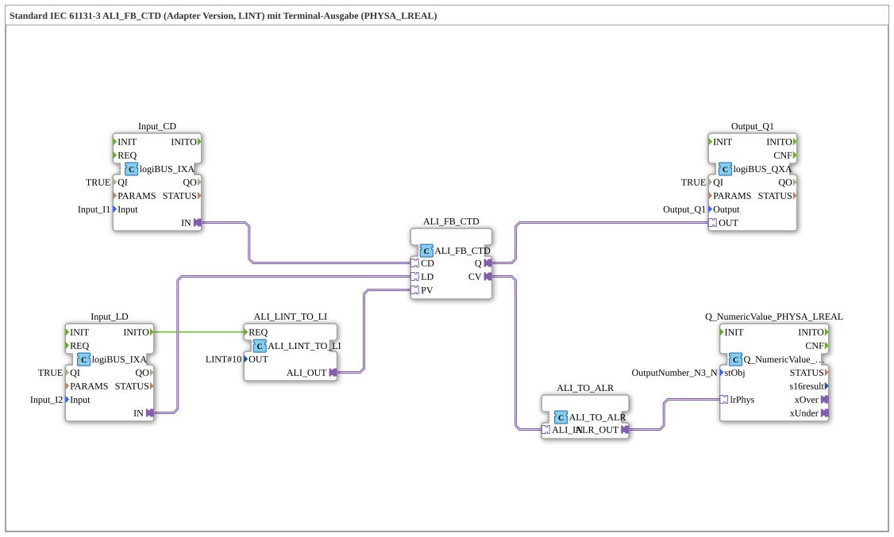

# Exercise_217b_ALR: Standard IEC 61131-3 ALI_FB_CTD (Adapter Version, LINT) with Terminal Output (PHYSA_LREAL)

* * * * * * * * * *
## Introduction
This exercise demonstrates the use of an IEC 61131-3 compliant down counter (CTD) in adapter format (ALI) with the LINT data type. The counter value is decremented via an input button, and another button loads a predefined preset value. The current counter value is output to a terminal via a conversion chain (LINT → LREAL). The counter output (Q) switches a digital output.
This exercise illustrates the use of adapter interfaces, signal conversion between different data types, and the connection of a numeric terminal output.

## Function Blocks (FBs) Used

### ALI_FB_CTD
- **Type**: `adapter::iec61131::counters::ALI_FB_CTD`
- **Description**: IEC 61131-3 Down Counter (CTD) for the LINT data type. It has two event inputs (`CD`, `LD`), one data input for the preset value (`PV`), and one event output (`Q`) for the counter result. The counter value is provided at the adapter output `CV`.

### ALI_LINT_TO_LI
- **Type**: `adapter::conversion::unidirectional::ALI_LINT_TO_LI`
- **Description**: Converts a LINT value to a LINT adapter value (LI). Used to pass the preset value (LINT#10) to the counter.
- **Parameters**: `OUT` = `LINT#10` (preset counter end value)

### Input_CD (logiBUS_IXA)
- **Type**: `logiBUS::io::DI::logiBUS_IXA`
- **Description**: Digital input block for the logiBUS. Detects the state of the button `Input_I1`, which triggers the decrement (`CD`).

**Parameters**: `OUT` = `LINT#10` (preset counter end value)

**Type**: `logiBUS::io::DI::logiBUS_IXA`

**Description**: Digital input block for the logiBUS. Detects the state of the button `Input_I1`, which triggers the decrement (`CD`).

**Parameters**: `CD` - **Parameters**: `QI` = `TRUE`, `Input` = `Input_I1`

### Input_LD (logiBUS_IXA)
- **Type**: `logiBUS::io::DI::logiBUS_IXA`
- **Description**: Second digital input for the button `Input_I2`, which triggers the loading of the preset value (`LD`).
- **Parameters**: `QI` = `TRUE`, `Input` = `Input_I2`

### Output_Q1 (logiBUS_QXA)
- **Type**: `logiBUS::io::DQ::logiBUS_QXA`
- **Description**: Digital output module for the logiBUS. Outputs the state of `Q` (counter reading ≤ 0) to `Output_Q1`.
- **Parameters**: `QI` = `TRUE`, `Output` = `Output_Q1`

### ALI_TO_ALR
- **Type**: `adapter::conversion::unidirectional::ALI_TO_ALR`
- **Description**: Converts an ALI adapter (integer) to an ALR adapter (real). Allows passing the LINT counter value to a terminal output that expects an LREAL value.

### Q_NumericValue_PHYSA_LREAL
- **Type**: `isobus::UT::Q::Q_NumericValue_PHYSA_LREAL`
- **Description**: Terminal output block for numeric values of type `PHYSA_LREAL`. Displays the converted counter value on the associated terminal object `OutputNumber_N3`.
- **Parameters**: `stObj` = `OutputNumber_N3`

## Program Flow and Connections

1. **Initialization**: Upon startup (e.g., after a reset), `Input_LD` sends the event `INITO` to `ALI_LINT_TO_LI`, which provides the preset value `LINT#10`.

2. **Load Preset**: Pressing the button `Input_I2` generates an event on the adapter `Input_LD.IN`. This event is connected to the load input `LD` of the counter `ALI_FB_CTD`. Simultaneously, the preset value supplied by `ALI_LINT_TO_LI` is transferred via the adapter `ALI_OUT` to the input `PV` of the counter. The counter then accepts the value `10`.

... 3. **Decrement**: Each key press on `Input_I1` (input `Input_CD`) generates an event that is routed via the adapter `IN` to the counter's decrement input `CD`. The counter reading decreases by 1.

4. **Output Q**: When the counter reading is ≤ 0, the adapter output `Q` of the counter becomes active. This signal is then passed to the digital output `Output_Q1` (switching a load or display).

5. **Displaying the Counter Value**: The current counter value `CV` (type LINT) is displayed on the terminal as a floating-point number via the conversion chain `ALI_TO_ALR` and `Q_NumericValue_PHYSA_LREAL`. The comments indicate that negative values can also occur here and that, in the case of rapid event sequences, an AX_D_FF can be useful to reduce terminal updates.

**Connection Overview** (Adapter and Event Connections):

| Source | Destination | Type |

|-------------------------------|--------------------------------|-----------------|

| `Input_CD.IN` | `ALI_FB_CTD.CD` | Adapter (IN) |

| `Input_LD.IN` | `ALI_FB_CTD.LD` | Adapter (IN) |

ALI_FB_CTD.Q` | `Output_Q1.OUT` | Adapter (OUT) |

ALI_FB_CTD.CV` | `ALI_TO_ALR.ALI_IN` | Adapter |

ALI_TO_ALR.ALR_OUT` | `Q_NumericValue_PHYSA_LREAL.lrPhys` | Adapter |

ALI_LINT_TO_LI.ALI_OUT` | `ALI_FB_CTD.PV` | Adapter |

Input_LD.INITO` (Event) | `ALI_LINT_TO_LI.REQ` | Event |

## Summary

Exercise **217b_ALR** teaches the safe handling of an IEC 61131-3 down counter in adapter format, signal conversion between integer and floating-point types, and the connection of a terminal output. It demonstrates the typical interconnection of logiBUS inputs/outputs with function blocks and prepares the user for the implementation of counter-based control tasks.

Exercise **217b_ALR** teaches the safe handling of an IEC 61131-3 down counter in adapter format, signal conversion between integer and floating-point types, and the connection of a terminal output. It demonstrates the typical wiring of logiBUS inputs/outputs with function blocks and prepares the user for the implementation of counter-based control tasks.

`` **Learning Objectives:**

- Understanding the IEC 61131-3 CTD counter (down counter) with LINT data type
- Working with adapter interfaces (ALI, LI, ALR)
- Conversion between data types (LINT → LREAL)
- Integration of a numeric terminal output
- Detection of event and data flows in an ST network

**Difficulty Level:** Advanced
**Prerequisites:** Basic knowledge of the 4diac IDE, working with logiBUS blocks, event chaining.

---

### 🌐 Related topic subpages on ms-muc-docs.de
* [🌐 Eclipse 4diac IDE & color reference on ms-muc-docs.de](https://www.ms-muc-docs.de/iec-61499/eclipse-4diac/)

]
