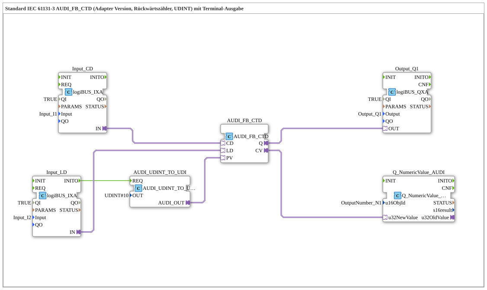

# Exercise_218_AUDI: Standard IEC 61131-3 AUDI_FB_CTD (Adapter Version, Down Counter, UDINT) with Terminal Output

* * * * * * * * * *
## Introduction
This exercise implements an IEC 61131-3 compliant down counter (AUDI_FB_CTD) with a UDINT data type. The counter value is output via a terminal block. A separate conversion block sets the initial value (preset value) to 10. The exercise demonstrates the use of adapter-based function blocks and their interaction with input/output modules as well as a numeric terminal display.
## Function Blocks (FBs) Used
- **AUDI_FB_CTD** – Type: `adapter::iec61131::counters::AUDI_FB_CTD`
- IEC 61131-3 compliant down counter (CTD). Each event at input `CD` (Count Down) decrements the internal counter. When the counter reaches zero, output `Q` is set. Input `LD` loads the current counter value from `PV`.
- **AUDI_UDINT_TO_UDI** – Type: `adapter::conversion::unidirectional::AUDI_UDINT_TO_UDI`
- Converts a UDINT value (here fixed to `UDINT#10`) and outputs it at its output `AUDI_OUT`. This value is used as the counter's preset value (`PV`).

``` - **Input_CD** – Type: `logiBUS::io::DI::logiBUS_IXA`

- Digital input connected to `Input_I1`. When TRUE, an event is generated at output `IN`, which decrements the counter.
- **Input_LD** – Type: `logiBUS::io::DI::logiBUS_IXA`
- Digital input connected to `Input_I2`. When TRUE, it triggers the initialization of the preset value via its event output `INITO` and then loads the counter via the adapter input `LD`.
- **Output_Q1** – Type: `logiBUS::io::DQ::logiBUS_QXA`
- Digital output connected to `Output_Q1`. Receives the value of `AUDI_FB_CTD.Q` and outputs it as a binary signal.
- **Q_NumericValue_AUDI** – Type: `isobus::UT::Q::Q_NumericValue_AUDI`
- Terminal output block for numeric values. Receives the current counter value (`CV`) and displays it on the associated object `OutputNumber_N1`.

## Program Flow and Connections

**Event and Data Connections:**

1. The input `Input_LD` (pin `Input_I2`) generates an event on a rising edge at the output `IN`. This event is forwarded to the conversion block `AUDI_UDINT_TO_UDI.REQ` via the event connection `Input_LD.INITO`.

2. Subsequently, `AUDI_UDINT_TO_UDI` outputs the pre-calculated UDINT value (10) at its output `AUDI_OUT`. This value is then routed via an adapter connection to the input `PV` of `AUDI_FB_CTD`.

3. Simultaneously, the adapter input `Input_LD.IN` is directly connected to the counter's input `LD` (adapter connection). This loads the preset value (10) into the counter.

3. 4. The input `Input_CD` (pin `Input_I1`) outputs a signal at its output `IN`, which is connected via an adapter to the counter's input `CD`. Each event decrements the counter reading by 1.

5. The counter output `Q` is passed via an adapter to the digital output `Output_Q1.OUT`. `Q` becomes TRUE once the counter reading reaches 0.

6. The current counter reading (`CV`) is sent via an adapter to the numeric terminal output `Q_NumericValue_AUDI.u32NewValue` and displayed on the terminal.

``` **Learning Objectives:**

- Understanding the IEC 61131-3 Down Counter (CTD) as an adapter block.
- Working with event and adapter connections in 4diac.
- Initializing counter values using conversion blocks.
- Visualizing values on a terminal.

**Difficulty Level:** Medium

**Required Prior Knowledge:** Basic PLC programming knowledge, familiarity with the 4diac IDE, understanding of event and data flows.

**Procedure:**

- Import the exercise into the 4diac IDE.
- Assign the inputs/outputs to the corresponding real or simulated hardware pins.
- Start the application and observe its behavior: Pressing `I2` resets the counter to 10. Pressing `I1` counts down until it reaches 0 – then `Q1` lights up. The current counter reading is displayed in the terminal.

## Summary

Exercise 218 demonstrates a complete IEC 61131-3 down counter with a UDINT data type, which communicates with digital inputs and outputs, as well as a terminal output, via adapter connections. The preset value is provided by a separate conversion block. The implementation shows typical patterns for using counters in automation technology with the 4diac IDE.

---

### 🌐 Related topic subpages on ms-muc-docs.de
* [🌐 Eclipse 4diac IDE & Color Reference on ms-muc-docs.de ](https://www.ms-muc-docs.de/iec-61499/eclipse-4diac/)

]
