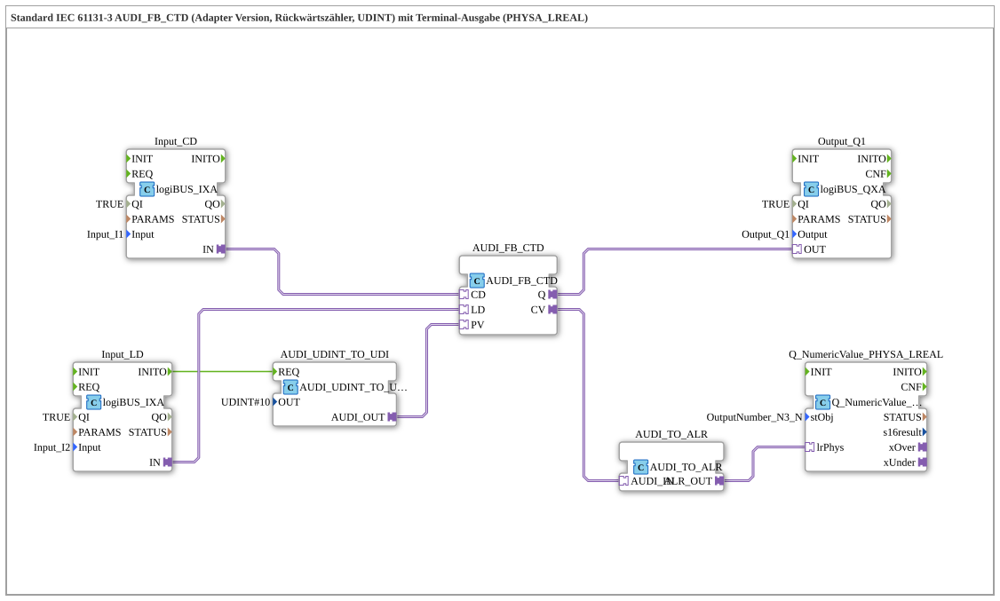

# Exercise_218b_ALR: Standard IEC 61131-3 AUDI_FB_CTD (Adapter Version, Down Counter, UDINT) with Terminal Output (PHYSA_LREAL)

* * * * * * * * * *
This exercise implements a **down counter (CTD)** according to IEC 61131-3 using an **AUDI_FB_CTD** (adapter version, data type **UDINT**). The current counter value is output to **PHYSA_LREAL** via a terminal. Additionally, a digital output (**Output_Q1**) is provided, indicating the counter's status (Q).
The implementation also allows **negative count values** – a corresponding message on the network indicates this. To reduce the event rate during rapid counting pulses, an **AX_D_FF** (flip-flop) could optionally be implemented.
---

## Function Blocks Used (FBs)

## Introduction

### Sub-Block: `AUDI_FB_CTD`

- **Type**: `adapter::iec61131::counters::AUDI_FB_CTD`
- **Internal FBs Used** (no other internal FBs)
- **Parameters**: No custom parameters (all data is connected via adapters)
- **Event Inputs/Outputs**:
- *Inputs*: CD (Count Down), LD (Load)
- *Outputs*: Q (Counter Status)
- **Data Inputs/Outputs**:
- *Inputs*: PV (Preset Value, UDINT)
- *Outputs*: CV (Current Value, UDINT)
- **Functionality**:

The block decrements the internal counter by one on every positive edge event at the **CD** input. When an event occurs at input **LD**, the counter is loaded with the value of **PV**. Output **Q** becomes active as soon as the counter value is zero or less. The current counter value is available at **CV**.

### Sub-module: `AUDI_UDINT_TO_UDI`

- **Type**: `adapter::conversion::unidirectional::AUDI_UDINT_TO_UDI`
- **Internal Function Blocks Used**: None
- **Parameters**:
- `OUT = UDINT#10` (fixed preset value 10)
- **Event Inputs/Outputs**:
- *Input*: REQ (Request)
- *Output*: CNF (Acknowledge)
- **Data Inputs/Outputs**:
- *Output*: AUDI_OUT (Output value, UDINT)
- **Functionality**:

When an event occurs at the **REQ** input, the parameterized UDINT value (here 10) is forwarded to the output `AUDI_OUT`. This value serves as the initial preset value for the countdown counter.

---

### Sub-Block: `Input_CD`

- **Type**: `logiBUS::io::DI::logiBUS_IXA`
- **Internal Function Blocks Used**: None
- **Parameters**:
- `QI = TRUE` (Qualifier – Input Active)
- `Input = Input_I1` (Physical Input Channel)
- **Event Inputs/Outputs**:
- *Output*: INITO (Initialization Complete)
- **Data Inputs/Outputs**:
- *Output*: IN (Adapter Output for the Counting Pulse)
- **Functionality**:

This block provides the digital input **Input_I1** (e.g., push button or sensor) as an adapter interface. When activated, the signal is forwarded at output `IN` and triggers a **CD** event on the connected counter.

### Sub-Block: `Input_LD`

- **Type**: `logiBUS::io::DI::logiBUS_IXA`
- **Internal Function Blocks Used**: None
- **Parameters**:
- `QI = TRUE`
- `Input = Input_I2` (Physical Input Channel)
- **Event Inputs/Outputs**:
- *Output*: INITO (Initialization Complete)
- **Data Inputs/Outputs**:
- *Output*: IN (Adapter Output for Loading)
- **Functionality**:

Identical to `Input_CD`, but connected to **Input_I2**. A signal at this input loads the counter preset value.

---

### Sub-Block: `Output_Q1`

- **Type**: `logiBUS::io::DQ::logiBUS_QXA`
- **Internal Function Blocks Used**: None
- **Parameters**:
- `QI = TRUE`
- `Output = Output_Q1` (physical output channel)
- **Event Inputs/Outputs**:
- *Input*: OUT (adapter input for the output signal)
- **Data Inputs/Outputs**:
- *Input*: (via adapter)
- **Functionality**:

This block sets the digital output **Output_Q1** to the value present at the adapter input `OUT`. It is used to display the counter status (Q).

### Sub-Block: `AUDI_TO_ALR`

- **Type**: `adapter::conversion::unidirectional::AUDI_TO_ALR`
- **Internal Function Blocks Used**: None
- **Parameters**: No custom parameters
- **Event Inputs/Outputs**: (No events; pure data conversion)
- **Data Inputs/Outputs**:
- *Input*: AUDI_IN (UDINT value)
- *Output*: ALR_OUT (physical LREAL value)
- **Functionality**:

This block converts the current counter value (UDINT) into a physical LREAL value suitable for terminal output. It allows the counter value to be displayed as a real number, including negative values.

---

### Sub-Block: `Q_NumericValue_PHYSA_LREAL`

- **Type**: `isobus::UT::Q::Q_NumericValue_PHYSA_LREAL`
- **Internal Function Blocks Used**: None
- **Parameters**:
- `stObj = OutputNumber_N3` (reference to the terminal output object)
- **Event Inputs/Outputs**: (no events)
- **Data Inputs/Outputs**:
- *Input*: lrPhys (physical LREAL value)
- **Functionality**:

The block receives the converted LREAL value and outputs it to the terminal (OutputNumber_N3). It serves as the link to the graphical/numerical display of the exercise.

---

1. **Initialization**

After the system starts, the function block `Input_LD` is initialized. This generates a `INITO` event, which triggers the function block `AUDI_UDINT_TO_UDI` (`REQ`). This block passes the fixed value **UDINT#10** to the counter's preset input.

2. **Counting Operation**
- Each positive signal at **Input_I1** (→ `Input_CD`) generates a **CD** event at the counter → the counter value is decremented by 1.
- A signal at **Input_I2** (→ `Input_LD`) generates an **LD** event → the counter is reset to the last loaded preset value (initial 10).
3. **Outputs**
- The counter output **Q** is connected to the digital output **Output_Q1** via an adapter. The output lamp will then light up when the counter is ≤ 0.
- The current counter value **CV** is converted to an LREAL value via `AUDI_TO_ALR` and output to the terminal (OutputNumber_N3) by `Q_NumericValue_PHYSA_LREAL`.
4. **Notes from the Comments**
- *“Negative values are possible here!”* – The counter can go below zero with continued CD events. The terminal output also displays negative LREAL values.
- *“If necessary, add an AX_D_FF here to reduce the number of events.”* – For very fast pulses, a preceding flip-flop can dampen the event rate and prevent unwanted counts.

`` **Connection Overview (Excerpt from the Network):**

- `Input_CD.IN` → `AUDI_FB_CTD.CD`
- `Input_LD.IN` → `AUDI_FB_CTD.LD`
- `AUDI_FB_CTD.Q` → `Output_Q1.OUT`
- `AUDI_FB_CTD.CV` → `AUDI_TO_ALR.AUDI_IN`
- `AUDI_TO_ALR.ALR_OUT` → `Q_NumericValue_PHYSA_LREAL.lrPhys`
- Event: `Input_LD.INITO` → `AUDI_UDINT_TO_UDI.REQ`

---

`` **Learning Objectives:**

- Design and parameterization of an adapter-based CTD function block
- Integration of digital inputs/outputs via logiBUS adapters
- Data conversion (UDINT → LREAL) for output purposes
- Detection of problems at high event rates and solutions (AX_D_FF)

**Difficulty Level:** Medium
**Prerequisites:** Basic knowledge of the 4diac IDE, working with IEC components and adapter connections.

---

* [🌐 Eclipse 4diac IDE & color reference on ms-muc-docs.de](https://www.ms-muc-docs.de/iec-61499/eclipse-4diac/)

]

## Program Flow and Connections

## Summary

### 🌐 Passende Themen-Unterseiten auf ms-muc-docs.de