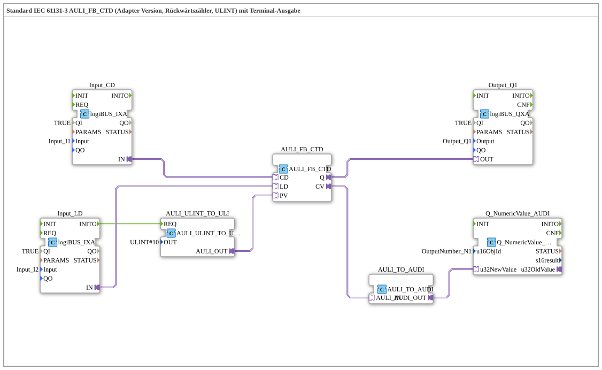

# Exercise_219_AULI: Standard IEC 61131-3 AULI_FB_CTD (Adapter Version, Countdown Counter, ULINT) with Terminal Output

* * * * * * * * * *
## Introduction
This exercise implements a **countdown counter** according to IEC 61131-3 (type `CTD`) in **adapter format**. The counter uses the **ULINT** (Unsigned Long Integer) data type and outputs the current counter value to a terminal (e.g., system display). Additionally, a digital output is set as soon as the counter value reaches zero.
All functionality is encapsulated in a sub-application (SubApp) that is connected to the hardware via logiBUS inputs and outputs.

## Function Blocks (FBs) Used

The subapp contains the following internal function blocks:

### FB: AULI_FB_CTD
- **Type**: `adapter::iec61131::counters::AULI_FB_CTD`
- **Description**: Core block – the actual countdown counter. It has the interfaces typical for a CTD:
- **Event Inputs**: – (automatically controlled by the adapter connections)
- **Data Inputs**: `CD` (Count-Down Pulse), `LD` (Load Start Value), `PV` (Preset Value, ULINT)
- **Data Outputs**: `Q` (Output Signal = TRUE if Counter Value = 0), `CV` (Current Counter Value, ULINT)
- **Parameters**: no additional parameters

### FB: AULI_ULINT_TO_ULI
- **Type**: `adapter::conversion::unidirectional::AULI_ULINT_TO_ULI`
- **Description**: Converts a constant ULINT value (10) into The format `ULI` (required by the CTD function block).
- **Parameters**: `OUT` = `ULINT#10` (fixed value, used as a preset value)
- **Event Input**: `REQ` (triggered by `Input_LD.INITO`)
- **Data Output**: `AULI_OUT` (connected to `AULI_FB_CTD.PV`)

### FB: Input_CD
- **Type**: `logiBUS::io::DI::logiBUS_IXA`
- **Description**: Digital input for the signal `CD` (Count Down). Reads the physical input `Input_I1`.
- **Parameters**: `QI` = `TRUE` (initialization), `Input` = `Input_I1`
- **Adapter output**: `IN` (connected to `AULI_FB_CTD.CD`)

### FB: Input_LD
- **Type**: `logiBUS::io::DI::logiBUS_IXA`
- **Description**: Digital input for the signal `LD` (load). Reads the physical input `Input_I2`.
- **Parameters**: `QI` = `TRUE`, `Input` = `Input_I2`
- **Adapter Output**: `IN` (connected to `AULI_FB_CTD.LD`)
- **Event Output**: `INITO` (triggers the conversion of the preset value)

### FB: Output_Q1
- **Type**: `logiBUS::io::DQ::logiBUS_QXA`
- **Description**: Digital output. Activates when the counter reaches zero (Q signal of the CTD).
- **Parameters**: `QI` = `TRUE`, `Output` = `Output_Q1`
- **Adapter Input**: `OUT` (connected to `AULI_FB_CTD.Q`)

### FB: AULI_TO_AUDI
- **Type**: `adapter::conversion::unidirectional::AULI_TO_AUDI`
- **Description**: Converts the current counter reading (`CV`, type AULI) to the AUDI type, which is required for terminal output.
- **Adapter Input**: `AULI_IN` (connected to `AULI_FB_CTD.CV`)
- **Adapter Output**: `AUDI_OUT` (connected to `Q_NumericValue_AUDI.u32NewValue`)

### FB: Q_NumericValue_AUDI
- **Type**: `isobus::UT::Q::Q_NumericValue_AUDI`
- **Description**: Function block for displaying a numeric value in the terminal. It receives the current counter value and displays it on the assigned output object.

### FB: Q_NumericValue_AUDI
- **Type**: `isobus::UT::Q::Q_NumericValue_AUDI`
- **Description**: Function block for displaying a numeric value in the terminal. It receives the current counter value and displays it on the assigned output object.

**Adapter Output**: `AULI_IN` (connected to `AULI_FB_CTD.CV`)

**Adapter Output**: `AUDI_OUT` (connected to `Q_NumericValue_AUDI.u32NewValue`)

**FB: Q_NumericValue_AUDI
**Type**: `isobus::UT::Q::Q_NumericValue_AUDI`
**Description**: **Function block for displaying a numeric value in the terminal. It receives the current counter value and displays it on the assigned output object.**

**Adapter Output**: `AULI_IN` (connected to `AULI_FB_CTD.CV`)
**Adapter Output**: `AUDI_OUT` (connected to `Q_NumericValue_AUDI.u32NewValue`)

**FB: Q_NumericValue_AUDI - **Parameters**: `u16ObjId` = `OutputNumber_N1` (Terminal output object)

- **Data input**: `u32NewValue` (connected to `AULI_TO_AUDI.AUDI_OUT`)

## Program flow and connections

1. **Initialization**:

At startup, the event `Input_LD.INITO` triggers the function block `AULI_ULINT_TO_ULI`. This delivers the fixed preset value 10 (ULINT) to the counter's data input `PV`.

2. **Loading the counter**:

A rising edge at the digital input `Input_I2` (LD) loads the counter with the preset value. The current counter value is set to 10.

3. **Count Down**:

Each rising edge at the digital input `Input_I1` (CD) decrements the counter value by 1, as long as the value is greater than 0.

4. **Counter Value Output**:

The current counter value (`CV`) is output to the terminal (object `OutputNumber_N1`) via the conversion chain `AULI_TO_AUDI` → `Q_NumericValue_AUDI`.

5. **Signal at Zero**:

As soon as the counter value reaches 0, the CTD block sets the output `Q` to TRUE. This activates the digital output `Output_Q1`.

**Summary of Connections (Adapter and Event Connections):**

| Source | Destination | Type |

|--------|------|-----|

| `Input_CD.IN` | `AULI_FB_CTD.CD` | Adapter |

| `Input_LD.IN` | `AULI_FB_CTD.LD` | Adapter |

| `AULI_FB_CTD.Q` | `Output_Q1.OUT` | Adapter |

| `AULI_FB_CTD.CV` | `AULI_TO_AUDI.AULI_IN` | Adapter |

| `AULI_TO_AUDI.AUDI_OUT` | `Q_NumericValue_AUDI.u32NewValue` | Adapter |

| `AULI_ULINT_TO_ULI.AULI_OUT` | `AULI_FB_CTD.PV` | Adapter |

| `Input_LD.INITO` | `AULI_ULINT_TO_ULI.REQ` | Event |

## Summary

**Learning Objectives** of this exercise:

- Understand the structure and function of an IEC 61131-3 down counter (CTD) in adapter format.
- Integrate digital inputs and outputs via logiBUS.
- Convert data types for communication between modules.
- Output process values to a terminal (ISOBUS-based).

**Difficulty Level**: Medium

**Prerequisites**: Basic knowledge of the 4diac IDE, working with logiBUS I/O modules, basic data conversion.

**Starting the Exercise**:

- The subapp can be inserted into a 4diac project and loaded onto a suitable controller (with logiBUS connectivity and a terminal).
- The inputs `Input_I1` (CD) and `Input_I2` (LD) must be connected to pushbuttons or a signal generator.
- The output `Output_Q1` and the terminal object `OutputNumber_N1` display the results.

--

### 🌐 Related topic subpages on ms-muc-docs.de
* [🌐 Eclipse 4diac IDE & color reference on ms-muc-docs.de ](https://www.ms-muc-docs.de/iec-61499/eclipse-4diac/)

]
