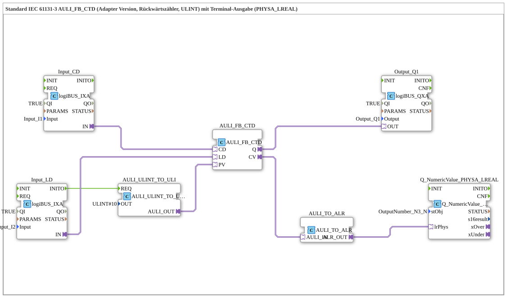

# Exercise_219b_ALR: Standard IEC 61131-3 AULI_FB_CTD (Adapter Version, Countdown Counter, ULINT) with Terminal Output (PHYSA_LREAL)

* * * * * * * * * *
## Introduction

This exercise implements a countdown counter (CTD) according to IEC 61131-3 as an adapter version. The counter processes ULINT values and outputs the current count via a terminal output (PHYSA_LREAL). Additionally, a digital output is set when the count reaches zero.

This exercise demonstrates the use of:

- Adapter-based function blocks for counters and conversions
- Physical inputs and outputs (logiBUS)
- Formatting and outputting numeric values to a terminal

## Function Blocks (FBs) Used

### AULI_FB_CTD

- **Type**: `adapter::iec61131::counters::AULI_FB_CTD`
- **Description**: Countdown counter for ULINT data type in adapter form. It has the event inputs `CD` (Countdown), `LD` (Load), and the data outputs `Q` (Zero Reached) and `CV` (Current Count Value).
- **Parameters**: None
- **Events**: Not directly connected (input events are controlled via adapter connections)
- **Data**:
- `PV` (Preset Value) receives the start value via `AULI_ULINT_TO_ULI`
- `CV` (Current Value) is assigned to `AULI_TO_ALR`

### AULI_ULINT_TO_ULI

- **Type**: `adapter::conversion::unidirectional::AULI_ULINT_TO_ULI`
- **Description**: Converts ULINT to ULINT (used here primarily for initialization). The parameter `OUT` is set to `ULINT#10`, meaning the counter starts at 10.
- **Parameters**:
- `OUT = ULINT#10`
- **Event Input**: `REQ` (from `Input_LD.INITO`)
- **Data Output**: `AULI_OUT` → `PV` of the counter

### Input_CD (logiBUS_IXA)

- **Type**: `logiBUS::io::DI::logiBUS_IXA`
- **Description**: Digital input for the countdown signal (button input `Input_I1`). Active when TRUE.
- **Parameters**:
- `QI = TRUE`
- `Input = Input_I1`

### Input_LD (logiBUS_IXA)

- **Type**: `logiBUS::io::DI::logiBUS_IXA`
- **Description**: Digital input for the load signal (button input `Input_I2`). Active when TRUE.
- **Parameters**:
- `QI = TRUE`
- `Input = Input_I2`

### Output_Q1 (logiBUS_QXA)

- **Type**: `logiBUS::io::DQ::logiBUS_QXA`
- **Description**: Digital output that is set when the counter value reaches zero (`Q` of the counter).
- **Parameters**:
- `QI = TRUE`
- `Output = Output_Q1`

### AULI_TO_ALR

- **Type**: `adapter::conversion::unidirectional::AULI_TO_ALR`
- **Description**: Converts the current ULINT count value to an LREAL value for physical output (AR).
- **Events**: No direct event connection
- **Data**:
- `AULI_IN` ← `CV` of the counter
- `ALR_OUT` → `Q_NumericValue_PHYSA_LREAL.lrPhys`

### Q_NumericValue_PHYSA_LREAL

- **Type**: `isobus::UT::Q::Q_NumericValue_PHYSA_LREAL`
- **Description**: Outputs the passed LREAL value as a formatted numeric string to a terminal (object `OutputNumber_N3`).
- **Parameters**:
- `stObj = OutputNumber_N3`
- **Data**:
- `lrPhys` ← `ALR_OUT` from `AULI_TO_ALR`

## Program Flow and Connections

The following description explains the data and event flow:

1. **Initialization**

At system startup (or after a reset), the event `INITO` of the input block `Input_LD` is triggered. This event triggers the conversion `AULI_ULINT_TO_ULI` via its `REQ` input. The module then outputs the value `ULINT#10` as the start value to the `PV` input of the counter `AULI_FB_CTD`.

2. **Load Operation**

When the input `Input_LD` (button I2) is pressed, the counter loads the preset value (10) into its current counter value `CV`. This occurs via the adapter connection `Input_LD.IN` → `AULI_FB_CTD.LD`.

3. **Countdown**

Each rising edge at input `Input_CD` (button I1) decrements the counter value by 1. This is implemented via the connection `Input_CD.IN` → `AULI_FB_CTD.CD`.

4. **Zero Detection**

As soon as the counter value `CV` reaches zero, the counter sets its output `Q` to TRUE. This output is then forwarded via the connection `AULI_FB_CTD.Q` → `Output_Q1.OUT` to the physical output `Output_Q1`. A connected device (e.g., a lamp) signals the zero state.

5. **Terminal Output**

The current counter value `CV` is displayed on the terminal (object `OutputNumber_N3`) via the conversion chain `AULI_FB_CTD.CV` → `AULI_TO_ALR.AULI_IN` → `AULI_TO_ALR.ALR_OUT` → `Q_NumericValue_PHYSA_LREAL.lrPhys`. The ULINT value is converted to LREAL, allowing negative values (e.g., due to overflow) to be displayed (see the note in the diagram).

**Notes from the comments:**

- Negative values are possible in the terminal output (e.g., when the counter is counted below zero).
- At high event rates, an AX_D_FF (delay element) can be inserted to reduce the number of terminal updates.

## Summary

The exercise `Uebung_219b_ALR` implements an IEC 61131-3 compliant down counter (CTD) in an adapter design. The counter is loaded and decremented via digital inputs. The current count is displayed on a terminal, and a digital output signals when the counter reaches zero. The implementation demonstrates the combination of standard counter ICs, conversion adapters, and low-level input/output in the 4diac IDE.

---

### 🌐 Related topic subpages on ms-muc-docs.de

- [🌐 Eclipse 4diac IDE & color reference on ms-muc-docs.de ](https://www.ms-muc-docs.de/iec-61499/eclipse-4diac/)

]
