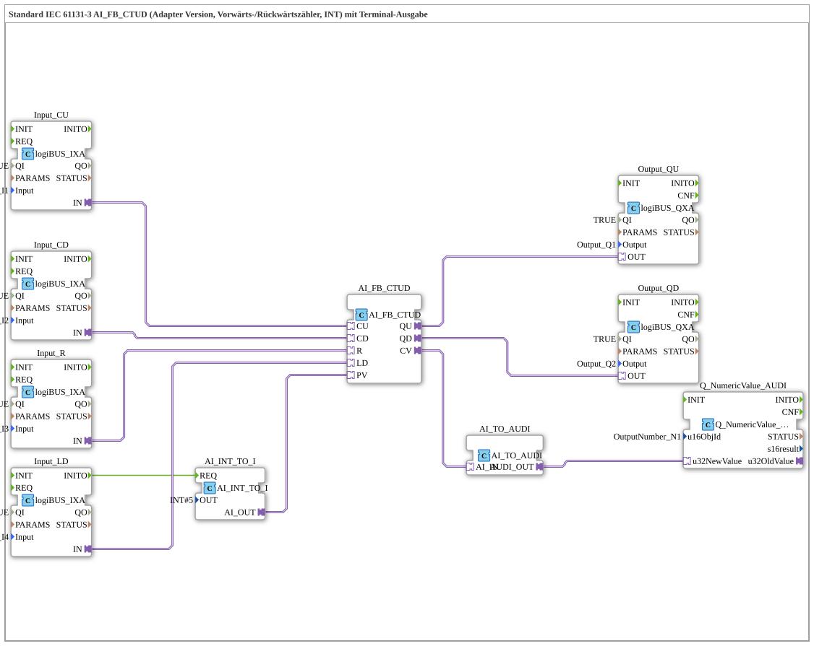

# Exercise_220_AI: Standard IEC 61131-3 AI_FB_CTUD (Adapter Version, Up/Down Counter, INT) with Terminal Output

* * * * * * * * * *
## Introduction
This exercise implements a **up/down counter according to IEC 61131-3 (CTUD)** as an adapter version for the data type `INT`. The current counter value is output via a terminal (numeric output). Control is achieved via four digital inputs (CU, CD, R, LD) and two digital outputs (QU, QD). A constant value (INT#5) is loaded as a preset value (PV).

```
## Function Blocks (FBs) Used

- **AI_FB_CTUD** (`adapter::iec61131::counters::AI_FB_CTUD`)

Central counter logic: Event-driven up/down counter (CTUD) with the terminals CU, CD, R, LD, and PV. Provides the outputs QU (overflow), QD (underflow), and CV (current counter value). No parameters.

- **AI_INT_TO_I** (`adapter::conversion::unidirectional::AI_INT_TO_I`)

Converts a constant `INT` value (here: 5) into an adapter format for the default value (PV). Parameter: `OUT = INT#5`.

- **Input_CU** (`logiBUS::io::DI::logiBUS_IXA`)

Digital input for the "Count Up" signal.

Parameters: `QI = TRUE`, `Input = Input_I1`.

- **Input_CD** (`logiBUS::io::DI::logiBUS_IXA`)

Digital input for the "Count Down" signal.

Parameters: `QI = TRUE`, `Input = Input_I2`.

- **Input_R** (`logiBUS::io::DI::logiBUS_IXA`)

Digital input for the reset signal.

Parameters: `QI = TRUE`, `Input = Input_I3`.

- **Input_LD** (`logiBUS::io::DI::logiBUS_IXA`)

Digital input for loading the preset value.

Parameters: `QI = TRUE`, `Input = Input_I4`.

- **Output_QU** (`logiBUS::io::DQ::logiBUS_QXA`)

Digital output that signals the counter overflow (QU).

Parameters: `QI = TRUE`, `Output = Output_Q1`.

- **Output_QD** (`logiBUS::io::DQ::logiBUS_QXA`)

Digital output that signals the counter underflow (QD).

Parameters: `QI = TRUE`, `Output = Output_Q2`.

- **AI_TO_AUDI** (`adapter::conversion::unidirectional::AI_TO_AUDI`)

Converts the current counter value (CV) from the adapter format to a numeric audio format (AUDI) that can be processed by the output component.

*Note: According to the comment in the source code, this block is not suitable for negative numbers.*

- **Q_NumericValue_AUDI** (`isobus::UT::Q::Q_NumericValue_AUDI`)

Terminal output block for displaying the counter value on a numeric display.

Parameter: `u16ObjId = OutputNumber_N1`.

## Program Flow and Connections

The flow is controlled by events. The connections are implemented as follows:

1. **Initialization & Load Default Value**

At startup, the event `Input_LD.INITO` is forwarded to `AI_INT_TO_I.REQ`. This transfers the constant value `INT#5` to the PV input of the meter `AI_FB_CTUD.PV` via the adapter `AI_INT_TO_I`.

``` 2. **Counter Inputs**

- `Input_CU.IN` → `AI_FB_CTUD.CU` (Count up on edge)
- `Input_CD.IN` → `AI_FB_CTUD.CD` (Count down on edge)
- `Input_R.IN` → `AI_FB_CTUD.R` (Reset to 0)
- `Input_LD.IN` → `AI_FB_CTUD.LD` (Load value from PV)

3. **Counter Outputs**

- `AI_FB_CTUD.QU` → `Output_QU.OUT` (Overflow)
- `AI_FB_CTUD.QD` → `Output_QD.OUT` (underflow)

4. **Counter Reading Output**

The current counter value `CV` is converted via `AI_TO_AUDI` and sent to the output block `Q_NumericValue_AUDI.u32NewValue`. This displays the value on a configured terminal number (`u16ObjId = OutputNumber_N1`).

**Notes from the Source Code**:

- The block `AI_TO_AUDI` does not support negative numbers – therefore, only counter values ≥ 0 can be displayed correctly.
- It was noted that edge-triggered D flip-flops (e.g., `AX_D_FF`) could potentially be used to reduce the event rate, but this is not implemented in this version.

## Summary

This exercise demonstrates the use of an IEC 61131-3 counter (CTUD) in a 4diac adapter environment. It shows the linking of digital inputs/outputs, the conversion of data formats (`INT` ↔ adapter ↔ AUDI), and the output of a numerical value to a terminal. The learning effect lies in understanding event-driven counters, data flow conversion, and error handling for negative values. This exercise is suitable for advanced users and requires basic knowledge of the 4diac IDE and IEC 61131-3.

### 🌐 Related topic subpages on ms-muc-docs.de
* [🌐 Eclipse 4diac IDE & Color Reference on ms-muc-docs.de](https://www.ms-muc-docs.de/iec-61499/eclipse-4diac/)

]
