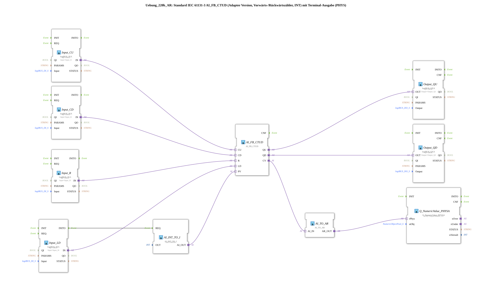

# Exercise_220b_AR: Standard IEC 61131-3 AI_FB_CTUD (Adapter Version, Up/Down Counter, INT) with Terminal Output (PHYS)

*Image not available*
* * * * * * * * * *
## Introduction
This exercise implements an up/down counter (CTUD) according to IEC 61131-3 in an adapter version. The counter value (integer) is initialized via a digital preset value (PV) and can be controlled via four digital inputs. The current counter value is output to a terminal via an analog output (physical representation). The exercise demonstrates the use of adapter-based function blocks as well as the conversion and output of counter data.

* * * * * * * * *

## Introduction

This exercise implements an up/down counter (CTUD) according to IEC 61131-3 in an adapter version.
## Function Blocks (FBs) Used

- **AI_FB_CTUD**
- **Type**: `adapter::iec61131::counters::AI_FB_CTUD`
- **Function**: Up/down counter with adapter interface (inputs CU, CD, R, LD, PV; outputs QU, QD, CV).
- **AI_INT_TO_I**
- **Type**: `adapter::conversion::unidirectional::AI_INT_TO_I`
- **Parameter**: `OUT = INT#5` (constant preset value)
- **Function**: Converts a constant integer value into an adapter output (AI_OUT), which is sent as a preset (PV) to the counter.
- **Input_CU, Input_CD, Input_R, Input_LD**
- **Type**: `logiBUS::io::DI::logiBUS_IXA`
- **Parameters**: `QI = TRUE` (input activation); `Input` assigned to logiBUS digital inputs (Input_I1 to Input_I4).
- **Function**: Digital input adapter for counter control (CU = forward count pulse, CD = reverse count pulse, R = reset, LD = load preset value).
- **Output_QU, Output_QD**
- **Type**: `logiBUS::io::DQ::logiBUS_QXA`
- **Parameters**: `QI = TRUE`; `Output` is assigned to logiBUS digital outputs (Output_Q1, Output_Q2).
- **Function**: Digital output adapter for the counter outputs QU (up counter reached) and QD (down counter reached).
- **AI_TO_AR**
- **Type**: `adapter::conversion::unidirectional::AI_TO_AR`
- **Function**: Converts the adapter output (AI_IN) of the counter value (CV) into an analog adapter value (AR_OUT).
- **Q_NumericValue_PHYSA**
- **Type**: `isobus::UT::Q::Q_NumericValue_PHYSA`
- **Parameter**: `stObj = OutputNumber_N3` (predefined terminal output object)
- **Function**: Physically outputs the analog numeric value to the terminal.

## Program Flow and Connections

Event control is handled via a single event path:

- The function block **Input_LD** triggers the function block **AI_INT_TO_I** (`REQ`) upon the initialization event (`INITO`), causing it to output the constant preset value (INT#5).

``` The logical data connections (adapter connections) link the components as follows:

- **Digital inputs to counters:**

`Input_CU.IN` → `AI_FB_CTUD.CU` (forward count pulse)

`Input_CD.IN` → `AI_FB_CTUD.CD` (backward count pulse)

`Input_R.IN` → `AI_FB_CTUD.R` (reset)

`Input_LD.IN` → `AI_FB_CTUD.LD` (load preset value)

- **Counter outputs to digital outputs:**

`AI_FB_CTUD.QU` → `Output_QU.OUT` (forward counter reached)

`AI_FB_CTUD.QD` → `Output_QD.OUT` (Counter down reached)

- **Counter value to terminal output:**

`AI_FB_CTUD.CV` → `AI_TO_AR.AI_IN` (Current counter value)

`AI_TO_AR.AR_OUT` → `Q_NumericValue_PHYSA.rPhys` (Analog value for terminal display)

- **Preset value:**

`AI_INT_TO_I.AI_OUT` → `AI_FB_CTUD.PV` (Sets the preset value to INT#5)

A comment indicates that negative values are also possible with the counter and that, if necessary, an AX_D_FF (D flip-flop) can be implemented per output to reduce the event rate.

The function block **AI_FB_CTUD** functions as a counter: The counter is incremented on each rising edge at CU, decremented on CD, reset to 0 on R, and charged to the value of PV on LD. The outputs QU and QD are activated when the counter reading reaches a threshold (typically >0 for QU, <0 for QD).

## Summary
Exercise **Exercise_220b_AR** demonstrates the use of a standardized IEC 61131-3 counter (CTUD) in an adapter architecture. By connecting digital inputs (pushbuttons/sensors), digital outputs, and a terminal output, a complete counting process with visualization is implemented. The learner understands the functionality of up/down counters, adapter communication in 4diac, and the conversion of data formats (INT via AI_TO_AR). Additionally, the possibility of event reduction using flip-flops is explored.

# Summary ---

### 🌐 Related topic subpages on ms-muc-docs.de
* [🌐 Eclipse 4diac IDE & Color Reference on ms-muc-docs.de](https://www.ms-muc-docs.de/iec-61499/eclipse-4diac/)

]
