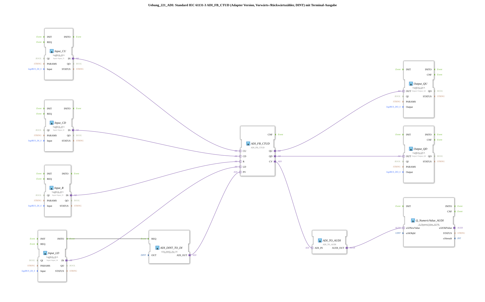

# Exercise_221_ADI: Standard IEC 61131-3 ADI_FB_CTUD (Adapter Version, Up/Down Counter, DINT) with Terminal Output

* * * * * * * * * *
## Introduction
This exercise implements an up/down counter (CTUD) according to IEC 61131-3 in an adapter version (ADI_FB_CTUD). The counter uses 32-bit integers (DINT) and outputs the current count via a terminal output. Inputs are read via logiBUS adapters, and outputs are controlled via logiBUS adapters. A fixed preset value of 5 is loaded during initialization.
## Function Blocks (FBs) Used
- **ADI_FB_CTUD** (Type: `adapter::iec61131::counters::ADI_FB_CTUD`)

Main counter block. It has the adapter interfaces CU (count up), CD (count down), R (Reset), LD (Load), PV (Preset Value), and the outputs QU (Overflow), QD (Underflow), and CV (Current Count Value).

- **ADI_DINT_TO_DI** (Type: `adapter::conversion::unidirectional::ADI_DINT_TO_DI`)

Converts a constant DINT value (here `DINT#5`) into a DI adapter interface. Parameter: `OUT = DINT#5`. The output `ADI_OUT` is connected to the PV input of the counter.

- **logiBUS_IXA** (Input Adapter) – four instances:
- `Input_CU`: Input for forward count pulses (connected to physical input `Input_I1`).
- `Input_CD`: Input for backward count pulses (`Input_I2`).
- `Input_R`: Reset input (`Input_I3`).
- `Input_LD`: Load input (`Input_I4`).

All have the parameter `QI = TRUE`.

- **logiBUS_QXA** (Output Adapter) – two instances:
- `Output_QU`: Output for overflow signal (physical output `Output_Q1`).
- `Output_QD`: Output for underflow signal (`Output_Q2`).

Both with `QI = TRUE`.

- **ADI_TO_AUDI** (Type: `adapter::conversion::unidirectional::ADI_TO_AUDI`)

Converts the ADI data stream (from the counter's CV) into an AUDI signal for terminal output. Note: This conversion does not support negative numbers (see comment in the network).

- **Q_NumericValue_AUDI** (Type: `isobus::UT::Q::Q_NumericValue_AUDI`)

Terminal output block. Parameter: `u16ObjId = OutputNumber_N1`. Displays the received numerical value (count value) on the terminal.

## Program Flow and Connections

1. **Initialization**: At startup, the INITO event of `Input_LD` is used to trigger the function block `ADI_DINT_TO_DI`. This then passes the fixed value `DINT#5` as an ADI interface to the PV input of the counter `ADI_FB_CTUD`. This sets the preset value to 5.

2. **Counting Operation**:

- Each rising edge at `Input_CU` (forward count pulse) increments the counter by 1.
- Each rising edge at `Input_CD` decrements the counter by 1.
- A positive signal at `Input_R` resets the counter to 0.
- A positive signal at `Input_LD` sets the counter to the current preset value (here, 5).

3. **Outputs**:

- The output `Output_QU` (overflow) is activated when the counter reaches its maximum DINT value and another forward pulse occurs.
- The output `Output_QD` (underflow) is activated when the counter reaches the minimum DINT value and another reverse pulse occurs.
- The current counter value (CV) is output via `ADI_TO_AUDI` and `Q_NumericValue_AUDI` to a terminal (object ID `OutputNumber_N1`).

4. **Data Connections** (Adapter Connections):

- The counter's adapter inputs `CU`, `CD`, `R`, and `LD` are directly connected to the corresponding logiBUS inputs.

`` - The adapter outputs `QU` and `QD` of the counter are connected to the logiBUS outputs.

- The adapter output `CV` (count value) is connected to `ADI_TO_AUDI.ADI_IN`.
- The AUDI output of `ADI_TO_AUDI` is connected to `Q_NumericValue_AUDI.u32NewValue`.
- The fixed preset value of `ADI_DINT_TO_DI` is transferred to `ADI_FB_CTUD.PV`.

5. **Notes**:

- The conversion used, `ADI_TO_AUDI`, cannot represent negative numbers (see comment in the network). If the counter displays negative values, the terminal output will be incorrect.
- For high-frequency events, it can be useful to insert an AX_D_FF (event flip-flop) to reduce the event rate (see comment).

## Summary
Exercise 221 demonstrates the use of an IEC 61131-3 compliant up/down counter in the adapter version. The counter is controlled via physical inputs and outputs its current value as well as overflow/underflow signals to outputs and a terminal. A fixed preset value is initially loaded. The exercise shows the integration of standard function blocks with logiBUS I/O and terminal output, as well as data conversion between different adapter interfaces. Information on limitations (no negative numbers) and optimization possibilities (event reduction) is provided.
