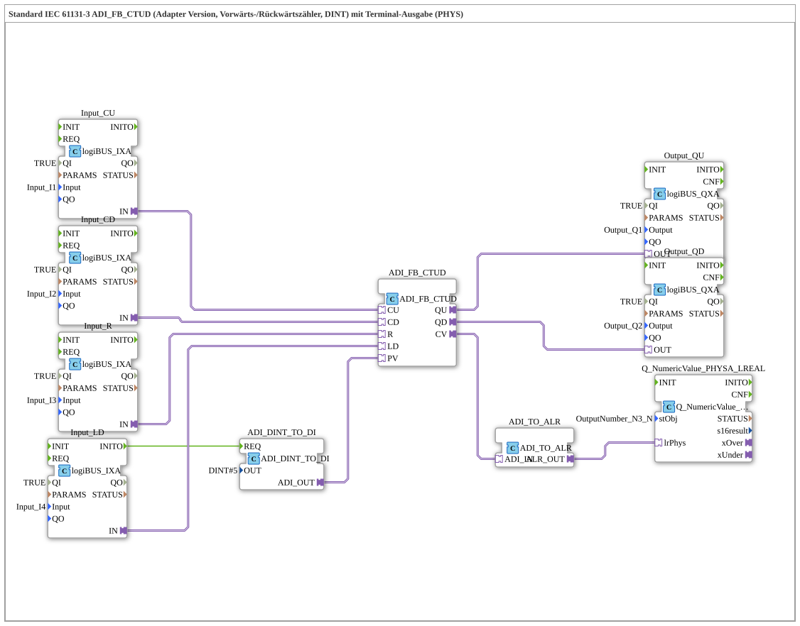

# Exercise_221b_ALR: Standard IEC 61131-3 ADI_FB_CTUD (Adapter Version, Up/Down Counter, DINT) with Terminal Output (PHYS)

* * * * * * * * * *

## Introduction

This exercise implements an up/down counter according to IEC 61131-3 (type `ADI_FB_CTUD`). The counter is controlled via digital inputs and outputs the current counter value via both digital outputs (as limit signals) and a terminal output (physical value). The counting range uses 32-bit integers (DINT), and negative values are also possible.
**Difficulty Level**: Advanced
**Prerequisites**: Basic knowledge of the 4diac IDE and the IEC 61131-3 function block system, understanding of adapter interfaces.

**Learning Objectives**:

- Working with the counter block `ADI_FB_CTUD`
- Configuring digital inputs/outputs via logiBUS adapters
- Converting data types (DINT → digital input, DINT → LREAL) for terminal output
- Generating pulses for loading the counter value (PV)

## Function Blocks (FBs) Used

The exercise consists of a flat network structure without any further sub-applications. The following function blocks are used:

- **`ADI_FB_CTUD`** (Type: `adapter::iec61131::counters::ADI_FB_CTUD`)

The central up/down counter. It has the adapter interfaces `CU` (Count Up), `CD` (Count Down), `R` (Reset), `LD` (Load), `PV` (Preset Value), and the outputs `QU` (Overflow), `QD` (Underflow), and `CV` (Current Counter Value).

- **`ADI_DINT_TO_DI`** (Type: `adapter::conversion::unidirectional::ADI_DINT_TO_DI`)

Converts a DINT value into a digital signal (adapter interface). The parameter `OUT` is set to `DINT#5`, meaning the preset value for the counter is set to 5.

- **`Input_CU`**, **`Input_CD`**, **`Input_R`**, **`Input_LD`** (Type: `logiBUS::io::DI::logiBUS_IXA`)

Digital input adapters for the logiBUS hardware. They read the physical inputs `I1`, `I2`, `I3`, and `I4`. The parameter `QI` is set to `TRUE`.

- **`Output_QU`**, **`Output_QD`** (Type: `logiBUS::io::DQ::logiBUS_QXA`)

Digital output adapters. `Output_QU` switches the physical output `Q1`, and `Output_QD` switches the output `Q2`. Both have `QI = TRUE`.

- **`ADI_TO_ALR`** (Type: `adapter::conversion::unidirectional::ADI_TO_ALR`)

Converts the adapter output `CV` (counter value) to the data type `ALR` (analog LREAL representation).

- **`Q_NumericValue_PHYSA_LREAL`** (Type: `isobus::UT::Q::Q_NumericValue_PHYSA_LREAL`)

Outputs the numeric value (LREAL) to a terminal. The parameter `stObj` refers to the constant object `OutputNumber_N3` from the library `Uebungen::const::UT::DefaultPool_Numeric`.

### Parameter Details of Selected Function Blocks

| Function Block | Parameter | Value |
| ---------- | ----------- | ------ |
| `ADI_DINT_TO_DI` | `OUT` | `DINT#5` |
| `Input_CU` | `QI` | `TRUE` |
| | `Input` | `Input_I1` |
| `Input_CD` | `QI` | `TRUE` |
| | `Input` | `Input_I2` |
| `Input_R` | `QI` | `TRUE` |
| | `Input` | `Input_I3` |
| `Input_LD` | `QI` | `TRUE` |
| | `Input` | `Input_I4` |
| `Output_QU` | `QI` | `TRUE` |
| | `Output` | `Output_Q1` |
| `Output_QD` | `QI` | `TRUE` |
| | `Output` | `Output_Q2` |
| `Q_NumericValue_PHYSA_LREAL` | `stObj` | `OutputNumber_N3` |

## Program Flow and Connections

### Signal Flow

1. **Inputs**: The four digital inputs (`I1`–`I4`) are read into the controller via the logiBUS adapters `Input_CU`, `Input_CD`, `Input_R`, and `Input_LD`.
2. **Counter Control**:

- `CU` (Count Up) from `Input_CU`: Each event at input `I1` increments the counter by 1.
- `CD` (Count Down) from `Input_CD`: An event at `I2` decrements the counter by 1.
- `R` (Reset) from `Input_R`: An event at `I3` resets the counter to 0.
- `LD` (Load) from `Input_LD`: An event on `I4` loads the preset value (PV) into the counter.
1. **Preset Value (PV)**: The function block `ADI_DINT_TO_DI` is activated on the INIT event of `Input_LD` (event connection `Input_LD.INITO → ADI_DINT_TO_DI.REQ`). It passes the constant value `DINT#5` to the adapter input `PV` of the counter. Thus, the counter is set to 5 with each load.
2. **Outputs**:

- `QU` (Count Up Overflow): outputs to `TRUE` when the counter reaches or exceeds its maximum value → outputs to `Output_Q1`.
- `QD` (Count Down Overflow): outputs to `TRUE` when the minimum value is undershot → outputs to `Output_Q2`.
- `CV` (Current Value): converted to an LREAL signal via `ADI_TO_ALR` and passed to `Q_NumericValue_PHYSA_LREAL`. This outputs the current counter value as a numerical value on the terminal (physical output).
...`` 4. **Output**:**

### Notes on the Setup

- **Network Comments**:

> *“Negative values are possible here!”* – The counter `ADI_FB_CTUD` uses DINT, therefore negative counter values can occur (e.g., due to more backward than forward pulses).

> *“If necessary, add an AX_D_FF here to reduce the number of events.”* – With fast pulse sequences, it might be necessary to insert edge filters (e.g., `AX_D_FF`) between the inputs and the counter to limit the event rate and prevent counting errors.

- **No separate sub-applications**: The entire program flow is implemented in a single layer.
- The connections are implemented as **adapter connections**, meaning that data and event transmission occurs via adapter interfaces.
- The **event connection** `Input_LD.INITO → ADI_DINT_TO_DI.REQ` ensures that the preset value is only resent when the input block starts (initialization).

### Starting the Exercise

1. The exercise is integrated as a SubAppType (`Uebung_221b_ALR`) in the 4diac IDE.
2. A running logiBUS hardware with connected inputs/outputs (`I1`–`I4`, `Q1`, `Q2`) is required.
3. The terminal object `OutputNumber_N3` must be present in the project (from the library `Uebungen::const::UT::DefaultPool_Numeric`). 4. After deployment, the controller can be tested by applying pulses to the inputs.

## Summary

Exercise `Uebung_221b_ALR` demonstrates the use of an industrial forward/downward counter (`ADI_FB_CTUD`).) in the 4diac IDE. By combining logiBUS inputs, data conversion, and terminal output, a complete signal path from the hardware to the visualization is mapped. The counter can be controlled via four digital inputs, using a fixed preset value of 5. Outputting the current counter reading as a floating-point number to the terminal facilitates monitoring and troubleshooting. This exercise provides practical knowledge of adapter interfaces, event handling, and data type conversion.

---

### 🌐 Related topic subpages on ms-muc-docs.de

- [🌐 Eclipse 4diac IDE & Color Reference on ms-muc-docs.de](https://www.ms-muc-docs.de/iec-61499/eclipse-4diac/)
