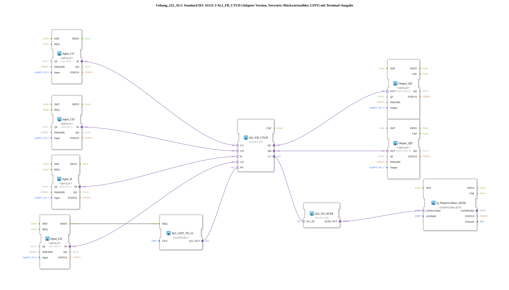

# Exercise_222_ALI: Standard IEC 61131-3 ALI_FB_CTUD (Adapter Version, Up/Down Counter, LINT) with Terminal Output

*Image not available*

* * * * * * * * * *
## Introduction

This exercise implements an up/down counter according to IEC 61131-3 (CTUD) in adapter format. The counter is controlled via digital inputs (logiBUS) and outputs its current count via a terminal. The preset value (PV) is set to LINT#5 and loaded when the LD input is set. The outputs QU (overflow) and QD (underflow) are connected to digital outputs.

## Function Blocks (FBs) Used

- **ALI_FB_CTUD** (Type: `adapter::iec61131::counters::ALI_FB_CTUD`):
- Parameters: none set in the XML (default values)
- Event inputs: CU, CD, R, LD
- Data inputs: PV (from ALI_LINT_TO_LI)
- Event outputs: (none visible)
- Data outputs: QU, QD, CV
- **ALI_LINT_TO_LI** (Type: `adapter::conversion::unidirectional::ALI_LINT_TO_LI`):
- Parameters: `OUT` = `LINT#5`
- Event input: REQ (connected to Input_LD.INITO)
- Data output: ALI_OUT (connected to ALI_FB_CTUD.PV)
- **Input_CU** (Type: `logiBUS::io::DI::logiBUS_IXA`):
- Parameters: `QI` = `TRUE`, `Input` = `Input_I1`
- Adapter output: IN
- **Input_CD** (Type: `logiBUS::io::DI::logiBUS_IXA`):
- Parameters: `QI` = `TRUE`, `Input` = `Input_I2`
- Adapter output: IN
- **Input_R** (Type: `logiBUS::io::DI::logiBUS_IXA`):
- Parameters: `QI` = `TRUE`, `Input` = `Input_I3`
- Adapter output: IN
- **Input_LD** (Type: `logiBUS::io::DI::logiBUS_IXA`):
- Parameters: `QI` = `TRUE`, `Input` = `Input_I4`
- Adapter output: IN
- **Output_QU** (Type: `logiBUS::io::DQ::logiBUS_QXA`):
- Parameters: `QI` = `TRUE`, `Output` = `Output_Q1`
- Adapter input: OUT
- **Output_QD** (Type: `logiBUS::io::DQ::logiBUS_QXA`):
- Parameters: `QI` = `TRUE`, `Output` = `Output_Q2`
- Adapter input: OUT
- **ALI_TO_AUDI** (Type: `adapter::conversion::unidirectional::ALI_TO_AUDI`):
- Converts a `ALI` value to a `AUDI` format (for terminal output)
- **Note:** As commented, this function block is not suitable for displaying negative numbers.
- **Q_NumericValue_AUDI** (Type: `isobus::UT::Q::Q_NumericValue_AUDI`):
- Parameter: `u16ObjId` = `OutputNumber_N1`
- Displays the passed numeric value on a terminal.

## Program Flow and Connections

The hardware inputs (I1–I4) are read via the logiBUS DI blocks. The events and data are connected as follows:

1. **Clock inputs CU and CD**:
- `Input_CU.IN` → `ALI_FB_CTUD.CU` (Count up, rising edge)
- `Input_CD.IN` → `ALI_FB_CTUD.CD` (Count down, rising edge)
2. **Reset and Load**:
- `Input_R.IN` → `ALI_FB_CTUD.R` (Sets the counter to 0)
- `Input_LD.IN` → `ALI_FB_CTUD.LD` (Loads the preset value PV into the counter)
- The event `Input_LD.INITO` triggers the `ALI_LINT_TO_LI.REQ` is output, so that the fixed value LINT#5 is available as a PV at output `ALI_OUT`.

The output is `ALI_LINT_TO_LI.REQ`. 3. **Preset Value**:

- `ALI_LINT_TO_LI.ALI_OUT` → `ALI_FB_CTUD.PV`
4. **Outputs**:
- `ALI_FB_CTUD.QU` → `Output_QU.OUT` (switched to digital output Q1)
- `ALI_FB_CTUD.QD` → `Output_QD.OUT` (switched to digital output Q2)
5. **Count Value Output to Terminal**:
- `ALI_FB_CTUD.CV` → `ALI_TO_AUDI.ALI_IN`
- `ALI_TO_AUDI.AUDI_OUT` → `Q_NumericValue_AUDI.u32NewValue`
- The current count value (CV) is converted and displayed in the terminal with the object ID `OutputNumber_N1` output.

**Notes from the comments**:

- The function block `ALI_TO_AUDI` does not support negative numbers – therefore, the output value cannot be displayed correctly if it is less than 0.
- To reduce the number of events (e.g., with fast counting pulses), a `AX_D_FF` could be inserted before each output.

## Summary

This exercise demonstrates the use of the standardized CTUD counter (IEC 61131-3) in a 4diac environment using the adapter concept. The connection to the real hardware (logiBUS) and the output of a count value to a terminal are shown. The preset value is set once at startup using a custom conversion block. The exercise also highlights limitations of the conversion blocks (no negative numbers) and provides a suggestion for optimizing event processing with fast signals.

---

### 🌐 Related topic subpages on ms-muc-docs.de

* [🌐 Eclipse 4diac IDE & Color Reference on ms-muc-docs.de](https://www.ms-muc-docs.de/iec-61499/eclipse-4diac/)

]
