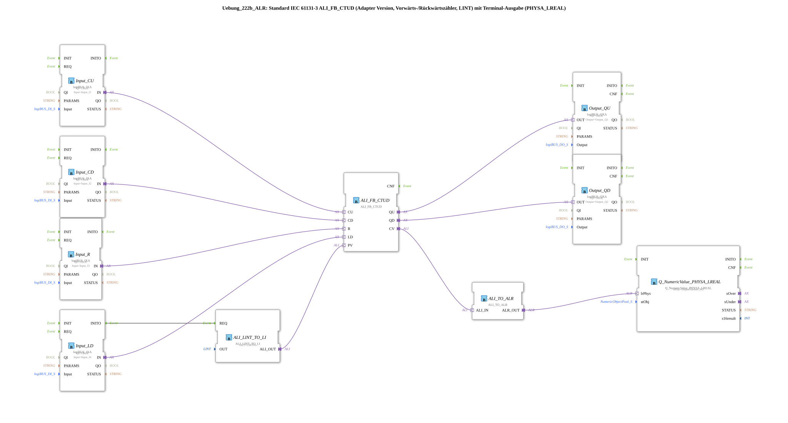

# Exercise_222b_ALR: Standard IEC 61131-3 ALI_FB_CTUD (Adapter Version, Up/Down Counter, LINT) with Terminal Output (PHYSA_LREAL)

* * * * * * * * * *
## Introduction
This exercise implements an up/down counter based on the adapted IEC 61131-3 function block `ALI_FB_CTUD` (type LINT).
The counter pulses, reset, and loading process are controlled via four digital inputs (logiBUS).

The two counter outputs, `QU` and `QD`, are routed to digital outputs.

The current counter reading (`CV`) is converted into a physical value (LREAL) via a converter and displayed on a terminal (output pool).

A constant starting value (`PV = 5`) is provided via a separate conversion module.

Learning Objectives:

- Use of the adapted IEC counter `ALI_FB_CTUD`
- Connection of digital inputs/outputs (logiBUS)
- Conversion between LINT and LREAL
- Output of a physical value to a terminal (pool element)

## Function Blocks (FBs) Used

The application consists of the following blocks, which are connected in the SubApp network:

- **ALI_FB_CTUD** (`adapter::iec61131::counters::ALI_FB_CTUD`)

The central forward/reverse counter (IEC 61131-3, LINT). It has the adapter inputs `CU`, `CD`, `R`, `LD`, the outputs `QU`, `QD`, and the data output `CV`.

- **ALI_LINT_TO_LI** (`adapter::conversion::unidirectional::ALI_LINT_TO_LI`)

Converts a constant LINT value into a LINT signal.

Parameter: `OUT = LINT#5` (start value for the counter).

- **Input_CU** (`logiBUS::io::DI::logiBUS_IXA`)

Digital input for the forward count pulse (`CU`), connected to `Input_I1`.

Parameter: `QI = TRUE`.

- **Input_CD** (`logiBUS::io::DI::logiBUS_IXA`)

Digital input for the reverse count pulse (`CD`), connected to `Input_I2`.

Parameter: `QI = TRUE`.

- **Input_R** (`logiBUS::io::DI::logiBUS_IXA`)

Digital input for reset (`R`), connected to `Input_I3`.

Parameter: `QI = TRUE`.

- **Input_LD** (`logiBUS::io::DI::logiBUS_IXA`)

Digital input for loading the initial value (`LD`), connected to `Input_I4`.

Parameter: `QI = TRUE`.

- **Output_QU** (`logiBUS::io::DQ::logiBUS_QXA`)

Digital output for the counter output `QU`, connected to `Output_Q1`.

Parameter: `QI = TRUE`.

- **Output_QD** (`logiBUS::io::DQ::logiBUS_QXA`)

Digital output for the counter output `QD`, connected to `Output_Q2`.

Parameter: `QI = TRUE`.

- **ALI_TO_ALR** (`adapter::conversion::unidirectional::ALI_TO_ALR`)

Converts the LINT counter reading (`CV`) into an LREAL value (physical quantity).

- **Q_NumericValue_PHYSA_LREAL** (`isobus::UT::Q::Q_NumericValue_PHYSA_LREAL`)

Accepts the physical value and outputs it to the configured terminal element (`OutputNumber_N3`).

## Program Flow and Connections

The logical connections (via adapters) establish the data flow:

1. **Inputs to the Counter**

- `Input_CU.IN` → `ALI_FB_CTUD.CU`
- `Input_CD.IN` → `ALI_FB_CTUD.CD`
- `Input_R.IN` → `ALI_FB_CTUD.R`
- `Input_LD.IN` → `ALI_FB_CTUD.LD`

2. **Start Value (PV)**

- `Input_LD.INITO` (Event) → `ALI_LINT_TO_LI.REQ`
- `ALI_LINT_TO_LI.ALI_OUT` → `ALI_FB_CTUD.PV`

The starting value is set on the loading screen (edge at `LD`).

3. **Counter Outputs**

- `ALI_FB_CTUD.QU` → `Output_QU.OUT`
- `ALI_FB_CTUD.QD` → `Output_QD.OUT`

4. **Counter Reading Output (Terminal)**

- `ALI_FB_CTUD.CV` → `ALI_TO_ALR.ALI_IN`
- `ALI_TO_ALR.ALR_OUT` → `Q_NumericValue_PHYSA_LREAL.lrPhys`

The counter value (LINT) is converted into an LREAL value and sent to the terminal output.

Note the comments in the network:

- *“Negative values are possible here!”* (the LINT counter can count below zero)
- *“If necessary, add an AX_D_FF here to reduce the number of events.”* (Note on event optimization at the outputs)

The function block `ALI_LINT_TO_LI` initializes the default value with `LINT#5`. This sets the counter to 5 during the first charging process.

## Summary

Exercise 222b demonstrates the use of an adapted IEC counter in the 4diac IDE.

Counting pulses, reset, and charging are controlled via digital logiBUS inputs.

The current counter reading is output to digital outputs and—after conversion to a physical quantity—to a terminal.

You will learn how to connect input/output blocks, convert integer values to floating-point values, and set a constant starting value.

Information on negative counter values and event reduction complements the practical application.

---

### 🌐 Related topic subpages on ms-muc-docs.de
* [🌐 Eclipse 4diac IDE & color reference on ms-muc-docs.de](https://www.ms-muc-docs.de/iec-61499/eclipse-4diac/)

]