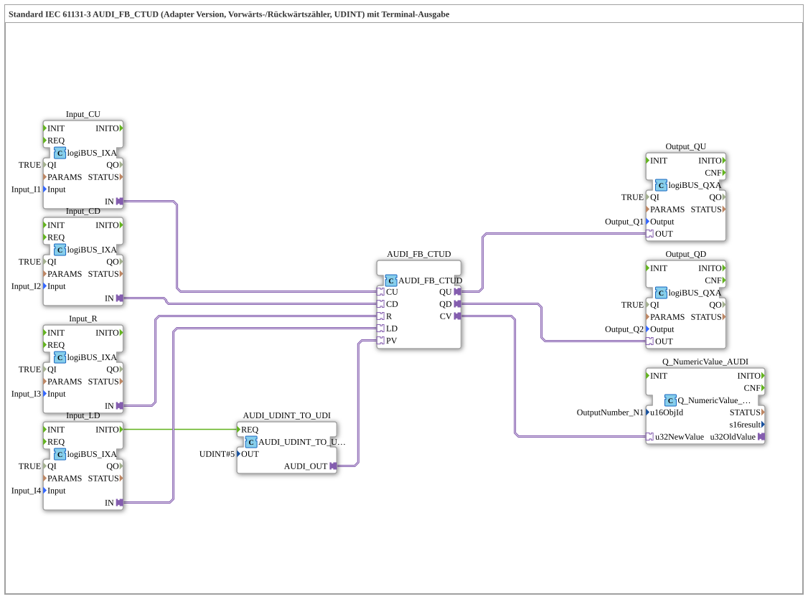

# Exercise_223_AUDI: Standard IEC 61131-3 AUDI_FB_CTUD (Adapter Version, Up/Down Counter, UDINT) with Terminal Output

* * * * * * * * * *
## Introduction
This exercise implements a bidirectional counter (up/down counter) according to IEC 61131-3 (type CTUD) as an adapter version. The counter value is processed as a UDINT (unsigned double integer) and output via a terminal module to a numeric display. The counter functions are controlled via four digital inputs (CU, CD, R, LD) connected via logiBUS modules. The outputs (QU, QD) are also routed to digital outputs via logiBUS modules.

## Function Blocks (FBs) Used
- **AUDI_FB_CTUD**

Type: `adapter::iec61131::counters::AUDI_FB_CTUD`

Core block: IEC 61131 compliant forward/downward counter (CTUD).

Event inputs: CU (forward count), CD (downward count), R (reset), LD (load preset value).

Data outputs: QU (overflow during forward count), QD (overflow during backward count), CV (current counter value).

Data inputs: PV (preset value).

- **AUDI_UDINT_TO_UDI**

Type: `adapter::conversion::unidirectional::AUDI_UDINT_TO_UDI`

Converts a constant UDINT value into a suitable adapter output (UDI) for the PV input of the counter.

Parameter: OUT = `UDINT#5` (preset value is set to 5).

- **Input_CU, Input_CD, Input_R, Input_LD**

Type: `logiBUS::io::DI::logiBUS_IXA`

Digital input modules (logiBUS adapters).

Parameter: QI = TRUE (active), Input = `Input_I1`, `Input_I2`, `Input_I3`, `Input_I4` (one physical input per module).

The adapter output "IN" provides the digital signal for CU, CD, R, and LD, respectively.

- **Output_QU, Output_QD**

Type: `logiBUS::io::DQ::logiBUS_QXA`

Digital output blocks (logiBUS adapter).

Parameters: QI = TRUE, Output = `Output_Q1` or `Output_Q2`.

The adapter input "OUT" receives the signal from QU or QD of the counter.

- **Q_NumericValue_AUDI**

Type: `isobus::UT::Q::Q_NumericValue_AUDI`

Block for outputting a numeric value to a terminal (e.g., display).

Parameters: u16ObjId = `OutputNumber_N1` (identifier of the terminal object).

Data input: u32NewValue (receives the current counter value CV).

## Program Flow and Connections

1. **Initialization**

At system startup (INITO of the input block Input_LD), the block `AUDI_UDINT_TO_UDI` is triggered via the event input REQ. This converts the constant value `UDINT#5` into an adapter output, which is connected to the preset value input PV of the counter. Thus, the counter is set to the value 5 on the first load (LD).

2. **Counter Control**

- **CU** (Input I1): On a rising edge, the counter increments by 1.
- **CD** (Input I2): On a rising edge, the counter decrements by 1.
- **R** (Input I3): On a rising edge, the counter is reset to 0.
- **LD** (Input I4): On a rising edge, the counter is loaded to the current PV value (5).

3. **Output Signals**

- **QU** (Output Q1): Becomes HIGH when the counter reaches its maximum value (overflow).
- **QD** (Output Q2): Becomes HIGH when the counter reaches its minimum value (underflow).
- The current counter value (CV) is transmitted to the terminal (OutputNumber_N1) via the function block `Q_NumericValue_AUDI` and displayed numerically there.

4. **Note on Debouncing**

A comment on the network suggests inserting AX_D_FF blocks (T flip-flops) between the digital inputs and the counter to reduce the event rate by damping the rising edge. This is not implemented in this exercise but can be added if needed.

## Summary

This exercise demonstrates the use of an IEC 61131-compliant up/down counter (CTUD) as an adapter in a 4diac IDE. Input signals are read via logiBUS modules, the counter value is initialized via adapter conversion, and the outputs (QU, QD) as well as the current counter reading are output to digital outputs or a terminal. The exercise covers the fundamentals of counter control, working with adapters, and input/output via logiBUS hardware.

---

### 🌐 Related topic subpages on ms-muc-docs.de
* [🌐 Eclipse 4diac IDE & Color Reference on ms-muc-docs.de](https://www.ms-muc-docs.de/iec-61499/eclipse-4diac/)

]
