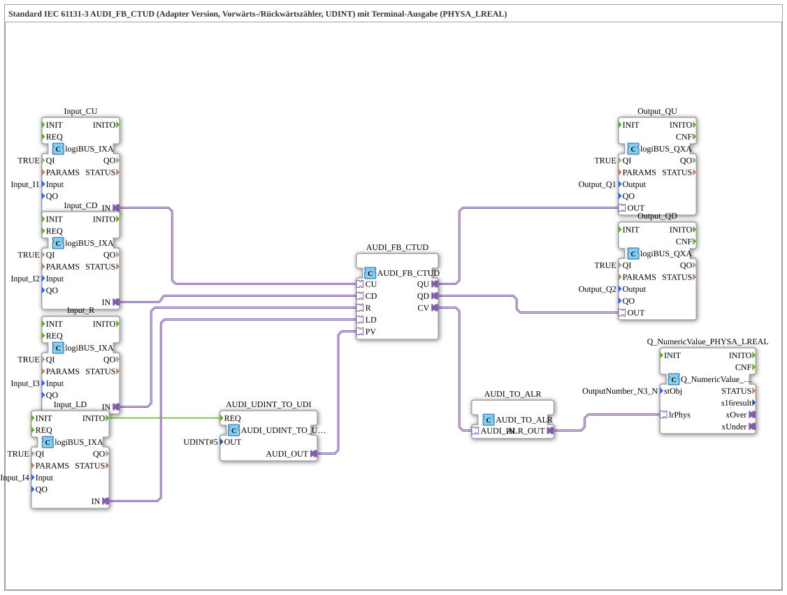

# Exercise_223b_ALR: Standard IEC 61131-3 AUDI_FB_CTUD (Adapter Version, Up/Down Counter, UDINT) with Terminal Output (PHYSA_LREAL)



* * * * * * * * * *

## Introduction

This exercise implements a standards-compliant up/down counter based on the IEC 61131-3 block **AUDI_FB_CTUD** in its adapter version. The counter processes four digital input signals (up count, down count, reset, and loading a preset value) and outputs the current counter value as well as overflow/underflow signals. The preset value is provided via a conversion block, and the counter value is converted into a physical LREAL value for terminal output.


This exercise demonstrates the adapter technology of the 4diac IDE, type conversion between different data formats, and the connection of digital inputs/outputs as well as a numerical output (e.g., for an operator panel).

## Function Blocks (FBs) Used

### Main Block: `AUDI_FB_CTUD`
- **Type**: `adapter::iec61131::counters::AUDI_FB_CTUD`
- **Description**: Standard IEC 61131-3 forward/reverse counter with a counting range of type `UDINT`.

- **Functionality**:

- On a rising edge at the **CU** input, the counter is incremented by one.

- On a rising edge at the **CD** input, the counter is decremented by one.

- When **R** (Reset) is activated, the counter value is reset to zero.

- When **LD** (Load) is activated, the preset value at the **PV** input is applied.

- The current counter value is provided at the **CV** output.

- The **QU** output sends a signal when the counter reaches its upper limit (overflow).

- The **QD** output sends a signal when the counter is at zero and should continue counting backward (underflow).


### Conversion Block: `AUDI_UDINT_TO_UDI`
- **Type**: `adapter::conversion::unidirectional::AUDI_UDINT_TO_UDI`
- **Parameters**: `OUT = UDINT#5`
- **Functionality**: Converts a constant of type `UDINT` (here: 5) to the type expected by the counter, `UDI`, and provides the value at output `AUDI_OUT`. This value is passed as a preset value to the **PV** input of the counter.


### Digital Inputs
- **Input_CU**, **Input_CD**, **Input_R**, **Input_LD**

- **Type**: `logiBUS::io::DI::logiBUS_IXA`

- **Parameters**:

- `QI = TRUE` (Qualifier, activates the function block)

- `Input` = respective physical input variable (`Input_I1`, `Input_I2`, `Input_I3`, `Input_I4`)

- **Functionality**: These adapter function blocks connect the digital inputs of the logiBUS hardware to the adapter interfaces. They provide an event and a data value (adapter interface) to the counter.


### Digital Outputs

- **Output_QU**, **Output_QD**

- **Type**: `logiBUS::io::DQ::logiBUS_QXA`

- **Parameters**:

- `QI = TRUE`

- `Output` = assigned output variable (`Output_Q1`, `Output_Q2`)

- **Functionality**: Receive the adapter signals from the counter (QU, QD) and forward them as digital output signals to the hardware.


### Conversion Module: `AUDI_TO_ALR`

- **Type**: `adapter::conversion::unidirectional::AUDI_TO_ALR`

- **Function**: Converts the `AUDI` counter value (type `AUDI`, corresponding to an unsigned integer) into a `ALR` value. This value is then passed to the terminal output.


### Terminal output: `Q_NumericValue_PHYSA_LREAL`
- **Type**: `isobus::UT::Q::Q_NumericValue_PHYSA_LREAL`
- **Parameter**: `stObj = OutputNumber_N3`
- **Functionality**: Accepts a physical value of type `LREAL` and outputs it as a numeric value to a terminal (e.g., HMI). The parameter `stObj` references the corresponding output element.


## Program Flow and Connections

The counter is controlled by the digital inputs:

- **Count Up** via `Input_CU` → `CU`
- **Count Down** via `Input_CD` → `CD`

- **Reset** via `Input_R` → `R`

- **Load Preset Value** via `Input_LD` → `LD`

The preset value is initialized via the event connection `Input_LD.INITO -> AUDI_UDINT_TO_UDI.REQ` when the device is first powered on. The conversion block `AUDI_UDINT_TO_UDI` then outputs the constant value 5 (UDINT) via its output `AUDI_OUT` to the **PV** input of the counter.

The current counter reading is routed via the adapter connection `AUDI_FB_CTUD.CV → AUDI_TO_ALR.AUDI_IN`, converted there to the `ALR` type, and then passed to the physical input `lrPhys` of the terminal block (`AUDI_TO_ALR.ALR_OUT → Q_NumericValue_PHYSA_LREAL.lrPhys`).


``
```
```````````````````````````````````)`````````) ` `AUDI_UDINT_TO_UDI`` ` `AUDI_UDINT_TO_UDI`` ` `AUDI_UDINT_TO_UDI`` ` qzmsdocs000042 ...` ` `AUDI_OUT`` ` `AUDI_OUT`` ` `AUDI_OUT`` ` `AUDI_OUT` The counter's overflow and underflow signals (`QU`, `QD`) are applied to the digital outputs `Output_QU` and `Output_QD`, which are connected to the physical outputs `Output_Q1` and `Output_Q2`.

**Special Features**:

- Negative counter readings are possible because the function block operates without a sign; however, the counter can go below zero during an underflow.

- For frequent events, it is recommended to insert **AX_D_FF** function blocks (event reducers) between the inputs and the counter to reduce the event load (see the network comment).


**Learning Objectives**:

- Use of the IEC 61131-3 up/down counter in the adapter version
- Understanding of adapter interface technology in the 4diac IDE

- Conversion between different data types (UDINT → UDI, AUDI → ALR → LREAL)

- Integration of digital inputs/outputs and terminal outputs

- Consideration of possible negative counter values and event optimization

## Summary

Exercise 223b implements a complete up/down counter with a fixed preset value (5). Digital inputs control the counter, the counter outputs (overflow/underflow) are connected to digital outputs, and the current counter value is output as a physical value on a terminal. The implementation consistently uses adapter technology, where event and data flows are connected via standardized interfaces. Data compatibility between the various subsystems is ensured through the use of conversion blocks. This exercise provides a solid foundation for advanced counter applications in automation technology.

---

### 🌐 Related topic subpages on ms-muc-docs.de

* [🌐 Eclipse 4diac IDE & color reference on ms-muc-docs.de](https://www.ms-muc-docs.de/iec-61499/eclipse-4diac/)

]