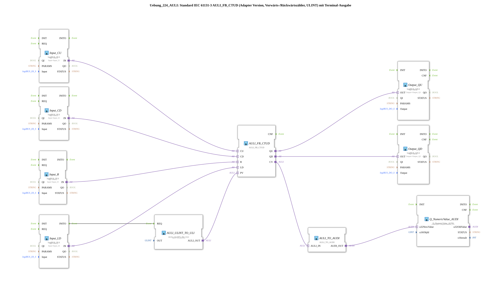

# Exercise_224_AULI: Standard IEC 61131-3 AULI_FB_CTUD (Adapter Version, Up/Down Counter, ULINT) with Terminal Output

* * * * * * * * * *
## Introduction
This exercise implements an up/down counter according to IEC 61131-3 (Type CTUD) in adapter format. The counter uses the ULINT (Unsigned Long Integer) data type and outputs the current counter value as well as overflow/underflow signals to physical outputs. Additionally, the counter value is output via a terminal (ISOBUS). The preset value (PV) is initially set to 5.
## Function Blocks (FBs) Used

### Sub-Blocks: `AULI_FB_CTUD`
- **Type**: `adapter::iec61131::counters::AULI_FB_CTUD`
- **Internal FBs Used**: None (Function block used directly)
- **Functionality**: IEC 61131-3 CTUD counter with the following connections:
- **CU** (Count Up) – Counts up on rising edge
- **CD** (Count Down) – Counts down on rising edge
- **R** (Reset) – Resets counter value to 0
- **LD** (Load) – Loads the preset value (PV) into the counter
- **PV** (Preset Value) – Default value (ULINT, initially set to 5)
- **QU** (Overflow) – Output becomes TRUE if counter value ≥ PV (during counting up)
- **QD** (Underflow) – Output becomes TRUE when counter value ≤ 0 (during down counting)
- **CV** (Current Value) – Current counter value (ULINT)

### Sub-Blocks: `AULI_ULINT_TO_ULI`
- **Type**: `adapter::conversion::unidirectional::AULI_ULINT_TO_ULI`
- **Internal Function Blocks Used**: None
- **Parameters**: `OUT = ULINT#5`
- **Functionality**: Converts a constant ULINT value (5) into a ULI format, which is used as the preset value (PV) for the counter. The block is triggered once at application startup (via event connection `Input_LD.INITO → AULI_ULINT_TO_ULI.REQ`).

### Sub-Blocks: `AULI_TO_AUDI`
- **Type**: `adapter::conversion::unidirectional::AULI_TO_AUDI`
- **Internal Function Blocks Used**: None
- **Functionality**: Converts the current counter reading (AULI format) into an AUDI format required for terminal output.

### Sub-Blocks: `Q_NumericValue_AUDI`
- **Type**: `isobus::UT::Q::Q_NumericValue_AUDI`
- **Internal Function Blocks Used**: None
- **Parameters**: `u16ObjId = OutputNumber_N1` (Reference to terminal output object)
- **Functionality**: Receives the converted counter reading (AUDI) and outputs it as a numeric value to the configured terminal (ISOBUS).

- **Type**: `u16ObjId = OutputNumber_N1` (Reference to terminal output object)

**Functionality**: Receives the converted counter reading (AUDI) and outputs it as a numeric value to the configured terminal (ISOBUS).

- **Type**: `adapter::conversion::unidirectional::AULI_TO_AUDI`
- **Internal Function Blocks Used**: None

**Parameters**: `u16ObjId = OutputNumber_N1` (Reference to terminal output object)

**Functionality**: Receives the converted counter reading (AUDI) and outputs it as a numeric value to the configured terminal (ISOBUS).

** ...
### Other Function Blocks Used (logiBUS I/O Connection)

- **Input_CU** (`logiBUS::io::DI::logiBUS_IXA`): Reads the digital input `Input_I1` (count up)
- **Input_CD** (`logiBUS::io::DI::logiBUS_IXA`): Reads the digital input `Input_I2` (count down)
- **Input_R** (`logiBUS::io::DI::logiBUS_IXA`): Reads the digital input `Input_I3` (reset)
- **Input_LD** (`logiBUS::io::DI::logiBUS_IXA`): Reads the digital input `Input_I4` (load)
- **Output_QU** (`logiBUS::io::DQ::logiBUS_QXA`): Switches the digital output `Output_Q1` (Overflow)
- **Output_QD** (`logiBUS::io::DQ::logiBUS_QXA`): Activates the digital output `Output_Q2` (Underflow)

All logiBUS blocks are activated by default with `QI = TRUE`.

## Program Flow and Connections

1. **Initialization**: At system startup, the block `Input_LD` triggers the block `AULI_ULINT_TO_ULI` via its event output `INITO`. This sets the counter's preset value to `ULINT#5`.

2. **Counting Operation**: The four digital inputs (`Input_I1` to `Input_I4`) are directly connected to the counter inputs `CU`, `CD`, `R`, and `LD` of `AULI_FB_CTUD` via adapter connections. The counter reacts to rising edges at the respective inputs.

The counter responds to rising edges at the respective inputs. 3. **Output of Meter Readings**:

- The overflow and underflow signals `QU` and `QD` are forwarded via the adapter outputs to the physical outputs `Output_Q1` and `Output_Q2`.
- The current meter reading `CV` is displayed on the terminal (object `OutputNumber_N1`) via the conversion blocks `AULI_TO_AUDI` and `Q_NumericValue_AUDI`. This conversion and output also occurs cyclically in parallel with the meter reading.

**Notes**:

- A comment on the network suggests optionally including AX_D_FF (D flip-flops) to reduce the event rate.
- The counter uses the ULINT data type, therefore large counting ranges are possible.

## Summary
This exercise demonstrates the use of a standard-compliant IEC 61131-3 CTUD counter in its adapter version. The counter is controlled via four digital inputs, outputs overflow/underflow values, and displays the current reading on a terminal. The preset value is initially fixed. The implementation uses logiBUS inputs/outputs and special conversion blocks to transfer the counter reading to the terminal. This example is suitable as a basis for counter applications in automation technology.
