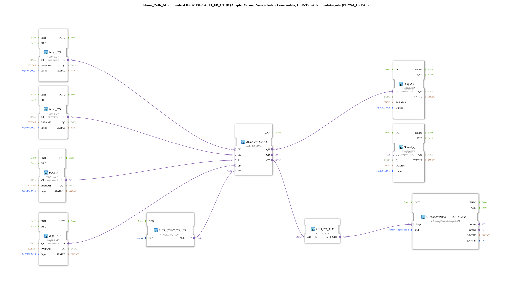

# Exercise_224b_ALR: Standard IEC 61131-3 AULI_FB_CTUD (Adapter Version, Up/Down Counter, ULINT) with Terminal Output (PHYSA_LREAL)

* * * * * * * * * *

## Introduction

This exercise implements a standard IEC 61131-3 up/down counter (CTUD) as an adapter version with the ULINT data type. The current counter value is output via a terminal output as the physical value (PHYSA_LREAL). Control is achieved via four digital inputs, two digital outputs, and a start value set using a ULINT-to-ULI converter.

## Function Blocks Used (FBs)

- **AULI_FB_CTUD**: Adapter-based forward/backward counter (Type: ULINT)
- **Parameters**: No static parameters
- **Explanation**: The actual counter. It has the event/adapter inputs CU (forward counting), CD (backward counting), R (reset), LD (load the initial value) and the outputs QU (overflow?), QD (underflow?), CV (current counter value). The initial value is loaded via the adapter input PV.
- **AULI_ULINT_TO_ULI**: Conversion from ULINT to ULI data type
- **Parameters**: OUT = ULINT#5 (fixed initial value 5)
- **Function**: Provides the initial value (PV) for the counter.
- **Input_CU**, **Input_CD**, **Input_R**, **Input_LD**: logiBUS digital inputs (Type: logiBUS_IXA)
- **Parameters**: QI = TRUE, Input = corresponding physical input (Input_I1..I4)
- **Function**: Convert the binary input signals (pushbuttons, switches) into adapter signals for the counter.
- **Output_QU**, **Output_QD**: logiBUS digital outputs (Type: logiBUS_QXA)
- **Parameters**: QI = TRUE, Output = corresponding physical output (Output_Q1, Q2)
- **Function**: Pass the counter outputs QU (e.g., overflow) and QD (e.g., underflow) to the peripherals.
- **AULI_TO_ALR**: Conversion from AULI (analog value) to ALR (LREAL)
- **Parameters**: None
- **Function**: Converts the current counter value (CV) of type ULINT to the physical value (LREAL).
- **Q_NumericValue_PHYSA_LREAL**: Terminal output block (Type: isobus::UT::Q::Q_NumericValue_PHYSA_LREAL)
- **Parameters**: stObj = OutputNumber_N3 (Reference to a terminal object)
- **Function**: Outputs the converted value to the terminal.

### Sub-Blocks: None

This exercise does not use any further sub-blocks; all function blocks are located directly at the top level of the sub-app.

## Program Flow and Connections

1. **Initialization**: At startup (INITO event of Input_LD), the function block AULI_ULINT_TO_ULI is triggered, which passes the fixed starting value ULINT#5 to the PV input of the counter. This presets the counter to 5.
2. **Counting Operation**:

- **Count Up**: Pulse at input I1 → Input_CU → Adapter CU → Counter increments CV by 1.
- **Count Down**: Pulse at input I2 → Input_CD → Adapter CD → Counter decrements CV by 1 (negative values are possible!).
- **Reset**: Pulse at input I3 → Input_R → Adapter R → Counter is reset to 0.
- **Load**: Pulse at input I4 → Input_LD → Adapter LD → Counter loads the value from PV (currently 5) into CV.
1. **Output**:

- On overflow (QU), Output_Q1 is signaled.
- In case of underflow (QD), Output_Q2 is signaled.
- The current counter value CV is output to the terminal via the converter chain (AULI_TO_ALR → Q_NumericValue_PHYSA_LREAL).
1. **Notes**: The XML contains two comments:

- "Negative values are possible here!" – this refers to the counter, which can go below zero when counting backwards.
- "If necessary, add an AX_D_FF here to reduce the number of events." – a suggestion for a possible extension to reduce the number of events at the outputs.

## Summary

Exercise 224b ALR demonstrates the use of an IEC 61131-3 compliant forward/backward counter (CTUD) in the 4diac IDE using adapter technology. Four digital inputs control the counter (forward, reverse, reset, load), two digital outputs display the overflow/underflow states, and a terminal block visualizes the current counter reading as an LREAL value. The fixed starting value of 5 is provided via a ULINT-to-ULI converter. This exercise is suitable for beginners in IEC 61131-3 counter functions and adapter communication in 4diac.

---

### 🌐 Related topic subpages on ms-muc-docs.de

- [🌐 Eclipse 4diac IDE & color reference on ms-muc-docs.de](https://www.ms-muc-docs.de/iec-61499/eclipse-4diac/)

]
