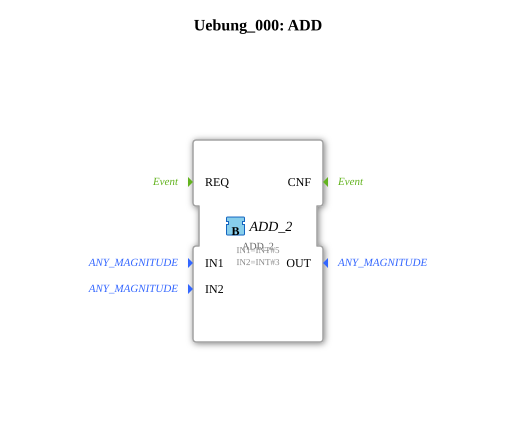

# Exercise_000: ADD

This article describes the logiBUS® exercise `Uebung_000`. This is the perfect introductory example for mathematical data processing.
## 🎧 Podcast

* [3000 Watt Lie: The TVS Diode Decoded ](https://podcasters.spotify.com/pod/show/ms-muc-lama/episodes/3000-Watt-Lge-Die-TVS-Diode-entschlsselt-e3aun8t)
* [Hannes' Turbo Corn: How a Farmer Processes 15,000 Tons of Grain Corn with a Wood Chip Recycling System and Tower Dryer ](https://podcasters.spotify.com/pod/show/ms-muc-lama/episodes/Hannes-Turbo-Mais-Wie-ein-Landwirt-mit-Hackschnitzel-Kreislauf-und-Turmtrockner-15-000-Tonnen-Krnermais-verarbeitet-e3a5e0o)

----

## Objective of the Exercise

Use of a standard mathematical building block (`ADD_2`). This section demonstrates how to apply constant values to the inputs of a function block to perform a simple calculation.

-----

## Description and Components

[cite_start]In `Uebung_000.SUB`, an addition function block is used to calculate a sum.[cite: 1]

### Function Blocks (FBs)
* **`ADD_2`**: A function block from the IEC 61131 library (arithmetic).
* **Parameters**:
* `IN1`: Fixed value 5 (`INT#5`).
* `IN2`: Fixed value 3 (`INT#3`).

-----

## Functionality

The function block takes the two input values and adds them internally. Since no event connections are defined in this minimalist example, this is a purely static calculation of the data flow. The mathematical result at the output `OUT` is 8.

-----

## Learning Objective

This exercise is designed to familiarize you with the 4diac interface:

1. Drag and drop function blocks from the library.

2. Edit the properties (parameters) of function blocks in the Properties window.

3. Understand the difference between variable inputs and constants.

---

### 🌐 Related topic subpages on ms-muc-docs.de
* [🌐 Eclipse 4diac IDE & Color Reference on ms-muc-docs.de](https://www.ms-muc-docs.de/iec-61499/eclipse-4diac/)
* [🌐 Diode & Semiconductor Basics on ms-muc-docs.de](https://www.ms-muc-docs.de/elektrotechnik/elektronik-i/diode/diode/)

]