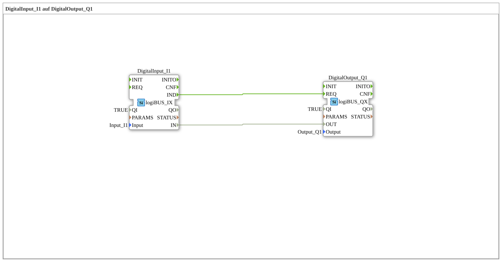
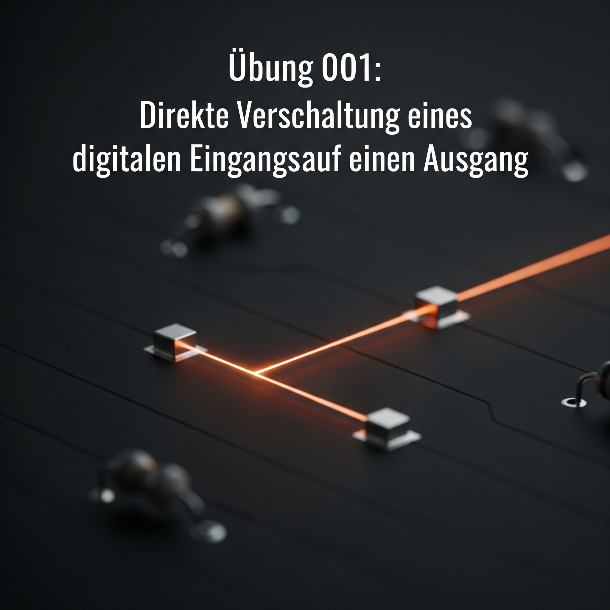
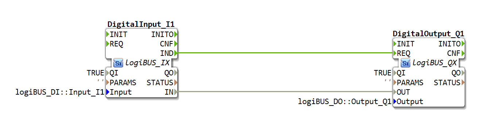

# Exercise_001: DigitalInput_I1 to DigitalOutput_Q1

[](https://notebooklm.google.com/notebook/a6872e59-1dfc-4132-a118-aff1bc7bc944)
This article describes the basic logiBUS® exercise `Uebung_001`. It demonstrates the fundamental principle of IEC 61499: the explicit separation of data flow and event flow.

## 🎧 Podcast



* [Analysis of the amendment to the Master Craftsman Examination Regulations in the agricultural and construction machinery mechatronics trade: A detailed comparison of the 2024 and 2001 regulations](https://podcasters.spotify.com/pod/show/ms-muc-lama/episodes/Analyse-der-Novellierung-der-Meisterprfungsverordnung-im-Land--und-Baumaschinenmechatroniker-Handwerk-Ein-Detaillierter-Vergleich-der-Verordnungen-von-2024-und-2001-e37aejv)

----





## Objective of the exercise

The objective of this introductory exercise is to route a signal from a physical digital input to a digital output. Users will learn that, according to IEC 61499, a simple data connection (the "line") is insufficient – an event (the "trigger") must also be transmitted for the target component to process the data.

-----

## Description and Components

[cite_start]The exercise consists of a subapplication (`Uebung_001.SUB`) that links an input block and an output block via two separate connection types[cite: 1].

### Function Blocks (FBs)

* **`DigitalInput_I1`**: An instance of type `logiBUS_IX`. [cite_start]This block represents the physical input `Input_I1`[cite: 1]. It provides both the logical state (`IN`) and a notification event (`IND`).
* **`DigitalOutput_Q1`**: An instance of type `logiBUS_QX`. [cite_start]This function block controls the physical output `Output_Q1`[cite: 1]. It requires a data value (`OUT`) and a trigger command (`REQ`).

-----

## Functionality

The logic is implemented using two parallel connections. The structure shown in `Uebung_001.SUB` illustrates this:

```xml
<EventConnections>
<Connection Source="DigitalInput_I1.IND" Destination="DigitalOutput_Q1.REQ"/>
</EventConnections>
<DataConnections>
<Connection Source="DigitalInput_I1.IN" Destination="DigitalOutput_Q1.OUT"/>
</DataConnections>
```
## Application Example

A **light switch in the house**:

The switch on the wall is the input `I1`, the light bulb on the ceiling is the output `Q1`. The cable transmits the current (data), but only when the switch is flipped (event) is the "On" or "Off" information processed and implemented.
