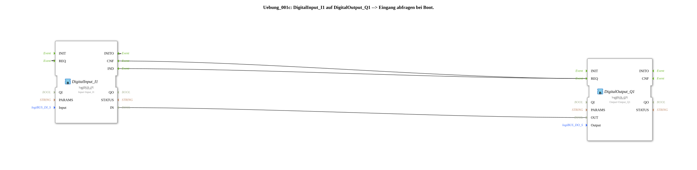

# Exercise_001c: DigitalInput_I1 to DigitalOutput_Q1 --> Querying the input during boot.

This article describes the logiBUS® exercise `Uebung_001c`. It demonstrates how to query a digital input immediately after system startup (boot process) to transfer the initial state to a digital output using standard event and data connections.
----
## Objective of the Exercise

The main objective of this exercise is to understand the initialization process in IEC 61499. It aims to ensure that the output adopts the correct current state of the hardware input as soon as the controller starts up, even if no state change (edge) has yet occurred.

-----

## Description and Components

[cite_start]This exercise uses the subapplication `Uebung_001c.SUB` to establish a connection between a digital input and an output, supplemented by self-triggering for system startup[cite: 1].

### Function Blocks (FBs)

* **`DigitalInput_I1`**: An instance of type `logiBUS_IX`. [cite_start]This block returns the event `IND` on changes and responds to the command `REQ` to manually read the current value[cite: 1].
* **`DigitalOutput_Q1`**: An instance of type `logiBUS_QX`. [cite_start]This component sets the hardware output `Output_Q1` on every incoming `REQ` event[cite: 1].

-----

## Functionality

The logic combines normal signal forwarding with an initialization loop. The structure in `Uebung_001c.SUB` is defined as follows:

<EventConnections>
<Connection Source="DigitalInput_I1.IND" Destination="DigitalOutput_Q1.REQ"/>
<Connection Source="DigitalInput_I1.INITO" Destination="DigitalInput_I1.REQ"/>
<Connection Source="DigitalInput_I1.CNF" Destination="DigitalOutput_Q1.REQ"/>
</EventConnections>
<DataConnections>
<Connection Source="DigitalInput_I1.IN" Destination="DigitalOutput_Q1.OUT"/>
</DataConnections>

[cite_start][cite: 1]

The process is divided into two phases:

1. **Initialization Phase (Boot)**:
* At system startup, the function block `DigitalInput_I1` is initialized and sends a `INITO` event.
* This event is fed back to its own `REQ` input.
* As a result, the function block immediately reads the physical state and acknowledges this with a `CNF` event.
* The `CNF` event finally triggers `DigitalOutput_Q1.REQ`, so that the output already receives the correct value at startup.
2. **Operating Phase (Runtime)**:
* Any subsequent change to the input directly triggers the output via `IND -> REQ`, as in Exercise 001.

-----

## Application Example

A **Status Display**:

Imagine the output `Q1` controls an indicator light that shows whether a safety switch (`I1`) is closed. When the system restarts after a power outage, the light must illuminate correctly immediately – not only after someone reactivates the safety switch. The boot query guarantees this immediate correctness of the display.
