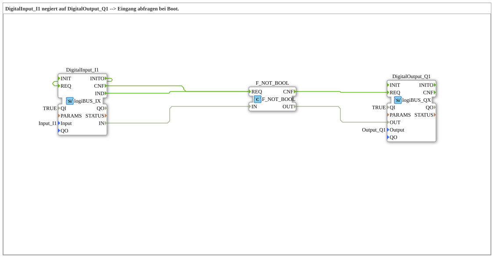

# Exercise_001c2: DigitalInput_I1 negated to DigitalOutput_Q1 --> Input polling at boot.



* * * * * * * * * *

## Introduction

This exercise implements a simple signal processing operation: The digital input `I1` is negated and output to the digital output `Q1`. The input is polled once during system boot. A specific comment in the network indicates that the startup behavior depends on the presence of a specific event connection (`INITO → REQ`).


``` ## Function Blocks (FBs) Used

### `DigitalInput_I1`
- **Type**: `logiBUS::io::DI::logiBUS_IX`
- **Parameters**:

- `QI = TRUE`

- `Input = Input_I1`
- **Event Interface**:

- Input: `REQ` (Request to read input)

- Output: `IND` (Acknowledgement: Input read), `INITO` (Initialization acknowledgement)

- **Data Interface**:

- Output: `IN` (Current digital value of the input)

- **Functionality**:

The block reads the digital value of the configured input (here The reading process is triggered by the event `Input_I1`. After a successful read, an event is output at `IND`, and the read value is made available via `IN`.

### `F_NOT_BOOL`

- **Type**: `iec61131::bitwiseOperators::F_NOT_BOOL`

- **Parameters**: None.

- **Event Interface**:

- Input: `REQ` (Request for negation)

- Output: `CNF` (Acknowledgement: Negation performed)

- **Data Interface**:

- Input: `IN` (BOOL value to be negated)

- Output: `OUT` (Negated BOOL value)

- **Functionality**:

This function block performs a logical negation on the incoming BOOL value. Upon an event at `REQ`, the value at `IN` is negated, and the result is output to `OUT`. Then, `CNF` is triggered.


``` ### `DigitalOutput_Q1`
- **Type**: `logiBUS::io::DQ::logiBUS_QX`
- **Parameters**:

- `QI = TRUE`

- `Output = Output_Q1`
- **Event Interface**:

- Input: `REQ` (Request to set output)

- Output: `CNF` (Acknowledgement: Output set)

- **Data Interface**:

- Input: `OUT` (Value to be written to output)

- **Functionality**:

This function block sets the digital output `Output_Q1` to the value received via `OUT`. Upon an event at `REQ`, the value is transferred and the output is physically updated. Once complete, `CNF` is triggered.

## Program Flow and Connections

The three modules are connected as follows:

1. **Input Reading and Triggering Negation**

The event output `IND` of `DigitalInput_I1` is directly connected to the event input `REQ` of `F_NOT_BOOL`. This ensures that after each successful reading of the digital input, the negation of the read value is immediately triggered. Simultaneously, the data value `IN` from `DigitalInput_I1` is transferred to the data input `IN` of `F_NOT_BOOL`.

2. **Negation and Setting Output**

The event output `CNF` from `F_NOT_BOOL` is connected to the event input `REQ` from `DigitalOutput_Q1`. Once the negation is complete, the negated value (from output `OUT` of `F_NOT_BOOL`) is placed on data input `OUT` of `DigitalOutput_Q1`, and the output is updated.

3. **Special Features During Boot**

An important aspect is the initialization. The event output `INITO` of `DigitalInput_I1` is connected back to the event input `REQ` of `DigitalInput_I1` (i.e., the block itself). This connection ensures that the input is read once immediately after booting. Without this feedback, the output `Q1` would retain the value `FALSE` at startup because no initial event is triggered. **With this connection**, the input is immediately queried, negated, and the output is set to the actual (negated) value – which could then be `TRUE`.

The network comment summarizes this:

> "Without the INITO -> REQ line, output Q1 is FALSE at startup. With the line, it is TRUE."

## Summary

This exercise demonstrates the basic use of digital input and output components in combination with logical negation. The focus is on understanding event-driven control (event chain) and the initialization behavior during system startup. The feedback from the ``INITO`` event ensures that the output receives a correct (negated) value during boot. This is a typical example of using initialization events in the 4diac IDE.

---

### 🌐 Related topic subpages on ms-muc-docs.de

* [🌐 Eclipse 4diac IDE & Color Reference on ms-muc-docs.de ](https://www.ms-muc-docs.de/iec-61499/eclipse-4diac/)


```