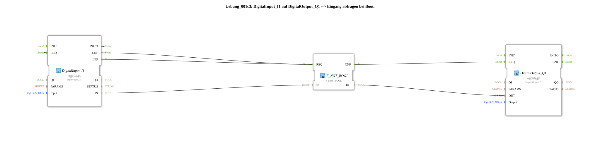

# Exercise_001c3: DigitalInput_I1 to DigitalOutput_Q1 --> Query input on boot.



* * * * * * * * * *

## Introduction

This exercise demonstrates reading a digital input (Input I1) and directly outputting it to a digital output (Output Q1) during the controller's startup.

A special feature is the use of a negation of the input signal and a special event connection that sets the output to TRUE during boot.

## Function Blocks (FBs) Used

- **DigitalInput_I1** (Type: `logiBUS::io::DI::logiBUS_IX`)

- Parameters: `QI = TRUE`, `Input = Input_I1`

- Provides the physical digital input I1. Data is provided via the event outputs `IND` (upon new valid input information) and `INITO` (initialization at startup).

- **F_NOT_BOOL** (Type: `iec61131::bitwiseOperators::F_NOT_BOOL`)

- Parameters: none

- Performs a logical negation (NOT) of the Boolean input signal.

- **DigitalOutput_Q1** (Type: `logiBUS::io::DQ::logiBUS_QX`)

- Parameters: `QI = TRUE`, `Output = Output_Q1`

- Controls the physical digital output Q1. The output value is only updated upon a REQ event.


## Program Flow and Connections

The flow is defined by the event and data connections in the SubApp network:

1. **Initialization**

- Upon booting, `DigitalInput_I1` sends the event `INITO` to its own `REQ` input. This causes the input to be read once immediately after startup.

2. **Input Reading and Negation**

- Each time a new value is present at the input, `DigitalInput_I1` sends the event `IND`.

- The event `IND` (as well as `CNF`) is connected to the `REQ` input of `F_NOT_BOOL`.

- Simultaneously, the data value `IN` (from the input) is transferred to the `IN` input of `F_NOT_BOOL`. **Important:** This data connection has the property `Negated = true`, which performs a negation at the connection level. This inverts the input value before the NOT operation.


``` 3. **Output**

- After the calculation, `F_NOT_BOOL` sends the event `CNF` to the `REQ` input of `DigitalOutput_Q1`.

- The negated data value `OUT` from `F_NOT_BOOL` is placed on the data input `OUT` of the output block.

- Due to the initialization (`INITO -> REQ`), the output is immediately active (TRUE) after boot – without this connection, it would be FALSE.

**Special Features:**

- The combination of negation on the data connection and the NOT block results in a double negation, meaning the input value remains unchanged at the output.

- The connection `INITO -> REQ` ensures that the output assumes a defined state (TRUE) at startup, even if no valid input value is yet available.

## Summary

This exercise demonstrates the basic connection of a digital input to an output in 4diac.

The startup behavior is controlled by using negation and initialization events. The learner understands how event and data flows are structured in an IEC 61499 application and how to work with negation at the connection level.

---

### 🌐 Related topic subpages on ms-muc-docs.de

* [🌐 Eclipse 4diac IDE & color reference on ms-muc-docs.de ](https://www.ms-muc-docs.de/iec-61499/eclipse-4diac/)


```