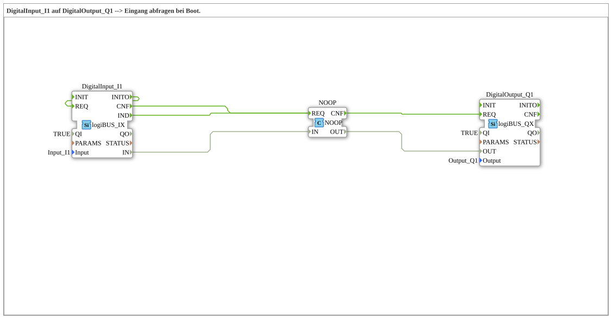

# Exercise_001c4: DigitalInput_I1 to DigitalOutput_Q1 --> Query input at boot.

* * * * * * * * * *
## Introduction
This exercise demonstrates the basic use of a digital input and a digital output on a logiBUS system. The input **Input_I1** is queried at system startup (boot), and its state is directly transferred to the output **Output_Q1**. The exercise shows how the initialization event connection (INITO → REQ) ensures that the output assumes the correct value during startup. Additionally, the **NOOP** block is used as a simple pass-through block to connect the event and data paths.
## Function Blocks Used (FBs)

In this exercise, three predefined function blocks are used directly in the SubApp network. There are no other sub-blocks.

- **DigitalInput_I1** (Type: `logiBUS::io::DI::logiBUS_IX`)
- **Parameters**:
- `QI` = `TRUE` (Activate function block)
- `Input` = `Input_I1` (Physical input channel)
- **Functionality**: This function block reads the state of the digital input `Input_I1`. It has the event outputs `IND` (Indication of data change), `INITO` (Initialization confirmation), and `CNF` (Confirmation after a read request). The read value is provided at data output `IN`.
- **DigitalOutput_Q1** (Type: `logiBUS::io::DQ::logiBUS_QX`)
- **Parameters**:
- `QI` = `TRUE` (Enables the function block)
- `Output` = `Output_Q1` (Physical output channel)
- **Functionality**: This function block sets the digital output `Output_Q1` to the value present at data input `OUT` as soon as it is triggered by event input `REQ`. The output is updated with each REQ event.
- **NOOP** (Type: `iec61131::bitwiseOperators::NOOP`)
- **Parameters**: None
- **Functionality**: The NOOP block is a "No Operation" block that passes the data at its input unchanged to the output. It serves here as a simple pass-through block for both events and data. It can also be used as a counterpart to a `E_TRIG` block if simple pass-through without trigger edge detection is desired.

## Program Flow and Connections

The exercise proceeds as follows:

1. **Initialization**: Upon successful initialization, the `DigitalInput_I1` block sends an event to its output, `INITO`, when the system starts. This event is then fed back to its own event input, `REQ` (self-triggering). This triggers an initial read request from the input before the actual cyclic behavior begins. Without this connection, the output `Q1` would be **FALSE** at startup; with the connection, it is **TRUE** (provided the input is enabled).

2. **Cyclic Reading**: After the read request, `DigitalInput_I1` acknowledges the operation with a `CNF` event. Simultaneously, it generates a `IND` event for every change in the input signal. Both events (`CNF` and `IND`) are forwarded to the event input `REQ` of the **NOOP** block.
... 3. **Data Passthrough**: The read input value (data output `IN` of DigitalInput_I1) is routed to the data input `IN` of the NOOP function block. The NOOP then forwards this value unchanged to its data output `OUT`.

4. **Setting the Output**: As soon as the NOOP receives an event at its `REQ` input (from `DigitalInput_I1`), it sends an acknowledgment event at its output `CNF`. This `CNF` event triggers the event input `REQ` of the **DigitalOutput_Q1** function block. Simultaneously, the passed-through data value from NOOP is present at the data input `OUT` of the output block. Subsequently, `DigitalOutput_Q1` sets the physical output `Output_Q1` to the corresponding value.

### Visualization of Connections

The following table shows the essential connections in the network:

| From | To | Type |

|-----|------|-----|

| `DigitalInput_I1.INITO` | `DigitalInput_I1.REQ` | Event |

| `DigitalInput_I1.IND` | `NOOP.REQ` | Event |

| `DigitalInput_I1.CNF` | `NOOP.REQ` | Event |

| `NOOP.CNF` | `DigitalOutput_Q1.REQ` | Event |

| `DigitalInput_I1.IN` | `NOOP.IN` | Data |

| `NOOP.OUT` | `DigitalOutput_Q1.OUT` | Data |

### Learning Objectives
- Understanding the initialization sequence (INITO) and its effect on output values at startup.
- Working with logiBUS input and output blocks in 4diac.
- Using the NOOP block as a simple pass-through block to connect event and data paths.
... Understanding the use of logiBUS input and output blocks in 4diac. - Basic understanding of event-driven processes in IEC 61499.

## Summary

Exercise **Exercise_001c4** demonstrates a simple use case: A digital input is directly mapped to a digital output. The clever use of self-triggering during initialization ensures that the output assumes the correct state upon boot. The NOOP block acts as a universal interface block, forwarding both events and data unchanged. This exercise is suitable for beginners who want to learn the fundamentals of event and data linking in 4diac.

---

### 🌐 Related topic subpages on ms-muc-docs.de
* [🌐 Eclipse 4diac IDE & color reference on ms-muc-docs.de](https://www.ms-muc-docs.de/iec-61499/eclipse-4diac/)

]
