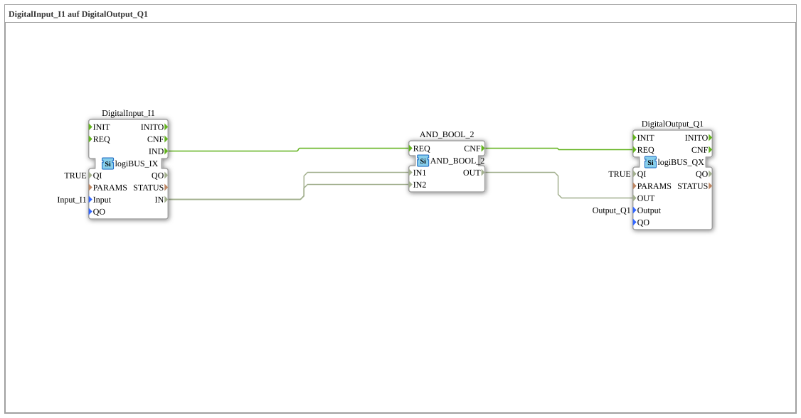

# Exercise_001d: DigitalInput_I1 to DigitalOutput_Q1

* * * * * * * * * *
## Introduction
This exercise demonstrates the basic connection of a digital input (Input_I1) to a digital output (Output_Q1) using a logic AND gate. The goal is to switch the input signal directly to the output – using the AND gate to learn how event and data flows work within the 4diac IDE.
## Function Blocks Used (FBs)
- **DigitalInput_I1** (Type: `logiBUS::io::DI::logiBUS_IX`)
- Parameters:
- `QI` = `TRUE`
- `Input` = `Input_I1`
- Event output: `IND` (indicates that a new input value is present)
- Data output: `IN` (current digital value)
- **AND_2** (Type: `iec61131::bitwiseOperators::AND_2_BOOL`)
- Parameters: none
- Event input: `REQ` (starts the calculation)
- Event output: `CNF` (confirms execution)
- Data inputs: `IN1`, `IN2` (two Boolean inputs)
- Data output: `OUT` (result of the AND operation)
- **DigitalOutput_Q1** (Type: `logiBUS::io::DQ::logiBUS_QX`)
- Parameters:
- `QI` = `TRUE`
- `Output` = `Output_Q1`
- Event input: `REQ` (receives the output value)
- Data input: `OUT` (Value set to the physical output)

## Program Flow and Connections

1. The **DigitalInput_I1** acquires the value of the physical input `Input_I1`. A change in this value triggers the event `IND`.

2. This event is sent via the event connection to the **AND_2** block (to its event input `REQ`).

3. Simultaneously, the data value `IN` from the input block is passed via two parallel **data connections** to the data inputs `IN1` and `IN2` of the AND_2 block.

4. The **AND_2** block calculates the logical AND operation of the two identical signals:

`OUT = IN1 AND IN2 = IN (da beide Eingänge gleich sind)`.

5. After the calculation, the event `CNF` is triggered and forwarded to the **DigitalOutput_Q1** block (event input `REQ`).

6. The data value `OUT` of the AND_2 block is transferred to the data input `OUT` of the output block. This sets the physical output `Output_Q1` to the same value as the input `Input_I1`.

**Result:** The signal from the digital input is passed through to the digital output unchanged – the AND gate of two identical signals does not change the value.

## Summary
This exercise introduces the fundamentals of event and data connections in the 4diac IDE. Although the AND gate is functionally redundant in this case, it illustrates the interaction between the sensor (input), logic (AND gate), and actuator (output). You will learn how to implement simple control tasks by connecting function blocks.

---

### 🌐 Related topic subpages on ms-muc-docs.de
* [🌐 Eclipse 4diac IDE & color reference on ms-muc-docs.de](https://www.ms-muc-docs.de/iec-61499/eclipse-4diac/)

]
