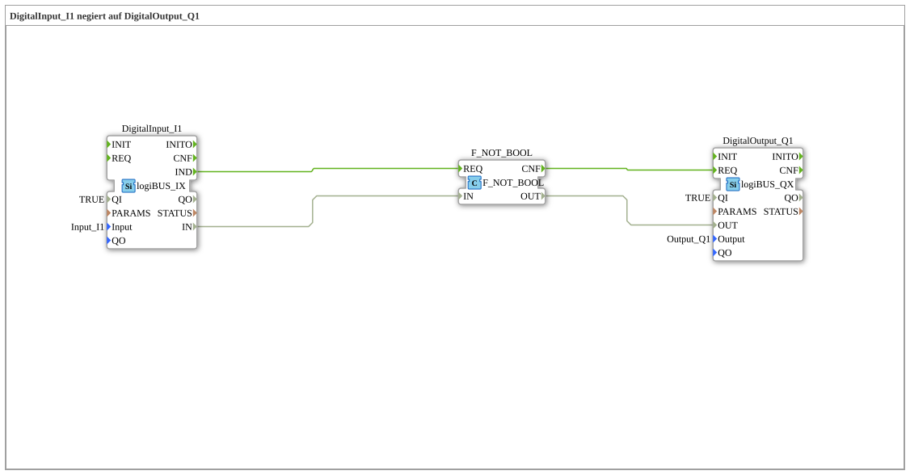

# Exercise_001e: DigitalInput_I1 negated to DigitalOutput_Q1

*Note: This exercise does not include a separate image.*
---

## Introduction

This exercise demonstrates the basic negation of a digital input signal. The digital input **Input_I1** (pin I1) is read, logically negated, and output to the digital output **Output_Q1** (pin Q1). This disables the output when the input is active and vice versa.

*Note: This exercise does not include a separate image.*

---

This exercise demonstrates the basic negation of a digital input signal. The digital input **Input_I1** (pin I1) is read, logically negated, and output to the digital output **Output_Q1** (pin Q1). This exercise is suitable for beginners in industrial automation with IEC 61499 and serves to develop an understanding of:

- Input and output function blocks of the logiBUS library
- Logical negation using IEC 61131 bit operators
- Event-driven data processing

**Difficulty level:** Easy
**Required prior knowledge:** Basic knowledge of the 4diac IDE and the IEC 61499 model

---

## Function blocks (FBs) used

### **DigitalInput_I1** (`logiBUS::io::DI::logiBUS_IX`)

- **Type:** `logiBUS::io::DI::logiBUS_IX`
- **Parameters:**
- `QI` = `TRUE` (Qualifier – always active)
- `Input` = `Input_I1` (physical pin I1)
- **Event output:** `IND` – triggered as soon as the input value is updated
- **Data output:** `IN` – the current digital state (BOOL) of the pin
- **Functionality:** Reads the digital state of input I1 and makes it available at output `IN`. An incoming event (e.g., via the network) activates the readout.

### **F_NOT_BOOL** (`iec61131::bitwiseOperators::F_NOT_BOOL`)

- **Type:** `iec61131::bitwiseOperators::F_NOT_BOOL`
- **Parameters:** None
- **Event Input:** `REQ` – starts the negation
- **Event Output:** `CNF` – confirms the completed negation
- **Data Input:** `IN` (BOOL) – value to be negated
- **Data Output:** `OUT` (BOOL) – negated value
- **Functionality:** Performs a logical NOT operation on the Boolean input value. `IN = TRUE` becomes `OUT = FALSE` and vice versa.

### **DigitalOutput_Q1** (`logiBUS::io::DQ::logiBUS_QX`)

- **Type:** `logiBUS::io::DQ::logiBUS_QX`
- **Parameters:**
- `QI` = `TRUE` (Qualifier – always active)
- `Output` = `Output_Q1` (Physical Pin Q1)
- **Event Input:** `REQ` – triggers setting the output
- **Data Input:** `OUT` (BOOL) – desired output state
- **Functionality:** Sets the digital output Q1 to the value present at input `OUT` as soon as an event occurs at the input The input `REQ` arrives.

---

## Program Flow and Connections

The flow is strictly event-driven:

1. **Input Event:** The function block `DigitalInput_I1` generates an event at its output `IND` as soon as input I1 provides a new value (e.g., through a cyclic query or external change).
2. **Start Negation:** This `IND` event is forwarded via an **event connection** to the event input `REQ` of `F_NOT_BOOL`. Simultaneously, the current data value of `DigitalInput_I1.IN` is transferred via a **data connection** to the input `F_NOT_BOOL.IN`.
3. **Perform negation:** `F_NOT_BOOL` calculates the negated value and outputs it to its output `OUT`. Once the calculation is complete, an event is generated at output `CNF`.
4. **Set output:** The `CNF` event is sent via another **event connection** to the event input `REQ` of `DigitalOutput_Q1`. Simultaneously, the negated data value from `F_NOT_BOOL.OUT` is set to the data input `DigitalOutput_Q1.OUT` via a **data connection**. This updates output Q1 with the negated value.
5. **Set output:** The `CNF` event is sent to the event input `REQ` of `DigitalOutput_Q1` via another **data connection**. **Summary of Connections:**

- Event: `DigitalInput_I1.IND` → `F_NOT_BOOL.REQ` → `F_NOT_BOOL.CNF` → `DigitalOutput_Q1.REQ`
- Data: `DigitalInput_I1.IN` → `F_NOT_BOOL.IN` → `F_NOT_BOOL.OUT` → `DigitalOutput_Q1.OUT`

This exercise can be performed in 4diac by starting the application (e.g., with a simulation run). Observe the behavior: Output Q1 is active only when input I1 is inactive (and vice versa).

---

## Summary

Exercise **Exercise_001e** implements a simple negation of a digital input using a cascade of three function blocks. This course teaches the fundamental principles of event-driven data processing according to IEC 61499, as well as the use of logiBUS input/output blocks and IEC 61131 bit operators. Upon successful completion, you will understand how input data is processed in real time and written to outputs. This forms the basis for more complex automation applications.

---

### 🌐 Related topic subpages on ms-muc-docs.de

- [🌐 Eclipse 4diac IDE & color reference on ms-muc-docs.de](https://www.ms-muc-docs.de/iec-61499/eclipse-4diac/)

]
