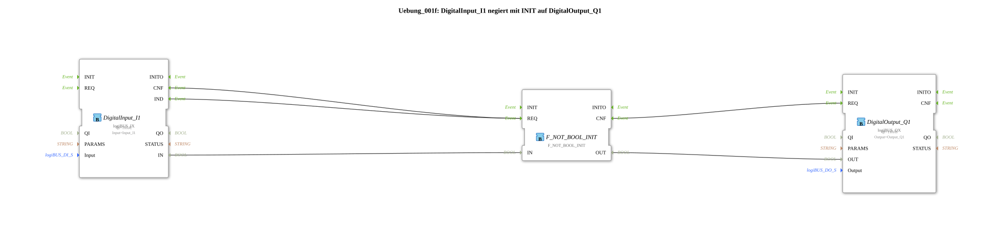

# Exercise_001f: DigitalInput_I1 negated with INIT to DigitalOutput_Q1

* * * * * * * * * *
## Introduction

This exercise demonstrates the negation of a digital input signal using the function block `F_NOT_BOOL_INIT`. The digital input `Input_I1` is read, inverted, and written to the digital output `Output_Q1`. It becomes clear that the negation block outputs a defined value even at system startup (BOOT), even if the input is not yet being read at that time.
**Learning Objective:** Understanding the linking of input/output blocks with logic function blocks (FBs) and the initialization of negation blocks.

## Function Blocks Used

The exercise consists of three function blocks placed directly in the network. No sub-modules are used.

- **DigitalInput_I1**
- **Type:** `logiBUS::io::DI::logiBUS_IX`
- **Parameters:** `QI = TRUE`, `Input = Input_I1`
- **Function:** Reads the digital input `Input_I1` and provides the value at the data output `IN`, as well as the events `IND` (on rising edge) and `CNF` (on falling edge).
- **F_NOT_BOOL_INIT**
- **Type:** `iec61131::bitwiseOperators::F_NOT_BOOL_INIT`
- **Parameters:** none
- **Function:** Negates the applied Boolean value at data input `IN` and outputs the result at data output `OUT`. The function block has a built-in INIT mechanism that provides a defined output value when the system starts.

** ... - **DigitalOutput_Q1**

- **Type:** `logiBUS::io::DQ::logiBUS_QX`
- **Parameters:** `QI = TRUE`, `Output = Output_Q1`
- **Function:** Writes the Boolean value present at data input `OUT` to output `Output_Q1` as soon as the event `REQ` is received.

## Program Flow and Connections

The exercise network operates using event-driven logic:

1. **Event Connections:**
- The output events `IND` and `CNF` of DigitalInput_I1 are both routed to the event input `REQ` of F_NOT_BOOL_INIT.
- The acknowledgment event `CNF` of F_NOT_BOOL_INIT is routed to the event input `REQ` of DigitalOutput_Q1.
2. **Data Connections:**
- The data output `IN` of DigitalInput_I1 is connected to the data input `IN` of F_NOT_BOOL_INIT.
- The data output `OUT` of F_NOT_BOOL_INIT is connected to the data input `OUT` of DigitalOutput_Q1.

**Process:**

- As soon as the state of the digital input `Input_I1` changes (rising or falling edge), DigitalInput_Q1 generates the corresponding event.
- This event triggers the negation block, which inverts the current input value and outputs the event `CNF` after the calculation is complete.
- This triggers the output block to write the negated value to `Output_Q1`.

Note: Because the negation block `F_NOT_BOOL_INIT` has an INIT mechanism, an initial negated value will be present at the output as soon as the system starts up (without any prior input changes) – even if the input has not yet been read. This is clarified by the comment in the network.

**Difficulty Level:** Easy

**Prerequisites:** Basic knowledge of event and data flow modeling in 4diac and input/output configuration via logiBUS.

## Summary

The exercise `Uebung_001f` implements a simple negation of a digital input signal to a digital output. It demonstrates the basic connection of hardware-level function blocks with a logical negation block and illustrates the initial behavior of the negation block during system startup. The implementation is done exclusively via direct function block chaining without sub-blocks and is suitable as an introductory exercise for event-driven logic with 4diac.

---

### 🌐 Related topic subpages on ms-muc-docs.de

- [🌐 Eclipse 4diac IDE & color reference on ms-muc-docs.de](https://www.ms-muc-docs.de/iec-61499/eclipse-4diac/)

]
