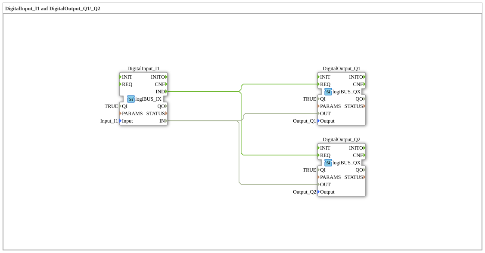

# Exercise_002: DigitalInput_I1 to DigitalOutput_Q1/_Q2
[](https://notebooklm.google.com/notebook/a6872e59-1dfc-4132-a118-aff1bc7bc944)
This article describes the logiBUS® exercise `Uebung_002`, in which a single digital input signal is distributed to two different digital outputs. This demonstrates the concept of "fan-out" (multiplying) connections.
----
## Objective of the Exercise
The main objective of this exercise is to demonstrate how event and data connections can be branched according to IEC 61499. A single source port can serve multiple destination ports. This is a fundamental method for triggering parallel actions in a controller.

-----

## Description and Components

[cite_start]In the subapplication `Uebung_002.SUB`, a digital input is read and directly passed on to two digital outputs[cite: 1].

### Function Blocks (FBs)



* **`DigitalInput_I1`**: An instance of type `logiBUS_IX`. [cite_start]This block reads the hardware input `Input_I1`[cite: 1].
* **`DigitalOutput_Q1` & `DigitalOutput_Q2`**: Instances of type `logiBUS_QX`. [cite_start]These represent the physical outputs `Output_Q1` and `Output_Q2`[cite: 1].

-----

## Functionality

Signal distribution is achieved by drawing two connections from the source to each destination. The setup in `Uebung_002.SUB` is defined as follows:

```xml
<EventConnections>
<Connection Source="DigitalInput_I1.IND" Destination="DigitalOutput_Q1.REQ"/>
<Connection Source="DigitalInput_I1.IND" Destination="DigitalOutput_Q2.REQ"/>
</EventConnections>
<DataConnections>
<Connection Source="DigitalInput_I1.IN" Destination="DigitalOutput_Q1.OUT"/>
<Connection Source="DigitalInput_I1.IN" Destination="DigitalOutput_Q2.OUT"/>
</DataConnections>

The signal path proceeds in the following steps:

1. The function block `DigitalInput_I1` detects a change at its physical input.

2. An event is triggered at port `IND` and sent to **both** target function blocks (`Q1` and `Q2`).

3. Simultaneously, the current signal state is available at port `IN` for both function blocks.

4. Both output function blocks receive the event simultaneously and switch their respective hardware outputs to the delivered value.

As a result, both outputs switch synchronously with the state of input `I1`.

-----

## Application Example

A typical application example is the **parallel status display**:

A sensor on a machine (`I1`) should not only control the internal logic, but also simultaneously activate a local indicator light (`Q1`) and a signal lamp on a remote control panel (`Q2`). Branching the signals ensures that both displays always reflect the same sensor status.
