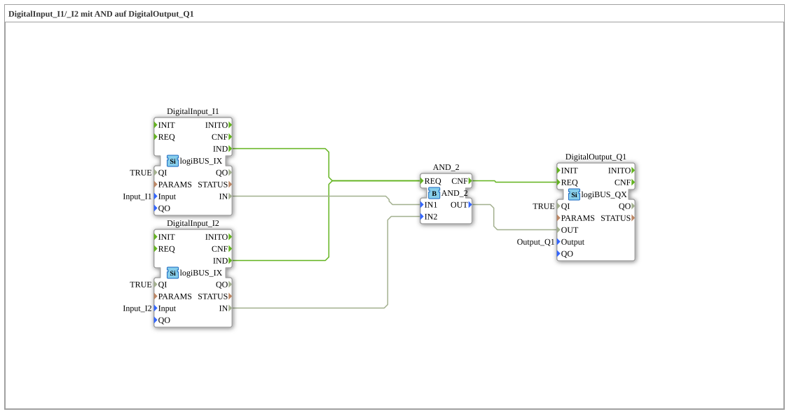

# Exercise_002a: DigitalInput_I1/_I2 with AND on DigitalOutput_Q1

[(https://notebooklm.google.com/notebook/a6872e59-1dfc-4132-a118-aff1bc7bc944)
This article describes the logiBUS® exercise `Uebung_002a`. In this exercise, a classic AND gate is implemented, where a digital output is only activated if two digital inputs are simultaneously in the "True" (HIGH) state.
-----
## Objective of the Exercise

The main objective of this exercise is to implement a basic logical decision structure. It demonstrates how signals from multiple sensors (inputs) can be combined to trigger an action at an actuator (output). This is a fundamental building block of any control programming.

-----

## Description and Components

[cite_start]The subapplication `Uebung_002a.SUB` links two digital inputs to a digital output via a logic block[cite: 1].

### Function Blocks (FBs)

- **`DigitalInput_I1` & `DigitalInput_I2`**: Instances of type `logiBUS_IX`. [cite_start]These represent the two hardware inputs being monitored[cite: 1].
- **`AND_2`**: An instance of type `AND_2` (from the IEC 61131 library). [cite_start]This block performs the logical AND operation. It has two data inputs (`IN1`, `IN2`) and one data output (`OUT`)[cite: 1]. For control, it requires an event at port `REQ` and acknowledges the calculation at port `CNF`.
- **`DigitalOutput_Q1`**: An instance of type `logiBUS_QX`. [cite_start]This block controls the hardware output `Output_Q1` based on the result of the logic[cite: 1].

-----

## Functionality

The logic is defined by the interconnection of event and data connections. The structure in `Uebung_002a.SUB` is defined as follows:

<EventConnections>
<Connection Source="DigitalInput_I1.IND" Destination="AND_2.REQ"/>
<Connection Source="DigitalInput_I2.IND" Destination="AND_2.REQ"/>
<Connection Source="AND_2.CNF" Destination="DigitalOutput_Q1.REQ"/>
</EventConnections>
<DataConnections>
<Connection Source="DigitalInput_I1.IN" Destination="AND_2.IN1"/>
<Connection Source="DigitalInput_I2.IN" Destination="AND_2.IN2"/>
<Connection Source="AND_2.OUT" Destination="DigitalOutput_Q1.OUT"/>
</DataConnections>

The process follows this logic:

1. If either of the two inputs (`I1` or `I2`) changes, the respective block sends a `IND` event to the `REQ` port of the `AND_2` block.
2. The `AND_2` block then reads both data inputs (`IN1` and `IN2`) and calculates the result (`IN1 AND IN2`).
3. After the calculation is complete, the logic block fires a `CNF` event (Confirmation).
4. This `CNF` event reaches the `REQ` port of `DigitalOutput_Q1`, which then accepts the result and switches the physical output.

-----

## Application Example

A classic application example is **safety enable**:

A motor (`Q1`) should only start if both the safety door is closed (`I1`) and the operator presses the start button (`I2`). Only when both conditions are met simultaneously (`TRUE`) does the AND gate provide a signal to switch on the motor.
