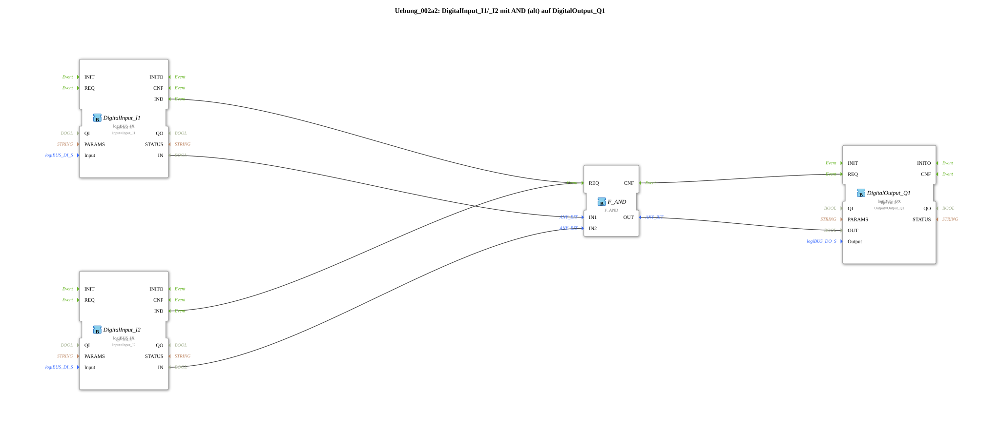

# Exercise_002a2: DigitalInput_I1/_I2 with AND (old) on DigitalOutput_Q1

[(https://notebooklm.google.com/notebook/041f4df4-b729-484d-b786-b6dcdf151961)
This article describes the logiBUS® exercise `Uebung_002a2`. This exercise is functionally identical to `Uebung_002a`, but demonstrates the use of the generic function block `F_AND` instead of the type-specific `AND_2`
-----

## Objective of the Exercise

The objective is to understand the use of generic function blocks (F-FBs) in IEC 61499. It demonstrates that different block types can perform the same logical operation (AND) while maintaining the same event-based execution model.

## Description and Components

[cite_start]In the subapplication `Uebung_002a2.SUB`, two digital inputs are linked using a generic AND gate[cite: 1].

### Function Blocks (FBs)

- **`DigitalInput_I1` & `DigitalInput_I2`**: Standard input blocks of type `logiBUS_IX`[cite: 1].
- **`F_AND`**: A generic function block of type `F_AND`. [cite_start]It calculates the logical AND operation on its inputs `IN1` and `IN2` as soon as it receives an event at input `REQ`, and outputs the result at output `OUT` as well as an acknowledgment event at port `CNF`[cite: 1].
- **`DigitalOutput_Q1`**: Standard output block of type `logiBUS_QX`[cite: 1].

-----

## Functionality

The structure in `Uebung_002a2.SUB` follows the proven pattern of an event chain:

<EventConnections>
<Connection Source="DigitalInput_I1.IND" Destination="F_AND.REQ"/>
<Connection Source="DigitalInput_I2.IND" Destination="F_AND.REQ"/>
<Connection Source="F_AND.CNF" Destination="DigitalOutput_Q1.REQ"/>
</EventConnections>
<DataConnections>
<Connection Source="DigitalInput_I1.IN" Destination="F_AND.IN1"/>
<Connection Source="DigitalInput_I2.IN" Destination="F_AND.IN2"/>
<Connection Source="F_AND.OUT" Destination="DigitalOutput_Q1.OUT"/>
</DataConnections>

Functional Flow:

1. Any change to the buttons `I1` or `I2` triggers a `IND` event.
2. Both events are connected to the `REQ` port of `F_AND`. This means that regardless of which button is pressed, the logic is recalculated.
3. `F_AND` determines the result.
4. The `CNF` event instructs the function block `DigitalOutput_Q1` to update the hardware output `Q1`.

The output is only active if both inputs simultaneously carry the value `TRUE`.

-----

## Application Example

**Enabling Circuit**:

An operator must press a button (`I1`) on a control panel, and simultaneously a second sensor (`I2`) must confirm the presence of a workpiece before the robot arm (`Q1`) is allowed to grasp the workpiece.
