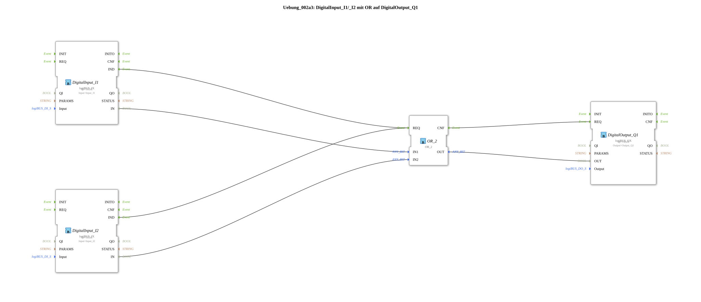

# Exercise_002a3: DigitalInput_I1/_I2 with OR on DigitalOutput_Q1

[(https://notebooklm.google.com/notebook/a6872e59-1dfc-4132-a118-aff1bc7bc944)
This article describes the logiBUS® exercise `Uebung_002a3`. In this exercise, a logical OR gate is implemented, in which a digital output is activated as soon as at least one of two digital inputs is in the "True" (HIGH) state
----

## Objective of the Exercise

The main objective of this exercise is to demonstrate the functionality of an OR gate in automation technology. It shows how alternative conditions (inputs) can be used to trigger the same action (output). This is a standard requirement for systems that must be operable from multiple locations.

-----

## Description and Components

[cite_start]The subapplication `Uebung_002a3.SUB` combines two digital input signals using an OR logic block[cite: 1].

### Function Blocks (FBs)

- **`DigitalInput_I1` & `DigitalInput_I2`**: Instances of type `logiBUS_IX`. [cite_start]These blocks capture the states of the physical inputs `Input_I1` and `Input_I2`[cite: 1].
- **`OR_2`**: An instance of type `OR_2` (from the IEC 61131 library). [cite_start]This function block performs the logical OR operation. It has two data inputs (`IN1`, `IN2`) and one data output (`OUT`)[cite: 1]. Like the AND function block, it reacts to an event at port `REQ` and acknowledges it with `CNF`.
- **`DigitalOutput_Q1`**: An instance of type `logiBUS_QX`. [cite_start]This function block sets the physical output `Output_Q1` based on the result of the OR operation[cite: 1].

-----

## Functionality

The logic is defined by the interconnection of event and data connections. The structure in `Uebung_002a3.SUB` is as follows:

<EventConnections>
<Connection Source="DigitalInput_I1.IND" Destination="OR_2.REQ"/>
<Connection Source="DigitalInput_I2.IND" Destination="OR_2.REQ"/>
<Connection Source="OR_2.CNF" Destination="DigitalOutput_Q1.REQ"/>
</EventConnections>
<DataConnections>
<Connection Source="DigitalInput_I1.IN" Destination="OR_2.IN1"/>
<Connection Source="DigitalInput_I2.IN" Destination="OR_2.IN2"/>
<Connection Source="OR_2.OUT" Destination="DigitalOutput_Q1.OUT"/>
</DataConnections>

The process follows this logic:

1. Any change to the buttons `I1` or `I2` triggers a `IND` event.
2. Both events are connected to the `REQ` port of `OR_2`. This means that regardless of which button is pressed, the logic is recalculated.
3. `OR_2` checks the states: If at least one input has the value `TRUE`, the output `OUT` also becomes `TRUE`.
4. The `CNF` event instructs the function block `DigitalOutput_Q1` to update the hardware output `Q1`.

-----

## Application Example

A typical application example is **hallway lighting with two switches**:

In a long hallway, there is a switch at each end (`I1` and `I2`). The light (`Q1`) should illuminate when switch 1 is pressed OR when switch 2 is pressed. This "either-or" logic is implemented by the `OR_2` function block, allowing the light to be switched on independently from either location.
