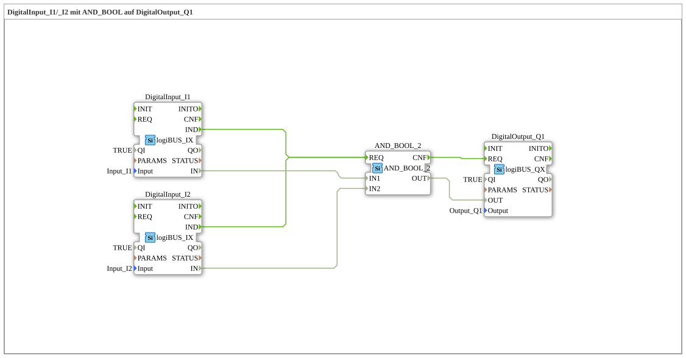

# Exercise_002a4: DigitalInput_I1/_I2 with AND_BOOL on DigitalOutput_Q1

[(https://notebooklm.google.com/notebook/041f4df4-b729-484d-b786-b6dcdf151961)
This article describes the logiBUS® exercise `Uebung_002a4`. In this exercise, a logical AND gate is implemented, where a digital output is only activated if two digital inputs are simultaneously in the "True" (HIGH) state
----

## Objective of the Exercise

The main objective of this exercise is to implement a logical decision structure using the specialized type `AND_2_BOOL`. It demonstrates how to combine event and data flows to control a hardware output based on multiple input conditions.

## Description and Components

[cite_start]The subapplication `Uebung_002a4.SUB` links two digital inputs to a digital output via a logic block[cite: 1].

### Function Blocks (FBs)

- **`DigitalInput_I1` & `DigitalInput_I2`**: Instances of type `logiBUS_IX`. [cite_start]These represent the two hardware inputs being monitored[cite: 1].
- **`AND_2_BOOL`**: An instance of type `AND_2_BOOL` (from the IEC 61131 library). [cite_start]This block performs the logical AND operation specifically for Boolean values. It has two data inputs (`IN1`, `IN2`) and one data output (`OUT`)[cite: 1]. Like all standard logic blocks, it responds to an event at port `REQ` and signals completion at port `CNF`.
- **`DigitalOutput_Q1`**: An instance of type `logiBUS_QX`. [cite_start]This block controls the hardware output `Output_Q1`[cite: 1].

-----

## Functionality

The logic is defined by the configuration of the event and data paths in the subapplication. The structure in `Uebung_002a4.SUB` is defined as follows:

<EventConnections>
<Connection Source="DigitalInput_I1.IND" Destination="AND_2_BOOL.REQ"/>
<Connection Source="DigitalInput_I2.IND" Destination="AND_2_BOOL.REQ"/>
<Connection Source="AND_2_BOOL.CNF" Destination="DigitalOutput_Q1.REQ"/>
</EventConnections>
<DataConnections>
<Connection Source="DigitalInput_I1.IN" Destination="AND_2_BOOL.IN1"/>
<Connection Source="DigitalInput_I2.IN" Destination="AND_2_BOOL.IN2"/>
<Connection Source="AND_2_BOOL.OUT" Destination="DigitalOutput_Q1.OUT"/>
</DataConnections>

Functional Flow:

1. Each key press on `I1` or `I2` triggers a `IND` event.
2. This event triggers the `REQ` input of the `AND_2_BOOL` function block.
3. The function block reads the current states of both inputs and performs a logical AND operation on them.
4. After the calculation, the function block sends a `CNF` event to `DigitalOutput_Q1`.
5. The output function block then updates the physical output `Q1` with the calculated result.

-----

## Application Example

A classic application example is **two-handed operation for safety**:

To start a machine (`Q1`), the operator must simultaneously press two spatially separated pushbuttons (`I1` and `I2`). This ensures that both of the operator's hands are outside the danger zone. The output is only activated when both signals are `TRUE`.
