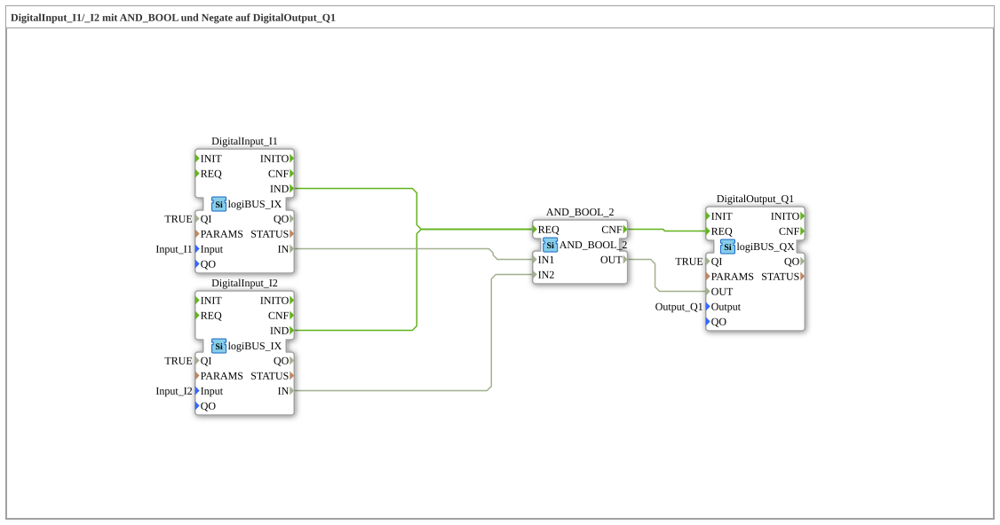

# Exercise_002a4b: DigitalInput_I1/_I2 with AND_BOOL and Negate on DigitalOutput_Q1

* * * * * * * * * *
## Introduction
This exercise demonstrates the basic linking of digital inputs with an **AND** function block, as well as the negation of an input signal. The result is routed to a digital output.
The goal is to understand the configuration and interconnection of input/output blocks of the **logiBUS** family with an **IEC 61131** standard block.

## Function Blocks Used

The exercise consists of the following function blocks used directly in the network (there are no sub-blocks):

| Block | Type | Parameters |

|----------|-----|-----------|

| **DigitalInput_I1** | `logiBUS::io::DI::logiBUS_IX` | `QI = TRUE`, `Input = Input_I1` |

| **DigitalInput_I2** | `logiBUS::io::DI::logiBUS_IX` | `QI = TRUE`, `Input = Input_I2` |

| **AND_2_BOOL** | `iec61131::bitwiseOperators::AND_2_BOOL` | (no parameters) |

| **DigitalOutput_Q1** | `logiBUS::io::DQ::logiBUS_QX` | `QI = TRUE`, `Output = Output_Q1` |

### Brief description of the function blocks used
- **logiBUS_IX**: Reads a digital input of the logiBUS hardware. The parameter `Input` specifies the physical connection (e.g., I1, I2). A new value is signaled via the event output `IND`.
- **AND_2_BOOL**: Performs an AND operation on two Boolean signals (type `iec61131::bitwiseOperators::AND_2_BOOL`). The output `OUT` is `TRUE` if and only if both inputs are `TRUE`.
- **logiBUS_QX**: Sets a digital output of the logiBUS hardware. The parameter `Output` determines the output channel (e.g., Q1). The output is controlled by the event `REQ`.

## Program Flow and Connections

The logic of the exercise is structured as follows:

1. The digital inputs **I1** and **I2** are read via the function blocks `DigitalInput_I1` and `DigitalInput_I2`.

2. The signal from **I2** is **negated** (inverted). This is done via a **Negate Connection** (attribute `Negated = "true"`) on the data connection between `DigitalInput_I2.IN` and `AND_2_BOOL.IN2`.

`` *(Negation is only possible with Boolean data types.)*

3. The function block `AND_2_BOOL` combines the signal from **I1** (to `IN1`) with the negated signal from **I2** (to `IN2`) using an AND operation.

4. The result (`AND_2_BOOL.OUT`) is passed to the data input `OUT` of the output function block `DigitalOutput_Q1`.

5. Event control:

Each of the two input function blocks triggers the event `IND` when a new value is received.

- Both `IND` events are connected to the `REQ` input of the **AND_2_BOOL**, so the AND operation is recalculated with each input change.
- The output block `DigitalOutput_Q1` receives a command to update its output from the `CNF` output of the **AND_2_BOOL** via its `REQ` event.

**Logic Summary:**
Q1 = I1 AND (NOT I2)`

**Learning Objectives:**

- Configuration of logiBUS input/output blocks.
- Use of the IEC 61131 function block `AND_2_BOOL`.
- Application of data negation (emergency connection) in 4diac.
- Understanding event control with `IND` and `REQ`.

**Difficulty Level:** Easy

**Required Prior Knowledge:** Fundamentals of IEC 61499 event control, basic Boolean logic.

## Summary

Exercise **Exercise_002a4b** implements a simple AND gate with a negated second input. It teaches the fundamentals of connecting hardware components (logiBUS) with logic components and the application of negation attributes to data connections. The behavior is deterministic: Output **Q1** is active if and only if input **I1** is active and input **I2** is inactive.

---

### 🌐 Related topic subpages on ms-muc-docs.de
* [🌐 Eclipse 4diac IDE & Color Reference on ms-muc-docs.de](https://www.ms-muc-docs.de/iec-61499/eclipse-4diac/)

]
