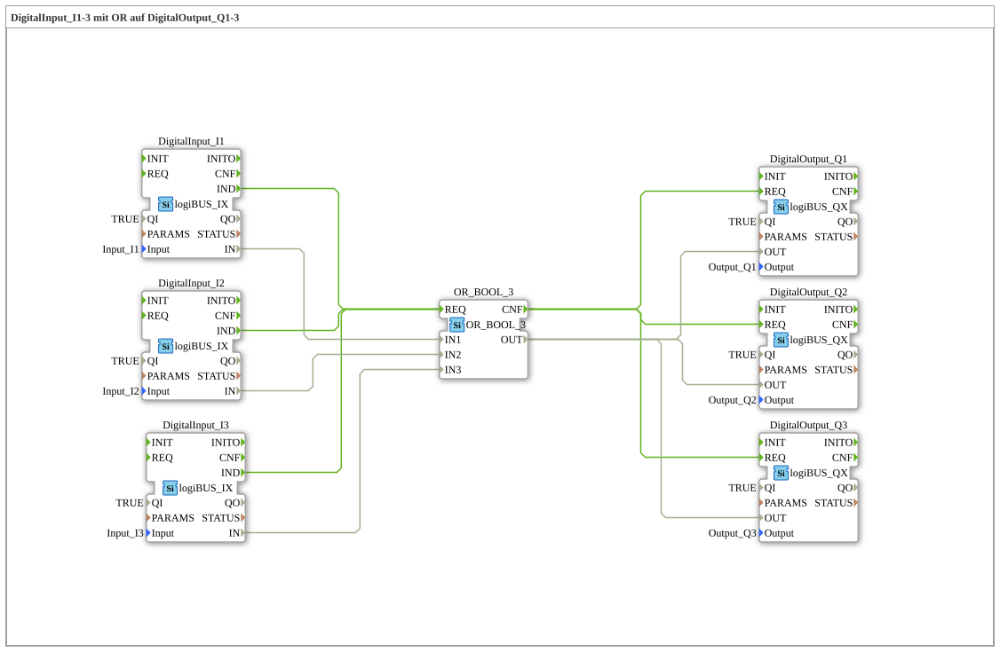

# Exercise_002a5b: DigitalInput_I1-3 with OR on DigitalOutput_Q1-3

[](https://notebooklm.google.com/notebook/a6872e59-1dfc-4132-a118-aff1bc7bc944)

This article describes the logiBUS® exercise `Uebung_002a5b`. This exercise combines two concepts: a logical OR operation with three inputs and the simultaneous distribution (fan-out) of the result to three digital outputs.

----

## Objective of the Exercise

The objective is to model a complex I/O structure. It demonstrates how information is collected from multiple sensors, logically evaluated, and the result distributed to a group of actuators. The scalability of event connections is illustrated on both the input (fan-in) and output (fan-out) sides.


``` -----

## Description and Components

[cite_start]In the subapplication `Uebung_002a5b.SUB`, three input blocks are linked to three output blocks via an OR gate[cite: 1].

### Function Blocks (FBs)



* **`DigitalInput_I1` to `I3`**: Three instances of type `logiBUS_IX`. [cite_start]They monitor the hardware inputs `Input_I1`, `Input_I2`, and `Input_I3`[cite: 1].


* **`OR_3_BOOL`**: An instance of type `OR_3_BOOL` (from the IEC 61131 library). This function block performs an OR operation on three Boolean inputs. It responds to `REQ` and acknowledges with `CNF`.

* **`DigitalOutput_Q1` to `Q3`**: Three instances of type `logiBUS_QX`. They control the physical outputs `Output_Q1`, `Output_Q2`, and `Output_Q3`.


-----

## Functionality

The circuit uses a central logic element as a node for all signals. The structure in `Uebung_002a5b.SUB` is defined as follows:


```xml
<EventConnections>
    <Connection Source="DigitalInput_I1.IND" Destination="OR_3_BOOL.REQ"/>
    <Connection Source="DigitalInput_I2.IND" Destination="OR_3_BOOL.REQ"/>
    <Connection Source="DigitalInput_I3.IND" Destination="OR_3_BOOL.REQ"/>
    <Connection Source="OR_3_BOOL.CNF" Destination="DigitalOutput_Q1.REQ"/>
    <Connection Source="OR_3_BOOL.CNF" Destination="DigitalOutput_Q2.REQ"/>
    <Connection Source="OR_3_BOOL.CNF" Destination="DigitalOutput_Q3.REQ"/>
</EventConnections>
<DataConnections>
    <Connection Source="DigitalInput_I1.IN" Destination="OR_3_BOOL.IN1"/>
    <Connection Source="DigitalInput_I2.IN" Destination="OR_3_BOOL.IN2"/>
    <Connection Source="DigitalInput_I3.IN" Destination="OR_3_BOOL.IN3"/>
    <Connection Source="OR_3_BOOL.OUT" Destination="DigitalOutput_Q1.OUT"/>
    <Connection Source="OR_3_BOOL.OUT" Destination="DigitalOutput_Q2.OUT"/>
    <Connection Source="OR_3_BOOL.OUT" Destination="DigitalOutput_Q3.OUT"/>
</DataConnections>
```


Functional sequence:

1. **Input trigger**: Any change to one of the three buttons (`I1`, `I2`, `I3`) triggers a recalculation of the logic.

2. **Calculation**: The function block `OR_3_BOOL` sets its result to `TRUE` if at least one input is active.

3. **Mass update**: The resulting signal is sent simultaneously to all three lamps (`Q1`, `Q2`, `Q3`). Once the logic is complete (`CNF`), all three hardware outputs are updated synchronously.

-----

## Application Example

**Central Warning System**:

In a factory hall, there are three emergency stop buttons (`I1`, `I2`, `I3`). As soon as one of these buttons is pressed, warning lights (`Q1`, `Q2`, `Q3`) must illuminate at three different locations in the hall. The OR logic collects the alarms, and the fan output ensures widespread signaling.