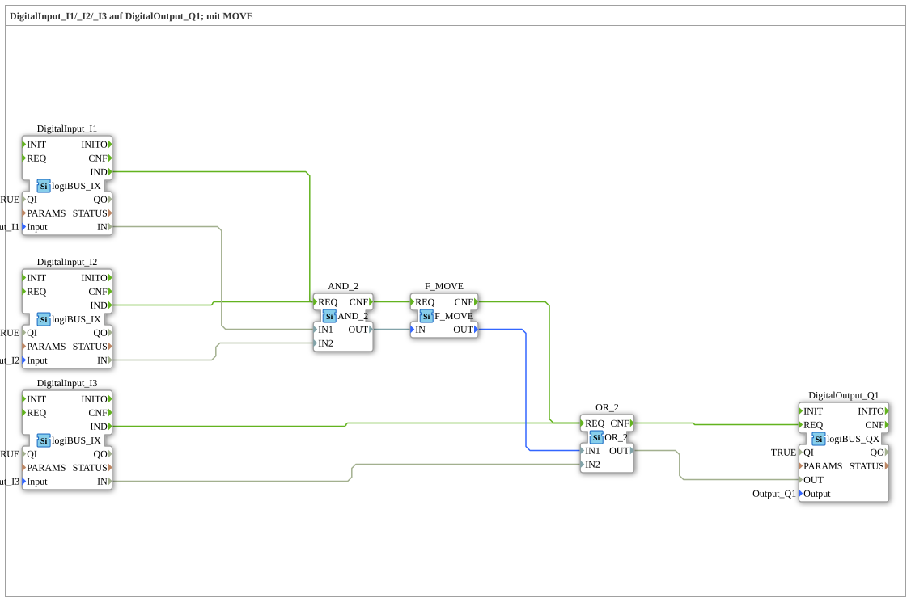

# Exercise_002b2: DigitalInput_I1/_I2/_I3 to DigitalOutput_Q1; with MOVE

This article describes the logiBUS® exercise `Uebung_002b2`. In this exercise, a combinational logic circuit is implemented that links two basic operations (AND and OR), using a `F_MOVE` block for explicit data forwarding.
-----
## Objective of the Exercise

The main objective of this exercise is the hierarchical linking of logic blocks. It demonstrates how partial results of one operation can serve as input for another operation. Additionally, the `F_MOVE` block is introduced, which is used to explicitly pass data values in a separate event step.

-----

## Description and Components

[cite_start]The subapplication `Uebung_002b2.SUB` implements the logical function `Q1 = (I1 AND I2) OR I3` using standard logic blocks[cite: 1].

### Function Blocks (FBs)

* **`DigitalInput_I1` to `I3`**: Three instances of type `logiBUS_IX`. [cite_start]They provide the input signals for the logic chain[cite: 1].
* **`AND_2`**: One instance of type `AND_2`. [cite_start]Combines the inputs `I1` and `I2`[cite: 1].
* **`F_MOVE`**: A data transfer block. [cite_start]It receives the value at input `IN` and outputs it unchanged at output `OUT` upon the event `REQ`[cite: 1]. It serves as a buffer between the logic stages.
* **`OR_2`**: An instance of type `OR_2`. [cite_start]Combines the (buffered) result of the AND block with the third input `I3`[cite: 1].
* **`DigitalOutput_Q1`**: Outputs the final result of the logic to the hardware output.

-----

## Functionality

The hierarchical structure of the logic is clearly illustrated by the event chain shown in `Uebung_002b2.SUB`:

<EventConnections>
<Connection Source="DigitalInput_I1.IND" Destination="AND_2.REQ"/>
<Connection Source="DigitalInput_I2.IND" Destination="AND_2.REQ"/>
<Connection Source="AND_2.CNF" Destination="F_MOVE.REQ"/>
<Connection Source="F_MOVE.CNF" Destination="OR_2.REQ"/>
<Connection Source="DigitalInput_I3.IND" Destination="OR_2.REQ"/>
<Connection Source="OR_2.CNF" Destination="DigitalOutput_Q1.REQ"/>
</EventConnections>
<DataConnections>
<Connection Source="DigitalInput_I1.IN" Destination="AND_2.IN1"/>
<Connection Source="DigitalInput_I2.IN" Destination="AND_2.IN2"/>
<Connection Source="AND_2.OUT" Destination="F_MOVE.IN"/>
<Connection Source="F_MOVE.OUT" Destination="OR_2.IN1"/>
<Connection Source="DigitalInput_I3.IN" Destination="OR_2.IN2"/>
<Connection Source="OR_2.OUT" Destination="DigitalOutput_Q1.OUT"/>
</DataConnections>

[cite_start][cite: 1]

The functional sequence:

1. If `I1` or `I2` changes, `AND_2` calculates the partial result.
2. The completion event (`CNF`) of `AND_2` triggers `F_MOVE`.
3. `F_MOVE` passes the partial result to the OR block and triggers it in turn (`CNF -> REQ`).
4. The OR block processes the buffered result together with the signal from `I3`.
5. The output `Q1` is activated when either both first inputs are active OR when the third input is active.

-----

## Application Example

**System Release with Bypass**:

A motor (`Q1`) should normally only run when two sensors (`I1` and `I2`) simultaneously show a green light (e.g., pressure OK AND temperature OK). For maintenance purposes, however, the motor should also be able to be started when a manual button (`I3`) is pressed, which bypasses the automatic logic.
