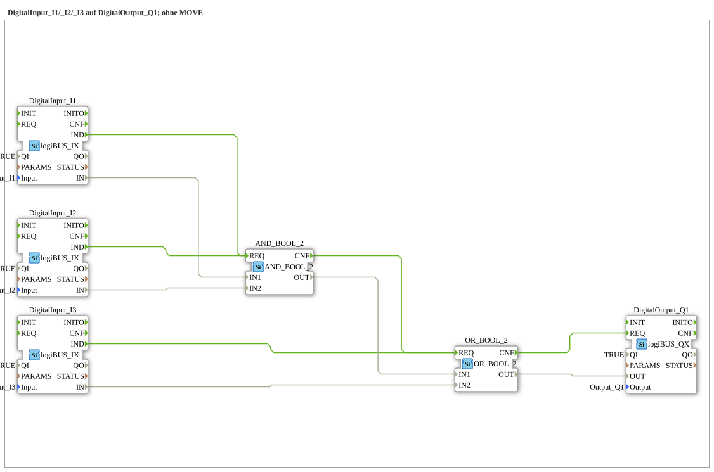

# Exercise_002b3: DigitalInput_I1/_I2/_I3 to DigitalOutput_Q1; without MOVE

* * * * * * * * * *

## Introduction

This exercise demonstrates the processing of digital input signals and their logical combination to control a digital output. The circuit combines AND and OR logic gates to implement specific logic between three inputs and one output.

## Function Blocks (FBs) Used

### DigitalInput_I1, DigitalInput_I2, DigitalInput_I3

- **Type**: logiBUS_IX
- **Parameters**:
- QI = TRUE
- Input = logiBUS_DI::Input_I1 (or I2, I3)
- **Function**: Reads the digital input signals from the corresponding hardware inputs

### AND_2_BOOL

- **Type**: AND_2_BOOL
- **Function**: Performs a logical AND operation between two Boolean inputs

### OR_2_BOOL

- **Type**: OR_2_BOOL
- **Function**: Performs a logical OR operation between two Boolean inputs

### DigitalOutput_Q1

- **Type**: logiBUS_QX
- **Parameters**:
- QI = TRUE
- Output = logiBUS_DO::Output_Q1
- **Functionality**: Writes the result of the logical operation to digital output Q1

## Program Flow and Connections

**Event Connections:**

- DigitalInput_I1.IND → AND_2_BOOL.REQ
- DigitalInput_I2.IND → AND_2_BOOL.REQ
- DigitalInput_I3.IND → OR_2_BOOL.REQ
- AND_2_BOOL.CNF → OR_2_BOOL.REQ
- OR_2_BOOL.CNF → DigitalOutput_Q1.REQ

**Data Connections:**

- DigitalInput_I1.IN → AND_2_BOOL.IN1
- DigitalInput_I2.IN → AND_2_BOOL.IN2
- DigitalInput_I3.IN → OR_2_BOOL.IN2
- AND_2_BOOL.OUT → OR_2_BOOL.IN1
- OR_2_BOOL.OUT → DigitalOutput_Q1.OUT

**Logical Function:**

Q1 = (I1 AND I2) OR I3

**Learning Objectives:**

- Understanding the logic operations AND and OR
- Working with digital inputs and outputs in 4diac
- Building combinational circuits
- Event-driven data processing

**Difficulty Level**: Easy
**Required Prior Knowledge**: Fundamentals of digital technology, basic knowledge of the 4diac IDE

**Starting the Exercise**: The exercise is loaded in the 4diac IDE and deployed to a compatible control system. The digital inputs I1, I2, and I3 can be tested to verify the functionality of the circuit.

## Summary

This exercise demonstrates a basic combinational logic circuit that processes digital input signals and controls an output via logic operations. This implementation demonstrates the basic functionality of event-driven systems according to IEC 61499 with direct connection to hardware inputs and outputs.

---

### 🌐 Related topic subpages on ms-muc-docs.de

- [🌐 Eclipse 4diac IDE & color reference on ms-muc-docs.de](https://www.ms-muc-docs.de/iec-61499/eclipse-4diac/)

]
