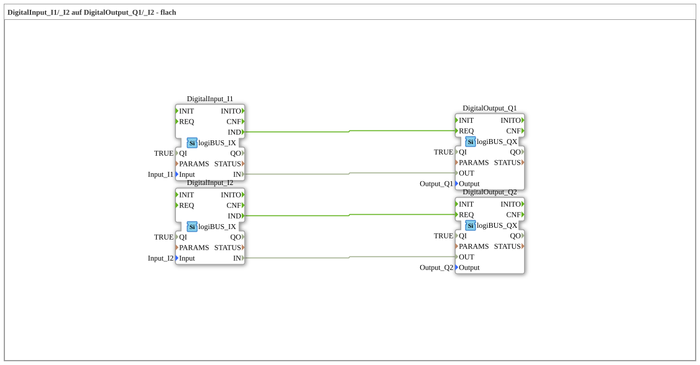

# Exercise_003: DigitalInput_I1/_I2 to DigitalOutput_Q1/_I2 - Flat

[(https://notebooklm.google.com/notebook/a6872e59-1dfc-4132-a118-aff1bc7bc944)
This article describes the logiBUS® exercise `Uebung_003`. In this exercise, two independent signal paths are implemented, with each digital input directly controlling an assigned digital output
----

## Objective of the Exercise

The main objective of this exercise is to demonstrate the parallel processing of signals in IEC 61499. Since function blocks in 4diac operate on an event-driven basis, multiple control tasks can exist completely independently of each other in a network without blocking each other's execution.

## Description and Components

[cite_start]The subapplication `Uebung_003.SUB` defines two separate signal paths ("channels") that are processed in parallel[cite: 1].

### Function Blocks (FBs)

Two pairs of input and output blocks are used:

- **`DigitalInput_I1` & `DigitalOutput_Q1`**: The first pair (Channel 1). [cite_start]Connects hardware input `I1` with hardware output `Q1`[cite: 1].
- **`DigitalInput_I2` & `DigitalOutput_Q2`**: The second pair (Channel 2). [cite_start]Connects hardware input `I2` with hardware output `Q2`[cite: 1].

-----

## Functionality

The independence of the two channels is ensured by the separate event and data connections in the sub-application `Uebung_003.SUB`:

<EventConnections>
<Connection Source="DigitalInput_I1.IND" Destination="DigitalOutput_Q1.REQ"/>
<Connection Source="DigitalInput_I2.IND" Destination="DigitalOutput_Q2.REQ"/>
</EventConnections>
<DataConnections>
<Connection Source="DigitalInput_I1.IN" Destination="DigitalOutput_Q1.OUT"/>
<Connection Source="DigitalInput_I2.IN" Destination="DigitalOutput_Q2.OUT"/>
</DataConnections>

[cite_start][cite: 1]

The functional sequence:

1. If the state of `I1` changes, the first block fires a `IND` event, which prompts `Q1` to update.
2. If the state of `I2` changes, the second block fires a `IND` event, which prompts `Q2` to update.

Both processes run asynchronously. A rapid switching sequence on channel 1 does not affect the response time of channel 2 in any way.

-----

## Application Example

**Independent Units**:

Two independent electric motors are controlled in an agricultural machine. Switch 1 (`I1`) activates the motor for the auger (`Q1`), and switch 2 (`I2`) activates the blower (`Q2`). Although both logic circuits are defined in the same control program, they operate as separate "software circuits."

---

### 🌐 Related topic subpages on ms-muc-docs.de

- [🌐 Eclipse 4diac IDE & color reference on ms-muc-docs.de](https://www.ms-muc-docs.de/iec-61499/eclipse-4diac/)

]
