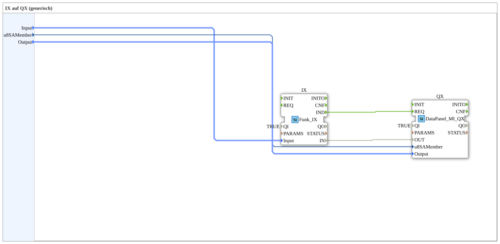

# Exercise_003b2_sub: IX to QX (generic)

[(https://notebooklm.google.com/notebook/a6872e59-1dfc-4132-a118-aff1bc7bc944)
This article describes the sub-application type `Uebung_003b2_sub`. This component serves as a universal coupler between a wireless remote control and a CAN bus output module (DataPanel)
----

## Purpose of the Exercise

Abstraction of wireless signals. The component allows wireless buttons to be handled as easily as directly wired inputs and mapped to a decentralized output module.

-----

## Description and Components

[cite_start]The type `Uebung_003b2_sub` combines wireless reception and CAN output[cite: 1].

### Internal Function Blocks (FBs)

- **`IX`**: Type `Funk_IX`. Receives the signals from the radio button selected via `Input`.
- **`QX`**: Type `DataPanel_MI_QX`. Sends CAN messages to the selected DataPanel (`u8SAMember`) and activates the physical port (`Output`) there.

-----

## Interfaces

[cite_start]This module offers three configuration options[cite: 1]:

- **`Input`**: Name of the radio button (e.g., `Key_01`).
- **`u8SAMember`**: CAN bus address of the target module.
- **`Output`**: Number of the output on the module (e.g., `DigitalOutput_1A`).

By using this type, a complex radio remote control can be configured by simply entering the IDs in the main application.

## 🛠️ Related Exercises

- [Exercise_003b2](Uebung_003b2.md)
