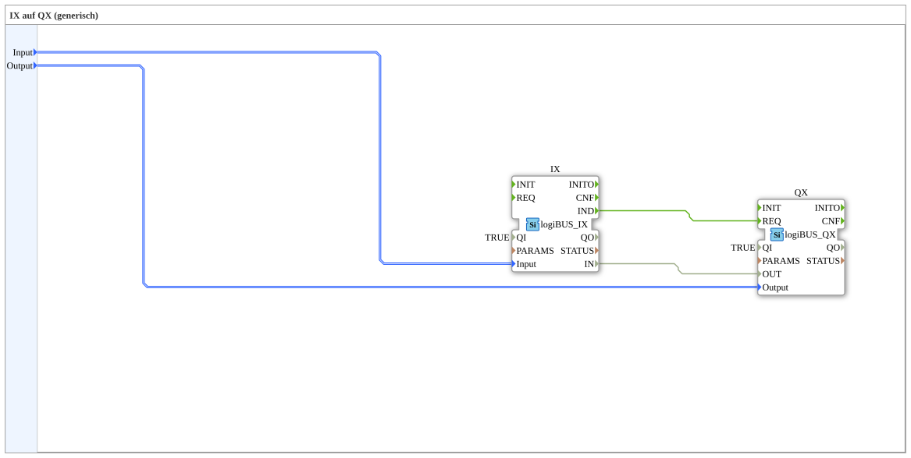

# Exercise_003b_sub: IX on QX (generic)

[(https://notebooklm.google.com/notebook/a6872e59-1dfc-4132-a118-aff1bc7bc944)

## Overview

[cite_start]This sub-app type is identical to `Uebung_003a_sub` and serves to demonstrate the multiple use of the same logical pattern for different exercise scenarios[cite: 1]. It encapsulates the direct connection between hardware input and hardware output.

## 🛠️ Related Exercises

- [Exercise_003b](Uebung_003b.md)
