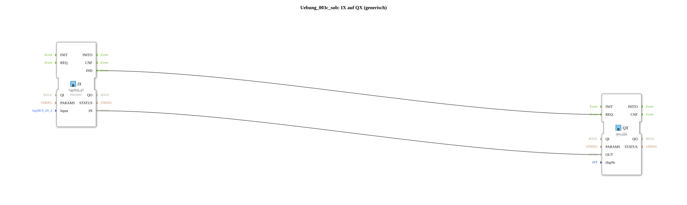

# Exercise_003c_sub: IX on QX (generic)

[(https://notebooklm.google.com/notebook/a6872e59-1dfc-4132-a118-aff1bc7bc944)
This article describes the sub-application type `Uebung_003c_sub`. This function block serves as a bridge between local hardware and the ISOBUS auxiliary input system.
----
## Purpose of the Exercise

Encapsulation of ISOBUS communication. The function block encapsulates the details of the ISOBUS protocol and provides a simple interface for mapping physical buttons to logical AUX numbers.

-----

## Description and Components

[cite_start]The type `Uebung_003c_sub` contains a local input function block and an ISOBUS output function block[cite: 1].

### Internal Function Blocks (FBs)

* **`IX`**: Type `logiBUS_IX`. Reads the local hardware pin (`Input`).
* **`QX`**: Type `Aux_QX`. Sends the status as an ISOBUS message for the selected function number (`iInpNr`).

-----

## Interfaces

[cite_start]The function block is configured via two parameters[cite: 1]:

* **`Input`**: The physical button on the controller.
* **`iInpNr`**: The sequential number (index) in the ISOBUS auxiliary pool.

Any change to the local button immediately triggers a corresponding status message in the ISOBUS network, making the button visible to other devices (e.g., task controllers).

## 🛠️ Related Exercises

* [Exercise_003c](Uebung_003c.md)
