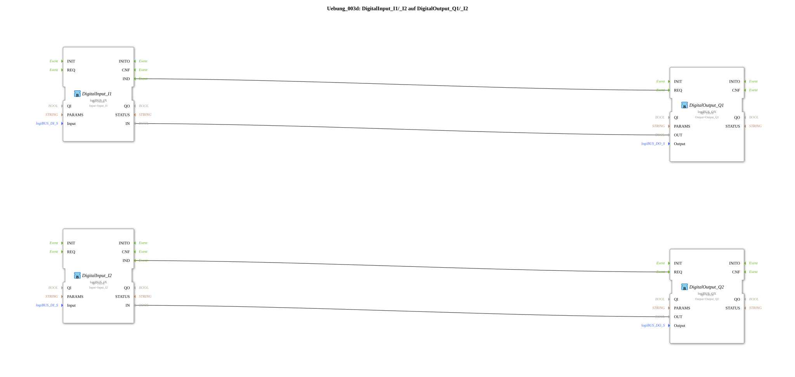

# Exercise_003d: DigitalInput_I1/_I2 to DigitalOutput_Q1/_I2

[(https://notebooklm.google.com/notebook/a6872e59-1dfc-4132-a118-aff1bc7bc944)
This article describes the logiBUS® exercise `Uebung_003d`. This exercise is structurally identical to `Uebung_003` and serves to reinforce the understanding of parallel signal paths in IEC 61499.
----
## Objective of the Exercise

The objective is to review direct I/O linking using event and data connections. It ensures that the concept of asynchronous and independent data flows is understood.

-----

## Description and Components

[cite_start]The subapplication `Uebung_003d.SUB` connects two input blocks directly to two output blocks[cite: 1].

### Function Blocks (FBs)

* **`DigitalInput_I1`** ➡️ **`DigitalOutput_Q1`**
* **`DigitalInput_I2`** ➡️ **`DigitalOutput_Q2`**

The block types are `logiBUS_IX` (input) and `logiBUS_QX` (output).

-----

## Functionality

The signals are passed through 1:1 and with low latency from the inputs to the outputs. Any change at the input `I1` immediately triggers an update of `Q1`, without affecting the logic for `I2`/`Q2`.

----

## Application Example

This exercise is ideally suited as a **wiring test program**:

When a new hardware configuration has been set up, this "transparent" program is uploaded to check whether all buttons and lamps are physically connected and addressed correctly. Pressing a button should immediately illuminate the corresponding lamp.