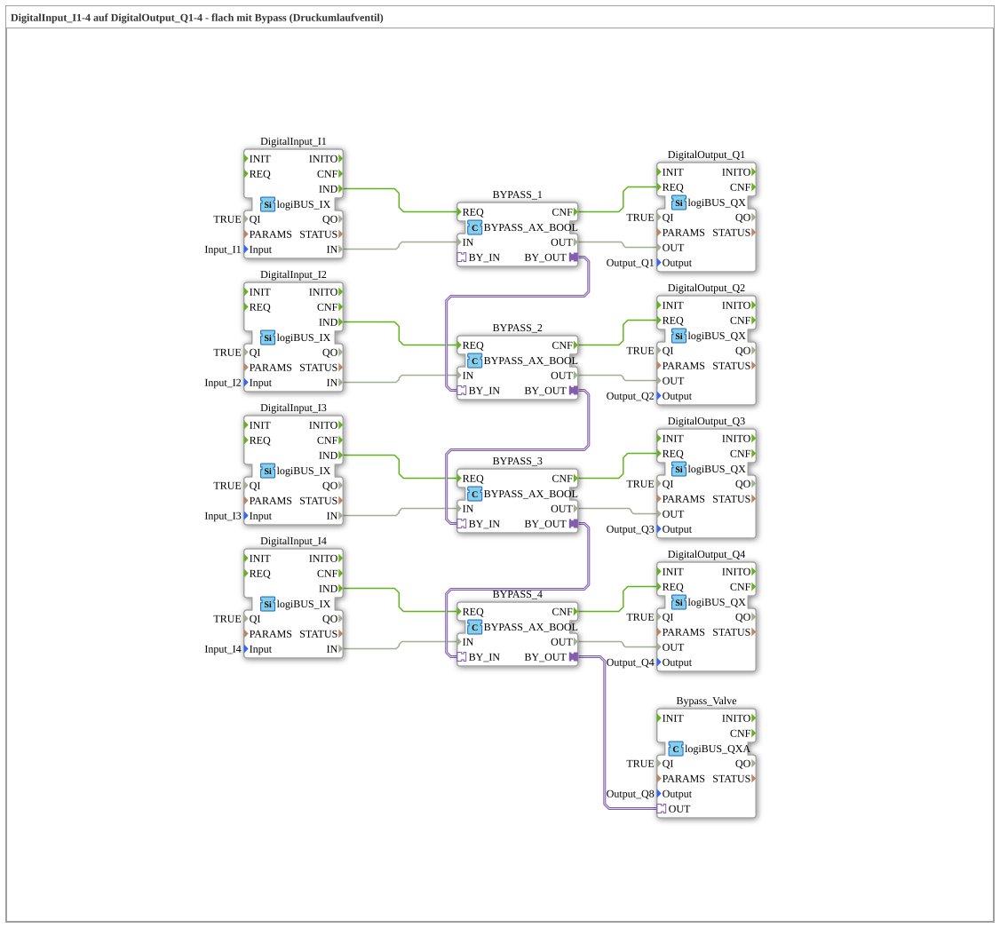

# Exercise_003e: Digital Input_I1-4 to Digital Output_Q1-4 - Flat with Bypass (Pressure Relief Valve)

* * * * * * * * * *

## Introduction

In this exercise, four digital input signals (I1–I4) are directly connected to four digital outputs (Q1–Q4). A bypass block is inserted between each output, providing additional functionality: The bypass blocks are cascaded and routed through a common bypass valve (output Q8). The circuit implements a simple pass-through with the option of influencing the signal flow via a pressure relief valve.

## Function Blocks (FBs) Used

The exercise consists of the following FB instances:

- **DigitalInput_I1** to **DigitalInput_I4**

Type: `logiBUS::io::DI::logiBUS_IX`

Parameters: QI = TRUE, Input = corresponding physical input (Input_I1, etc.)

- **DigitalOutput_Q1** to **DigitalOutput_Q4**

Type: `logiBUS::io::DQ::logiBUS_QX`

Parameters: QI = TRUE, Output = corresponding physical output (Output_Q1, etc.)

- **BYPASS_1** to **BYPASS_4**

Type: `logiBUS::signalprocessing::bypass::BYPASS_AX_BOOL`

No parameters set.

- **Bypass Valve**

Type: `logiBUS::io::DQ::logiBUS_QXA`

Parameters: QI = TRUE, Output = Output_Q8 (Bypass Valve)

**Event Connections:**

- `DigitalInput_I1.IND` → `BYPASS_1.REQ`
- `BYPASS_1.CNF` → `DigitalOutput_Q1.REQ`
- (Analog for I2–I4)

**Data Connections:**

- `DigitalInput_I1.IN` → `BYPASS_1.IN`
- `BYPASS_1.OUT` → `DigitalOutput_Q1.OUT`
- (Analog for I2–I4)

**Adapter Connections (Bypass Chain):**

- `BYPASS_1.BY_OUT` → `BYPASS_2.BY_IN`
- `BYPASS_2.BY_OUT` → `BYPASS_3.BY_IN`
- `BYPASS_3.BY_OUT` → `BYPASS_4.BY_IN`
- `BYPASS_4.BY_OUT` → `Bypass_Valve.OUT`

## Program Flow and Connections

1. **Signal Path**: Each digital input (I1–I4) generates an event `IND` upon a change. This triggers the corresponding bypass block (`BYPASS_x`). The bypass block passes the signal unchanged (or with the bypass function) to the output and signals the corresponding digital output (`DigitalOutput_Qx`) with `CNF`, which sets the physical output signal.
2. **Bypass Chain**: The adapter connections `BY_OUT` and `BY_IN` of the four bypass blocks are connected in series. This routes a common bypass signal (e.g., an enable or disable signal) through the entire chain. The last link in the chain (`BYPASS_4.BY_OUT`) is connected to the bypass valve (`Bypass_Valve`), which affects the output `Output_Q8`.
3. **Function of the Bypass**: The bypass signal allows the entire data flow of the four channels to be centrally controlled – for example, switched on or off. In the configuration as a pressure bypass valve, this serves to control a hydraulic or pneumatic circuit.

## Summary

This exercise demonstrates the basic chaining of digital inputs and outputs with the interposition of bypass modules. The special feature lies in the cascaded adapter connection, which allows a common control signal to be routed across multiple channels. This concept is suitable for applications where central shutdown or rerouting of the signals is required, for example, in safety circuits or pressure control systems.
