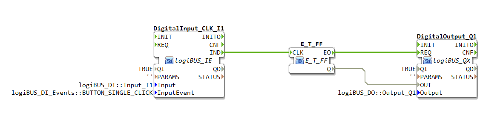
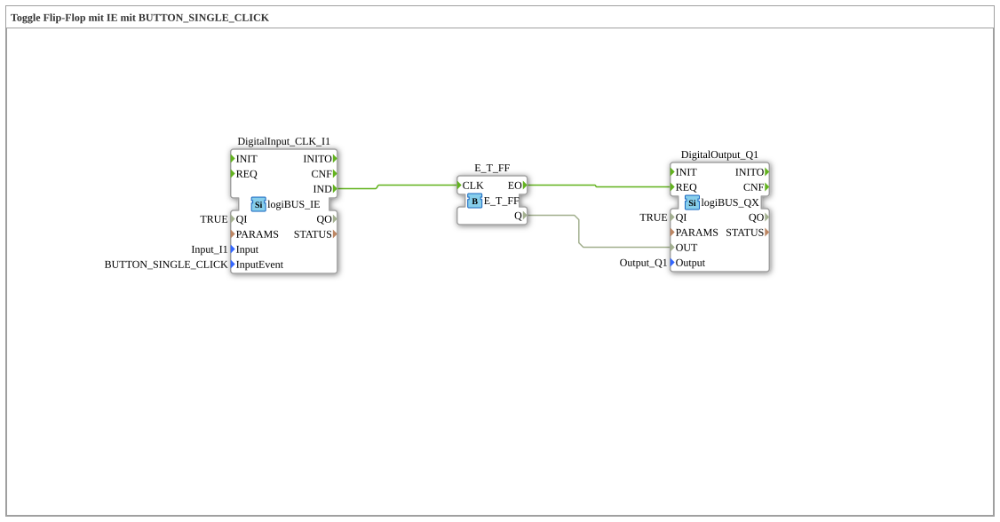

# Exercise_004a: Toggle Flip-Flop with IE using BUTTON_SINGLE_CLICK
[](https://notebooklm.google.com/notebook/a6872e59-1dfc-4132-a118-aff1bc7bc944)
This article describes the logiBUS® exercise `Uebung_004a`. In this exercise, we move beyond simple data forwarding and use events to implement a memory function: a classic impulse switch.
----

## Objective of the Exercise

The objective is to understand the difference between state-oriented (level) and event-oriented (edge) programming. While a simple push button is only "on" as long as it is pressed, here each press of the button should change the state of the output (toggle: Off ➡️ On ➡️ Off ➡️ ...).

-----

## Description and Components

[cite_start]The subapplication `Uebung_004a.SUB` uses a special input block that generates click events and a toggle flip-flop[cite: 1].

### Function Blocks (FBs)



* **`DigitalInput_CLK_I1`**: Type `logiBUS_IE` (Input Event). [cite_start]Unlike the standard input, this block does not provide a continuous signal but fires a single event (`IND`) when a specific condition is met. Here, it is configured to `BUTTON_SINGLE_CLICK`[cite: 1].
* **`E_T_FF`**: Type `E_T_FF` (standard IEC event block). [cite_start]This block has a clock input (`CLK`). Upon receiving an event, it changes its internal state and outputs it via the data output `Q` and an acknowledgment event `EO`[cite: 1].
* **`DigitalOutput_Q1`**: Type `logiBUS_QX`. [cite_start]Switches the physical output `Q1` based on the flip-flop's state[cite: 1].

-----

## Functionality

The logic is based on converting a momentary key press into a persistent memory state:

```xml
<EventConnections>
<Connection Source="DigitalInput_CLK_I1.IND" Destination="E_T_FF.CLK"/>
<Connection Source="E_T_FF.EO" Destination="DigitalOutput_Q1.REQ"/>
</EventConnections>
<DataConnections>
<Connection Source="E_T_FF.Q" Destination="DigitalOutput_Q1.OUT"/>
</DataConnections>

[cite_start][cite: 1]

1. The user briefly presses the button on `I1` ("click").

2. The `DigitalInput_CLK_I1` recognizes the "single click" pattern and sends a `IND` event.

3. The event reaches the `CLK` input of the `E_T_FF`.

4. The flip-flop changes its state (e.g., from FALSE to TRUE).

5. The new signal is available at the data output `Q`, and the flip-flop sends an event to `EO`.

6. `DigitalOutput_Q1` receives this event, reads the value from `Q`, and turns the light on.

7. The process repeats with the next click; the flip-flop returns to FALSE, and the light turns off.

-----

## Application Example

The classic **hallway lighting**: Pressing a button turns the light on, and the next press turns it off again. This is not possible with a purely electrical button (which springs back) without a memory element (software flip-flop).